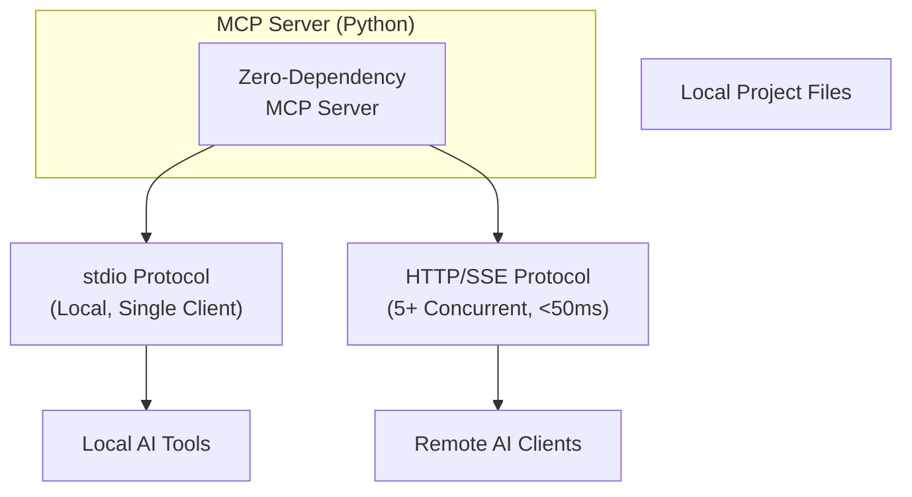

## My AI Couldn’t See My Files — I Built a Zero-Dependency MCP Server

這位開發者厭倦了複製粘貼項目文件到 AI 聊天界面，於是用純 Python 實現了一個零外部依賴的 MCP 服務器。該服務器直接賦予 AI 工具訪問本地項目文件的能力，通過簡潔的設計實現了雙重協議支援：stdio 模式用於本地單客戶端使用，HTTP/SSE 模式用於遠程或並發多客戶端。性能測試顯示，即使在 5 個並發客戶端的負載下，延遲也保持在 50ms 以內。這個項目展示了「沒有複雜框架，一樣能簡潔有效」的設計哲學，為 AI 工具提供了低阻力的本地文件訪問層。

### 重點
- 純 Python + 零外部依賴設計，同時支援 stdio（本地）和 HTTP/SSE（並發）雙協議
- 5 個並發客戶端下延遲 <50ms，展示簡潔架構的高效能表現
- MCP 服務器直接暴露本地文件系統，免除複製粘貼到 AI 聊天的繁瑣步驟

**原文：** [medium-towards-data-science](https://towardsdatascience.com/my-ai-couldnt-see-my-files-i-built-a-zero-dependency-mcp-server/)

---

### 📄 原文內容

點此展開 / 收合

I got tired of copying files into an AI chat just to get feedback. So I built a pure Python MCP server that gives AI tools direct access to my local project—no frameworks, no dependencies. It runs over stdio for local use and switches to HTTP/SSE for concurrent clients with a single flag. The result: 5 clients, under 50ms, and a design that stays simple without sacrificing capability. 
 The post My AI Couldn’t See My Files — I Built a Zero-Dependency MCP Server appeared first on Towards Data Science .

