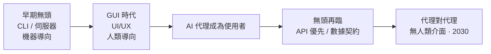
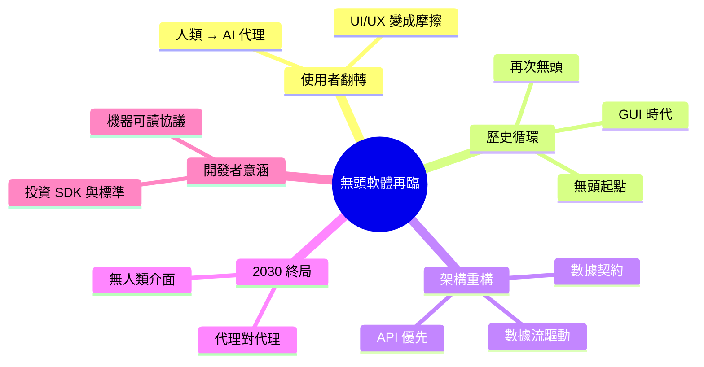

## The Architecture of Autonomy: Why Software Is Becoming Headless Again

軟體架構正進入新時代：AI agent 而非人類成為應用的主要使用者，推動「headless 軟體」重新興起。傳統 UI/UX 設計針對人類互動，但當 AI 代理成為首要客戶時，應用層必須重構為 API 優先、數據流驅動的模式。2030 年最強大的軟體可能完全沒有人類面向介面，而是純 agent-to-agent 通訊。此轉變要求開發者重新設計 SDK、數據契約與交互標準，從圖形介面驅動改為機器可讀的標準化協議。

### 重點
- AI agent 成為軟體主要使用者，傳統人類中心的 UI/UX 設計需根本重構
- Headless 軟體架構（API 優先、無人類 UI）正成為新常態與競爭優勢
- 軟體設計中心轉移：2030 年競爭力取決於 agent 適應性，而非人類介面美觀度

**原文：** [medium-tag-llm](https://blog.devgenius.io/the-architecture-of-autonomy-why-software-is-becoming-headless-again-28bdb127b2a6?source=rss------large_language_models-5)

---

<!-- deep-analysis:begin -->
## 📌 摘要 (TL;DR)

- 本文核心論點：到 2030 年，軟體最重要的「使用者」可能從不看螢幕——AI 代理（AI agent）正取代人類，成為應用程式的首要客戶。
- 作者認為這推動「無頭軟體」（headless software）重新興起：軟體回到只透過 API 提供功能、不依賴圖形介面的型態。
- 標題的「再次」（again）點出歷史循環：軟體從早期機器導向的無頭型態，走向人類導向的 GUI 時代，如今又因 AI 代理回到無頭。
- 當 AI 代理是主要客戶，傳統為人類設計的 UI/UX 失去優先地位，應用層必須重構為 API 優先（API-first）、數據流驅動的架構。
- 終局是代理對代理（agent-to-agent）的直接通訊：最強大的軟體可能完全沒有人類面向介面。
- 對開發者的意涵：重心從畫面與互動，轉向 SDK、數據契約（data contract）與機器可讀的標準化協議。

## 🎯 核心概念

- **無頭軟體（headless software）**：將後端邏輯與前端介面解耦、只透過 API 對外提供功能、本身沒有面向人類圖形介面的軟體。
- **API 優先（API-first）**：先定義 API 與資料結構作為產品本體，使用者介面（若存在）只是眾多消費端之一。
- **代理對代理（agent-to-agent）**：AI 代理之間直接互相呼叫、傳遞資料與委派任務，過程不需人類介入或畫面。
- **數據契約（data contract）**：機器之間交換資料時，明確、可驗證、版本化的格式與語意約定。

## 📖 整理分析

### 1. 「再次」無頭：歷史的循環
作者用標題的 again 點出：軟體最初本就是無頭的——伺服器、命令列、機器對機器的呼叫，並不為螢幕而生。GUI 時代之所以興起，是因為人類需要看得懂、點得到的畫面。如今當主要使用者換成 AI 代理，這個為人類而生的前提被推翻，軟體於是「回到」無頭型態。

### 2. 使用者換人：從人類到 AI 代理
本文的關鍵翻轉在於「誰在用軟體」。傳統 UI/UX 假設使用者是人，需要視覺層級、引導與互動回饋；但 AI 代理不需要按鈕與排版，它要的是穩定、結構化、可預測的介面。當代理成為首要客戶，為人類優化的設計反而成為摩擦。

### 3. 應用層重構：API 優先與數據流
一旦接受代理是主客戶，應用層的設計重心就從畫面轉向資料流。作者主張系統要重構為 API 優先、數據流驅動：功能以 API 暴露、輸入輸出以機器可讀格式定義，介面退化為可選的消費端，而非系統核心。

### 4. 終局：2030 的代理對代理
作者推估到 2030 年，最強大的軟體可能完全沒有人類面向介面，而是純粹的代理對代理通訊——一個代理直接呼叫另一個代理的能力，串成自動化的價值鏈，人類只在邊界設定目標與審核結果。

### 5. 對開發者的意涵
這個轉變要求開發者把投資從圖形介面，移到 SDK、數據契約與互動標準。能否被其他代理「發現、理解、安全呼叫」，取代了「畫面好不好看」成為競爭力來源；標準化、機器可讀的協議成為新的設計重點。

## 🧭 演進路徑

## 🧠 Mindmap

<!-- deep-analysis:end -->
### 📄 原文內容

點此展開 / 收合

The most powerful user of your software in 2030 may never look at a screen. Continue reading on Dev Genius »

