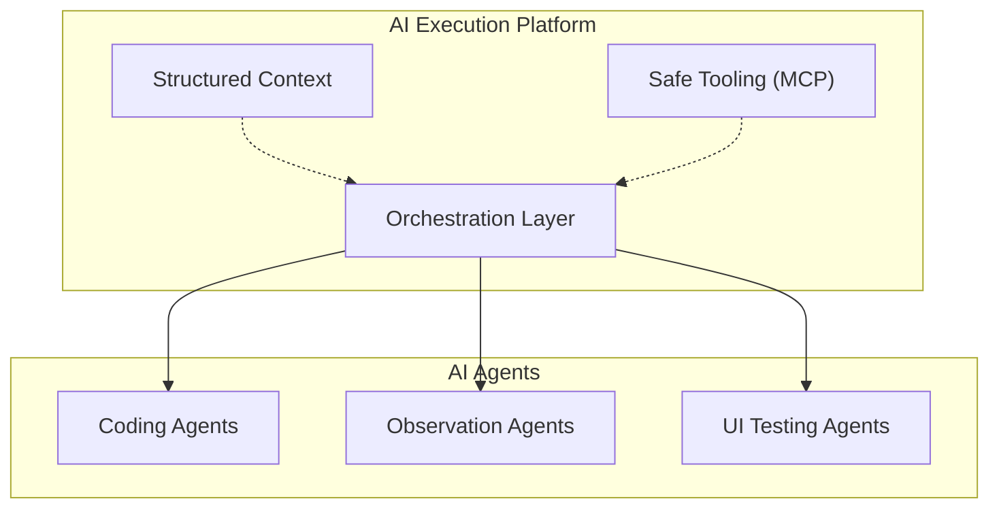

## Presentation: Platform Teams Enabling AI - MCP/Multi-Agentic Tools Across Linkedin

LinkedIn 的工程平台團隊（Karthik Ramgopal、Prince Valluri）在此分享了如何透過 MCP 和多代理工具構建大規模 AI 執行模型。他們強調了關鍵的架構模式：透過平台級的抽象層實現 orchestration、structured context 和安全的工具框架（尤其是 MCP），可以超越傳統碎片化的 AI 實現方式。LinkedIn 已在生產環境中部署了三類 AI 代理系統——coding agents、observation agents 和 UI testing agents——展示了多種代理在真實工程工作流中的協作方式。這次分享提供了關鍵的架構洞見：如何在企業規模上設計統一的代理編排基礎設施。

### 重點
- LinkedIn 部署三類 agents（coding、observation、UI testing），通過平台級抽象層統一編排
- MCP 和 safe tooling 框架是克服 AI 實現碎片化的關鍵
- Structured context 和 orchestration 架構是支撐大規模多代理執行的基礎

**原文：** [infoq-ai-ml](https://www.infoq.com/presentations/ai-multi-agentic-tools/?utm_campaign=infoq_content&utm_source=infoq&utm_medium=feed&utm_term=AI%2C+ML+%26+Data+Engineering)

---

### 📄 原文內容

點此展開 / 收合

LinkedIn’s Karthik Ramgopal and Prince Valluri discuss leveraging AI as a new execution model for large-scale engineering. They explain how to move beyond fragmented implementations by building platform abstractions for orchestration, structured context, and safe tooling like MCP. They share architectural insights from real-world coding, observation, and UI testing agents built at LinkedIn. By Karthik Ramgopal, Prince Valluri

