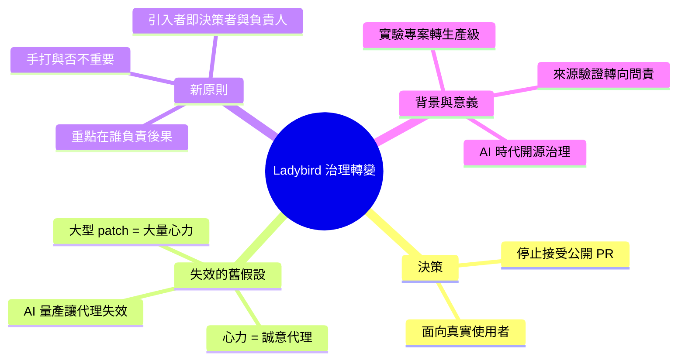

## Quoting Andreas Kling

Ladybird 瀏覽器創始人 Andreas Kling 宣布停止接受公開 PR，並闡述其核心哲學：代碼是否由人類手寫已不重要；重要的是誰對代碼負責。他強調，向專案引入代碼變更的人必須與決定這些變更是否屬於專案的人相同，並為後果負責。這反映了開源專案在 AI 時代的治理轉變——從來源驗證轉向責任與所有權的明確化，為 Ladybird 從實驗專案轉型為生產級瀏覽器提供了治理基礎。

### 重點
- Ladybird 停止接受公開 PR，改為內部維護者管理所有代碼變更
- 核心原則轉變：「代碼來源無關，責任與所有權至關重要」
- 強化開源治理：變更提交者必須同時為其決策與後果負責

**原文：** [simon-willison](https://simonwillison.net/2026/Jun/5/andreas-kling/#atom-everything)

---

<!-- deep-analysis:begin -->
## 📌 摘要 (TL;DR)

- Ladybird 瀏覽器創始人 Andreas Kling 在〈Changing How We Develop Ladybird〉中宣布：**不再接受公開的 pull request（PR）**。
- 他的核心論點是過去的一個假設已經失效——「一份大型 patch 過去意味著大量心力投入，而這份心力是判斷貢獻者『誠意（good faith）』的合理代理指標」。
- 在生成式 AI 普及後，產出大量看似紮實的程式碼變得幾乎不費力，因此「心力 ≈ 誠意」這個代理關係不再成立。
- Kling 強調：程式碼**是不是人類手打的並不重要**，重要的是「程式碼進入瀏覽器後由誰負責」。
- 引入變更的人，必須同時是決定這些變更該不該進專案、並為後果負責的人。
- 背景動機：Ladybird 正從實驗性專案轉型為「給真實使用者用的瀏覽器」，治理重心從「驗證來源」轉向「明確問責與所有權」。

## 🎯 核心概念

- **公開拉取請求（pull request，簡稱 PR）**：開源協作中，外部貢獻者提交程式碼變更、請維護者合併的標準機制。
- **誠意 / 善意（good faith）**：維護者過去用「貢獻者是否真心投入」來篩選 PR 的隱性信任基礎。
- **生成式 AI（generative AI）／大型語言模型（LLMs）**：能低成本量產程式碼，正是讓「心力＝誠意」這個代理指標失效的原因。

## 📖 整理分析

### 1. 被打破的舊假設
過去維護者篩選 PR 時，依賴一個隱性邏輯：一份實質性的 patch 代表貢獻者付出了實質心力，而這份心力可以當作「誠意」的合理代理（reasonable proxy）。Kling 直言：「That assumption no longer holds.（這個假設已不再成立。）」

### 2. 手打與否已不是重點
Kling 把問題從「來源」重新框定為「責任」：「Whether code was typed by hand is beside the point.（程式碼是否由人手打，無關緊要。）」在 AI 能大量生成程式碼的時代，糾結變更是不是人類親手寫的已沒有意義。

### 3. 真正重要的是問責
他主張關鍵在於「程式碼進入瀏覽器之後，由誰負責」。引入變更的人，必須就是決定這些變更屬於專案、並且願意為其後果負責的人。這把治理重點從「驗證貢獻者意圖」轉移到「明確化所有權與問責」。

### 4. 從實驗專案到生產級瀏覽器
這個轉變的背景是 Ladybird 的定位升級——「Ladybird is becoming a browser for real users.（Ladybird 正在成為一款給真實使用者使用的瀏覽器。）」面向真實使用者意味著更高的可靠性與責任門檻，因此需要收緊貢獻治理模式。

### 5. 對開源治理的訊號
此案例由 Simon Willison 引用，標註於 ai-ethics、open-source、generative-ai 等主題下。它反映了一個更廣的趨勢：當 AI 讓「程式碼產出量」與「投入心力」脫鉤後，開源專案傳統上以心力為信任代理的審查模式正受到挑戰，迫使維護者重新設計問責機制。

## 🧠 Mindmap

<!-- deep-analysis:end -->
### 📄 原文內容

點此展開 / 收合

We will no longer accept public pull requests. [...] 
 A substantial patch used to imply substantial effort, and that effort was a reasonable proxy for good faith. That assumption no longer holds. [...] 
 Whether code was typed by hand is beside the point. What matters is who is responsible for it once it enters the browser. Ladybird is becoming a browser for real users. The people introducing changes to it must be the people who decide those changes belong in the project, and who will answer for the consequences. 
 &mdash; Andreas Kling , Changing How We Develop Ladybird 

 Tags: ladybird , ai-ethics , open-source , generative-ai , ai , andreas-kling , llms

