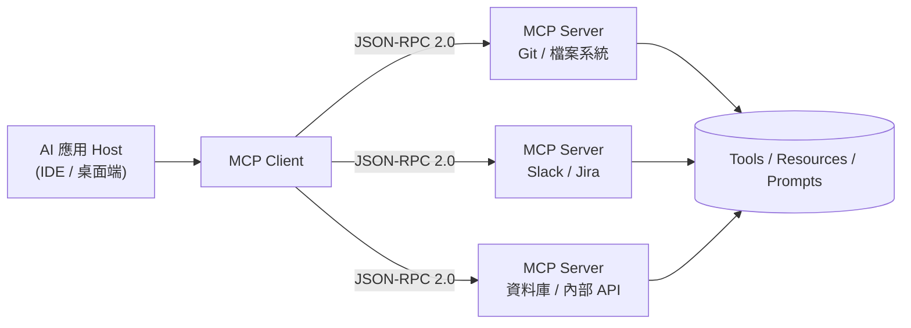
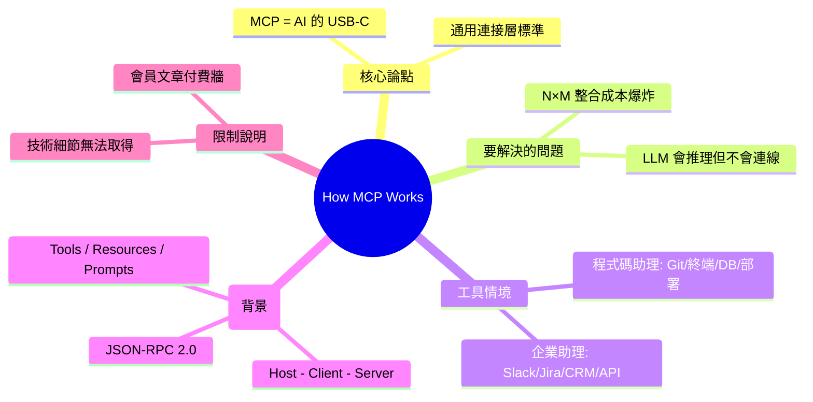

## How MCP Works

MCP（Model Context Protocol）正朝向成為 AI 生態的標準協議，類似 USB-C 在硬體生態的統一地位。文章解析 MCP 的工作原理，強調其作為通用連接層的潛力，使 AI 系統能靈活連接工具、數據源與服務。Anthropic 推動的 MCP 標準化降低了集成成本，成為 agent 系統互聯的基礎設施。隨著生態擴展，MCP 有望統一 LLM 與外部系統的協議層，類似 USB-C 統一計算設備生態。

### 重點
- MCP 是通用協議，目標地位相當於硬體生態的 USB-C 標準
- 快速連接 AI 系統與工具、數據源，顯著降低集成成本與複雜度
- Anthropic 推動的生態標準，成為 agent 系統互聯的基礎設施層

**原文：** [medium-tag-llm](https://codefarm0.medium.com/how-mcp-works-18a64f47d5ac?source=rss------large_language_models-5)

---

<!-- deep-analysis:begin -->
## 📌 摘要 (TL;DR)

- 本文作者 Arvind Kumar（Medium 上的 codefarm0，自述為 System Design / Microservices / Java / Spring Boot 領域的 Staff Engineer）提出核心論點：**模型情境協定（Model Context Protocol，簡稱 MCP）有機會成為「AI 系統的 USB-C」**——一個讓 AI 與外部工具互通的通用標準接口。
- 文章點出的問題：大型語言模型（large language model，LLM）「會推理但不會連線」——具備強大推理能力，卻缺乏原生管道去接觸真正完成工作的系統。
- 以**程式碼助理**為例，LLM 需要接觸的對象包括：原始碼儲存庫、Git、終端機、issue tracker、文件、資料庫、部署基礎設施。
- 以**企業助理**為例，需要接觸的對象包括：Slack、Jira、Confluence、CRM 平台、內部 API。
- ⚠️ **誠實說明**：本文為 Medium 會員限定文章，可公開存取的部分到「列舉企業工具」後即中斷（卡在一張需登入才看得到的示意圖）。文中對 MCP 架構、傳輸層、資料流的具體技術說明位於付費牆後，本整理無法取得，故不臆測其內容。下方「整理分析／架構圖」屬 MCP **公開規範背景補充**，非文章原文敘述。

## 🎯 核心概念

- **模型情境協定**（Model Context Protocol，簡稱 MCP）：一套標準化協定，讓 AI 應用以統一方式連接外部工具、資料源與服務，由 Anthropic 提出並開源。
- **USB-C 類比**：如同 USB-C 用單一規格統一了硬體生態的連接，MCP 想用單一協定取代「每個 AI × 每個工具」各寫一套整合的 N×M 困境。
- **通用連接層**（universal connector）：MCP 定位為 LLM 與外部系統之間的中介標準層。

## 📖 整理分析

### 1. 文章要解決的問題
作者主張：LLM 雖然推理能力強，卻**沒有原生連線能力**去接觸實際工作發生的地方。模型本身只能在對話框內生成文字，無法自行讀取你的程式碼庫、查資料庫或在 Slack 發訊息——這個「連接斷層」正是 MCP 想補上的缺口。

### 2. 兩類助理、兩組工具清單
文章用兩個情境凸顯整合需求的廣度。程式碼助理需要接觸原始碼儲存庫、Git、終端機、issue tracker、文件、資料庫與部署基礎設施；企業助理則需要 Slack、Jira、Confluence、CRM 與內部 API。重點在於：**每個工具若都要各自寫整合，成本會爆炸**，這就是標準協定的價值所在。

### 3. 為何用「USB-C」當比喻
副標題「The Protocol That Could Become the USB-C of AI Systems」是全文骨幹。USB-C 之前，每種裝置有自己的線；統一規格後一條線通吃。作者借此論證：MCP 若被廣泛採用，AI 應用就不必為每個資料源重造輪子，而是接上同一個協定即可。

### 4. MCP 標準架構（公開規範背景，非文章原文）
依 Anthropic 公開的 MCP 規範，協定採 **主機（Host）— 客戶端（Client）— 伺服器（Server）** 三角色：Host 是 AI 應用（如 IDE、桌面端）、Client 是其內嵌的協定連線端、Server 則封裝某個外部能力。三者以 **JSON-RPC 2.0** 通訊，Server 對外暴露三種原語：工具（Tools，可被呼叫的動作）、資源（Resources，可讀取的資料）、提示（Prompts，預設範本）。傳輸層支援本機的 stdio 與遠端的 Streamable HTTP。⚠️ 此段為通用規範整理，文章付費牆後的具體說法無法核對。

## 🧭 架構圖（MCP 公開規範，背景補充）

## 🧠 Mindmap

<!-- deep-analysis:end -->
### 📄 原文內容

點此展開 / 收合

The Protocol That Could Become the USB-C of AI Systems Continue reading on Medium »

