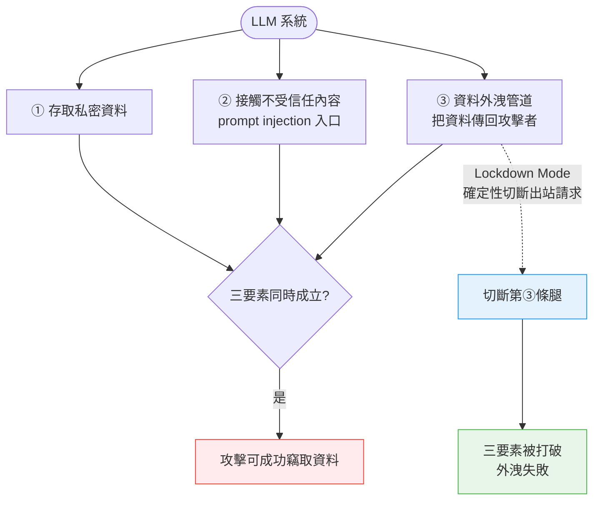
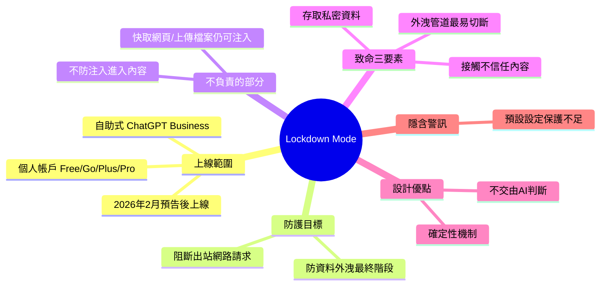

## OpenAI Help: Lockdown Mode

OpenAI 推出 Lockdown Mode，現已上線供個人帳戶（Free/Go/Plus/Pro）及自服務 ChatGPT Business 帳戶使用。該功能限制出站網路請求，防止 prompt injection 攻擊的資料外洩階段。Simon Willison 分析指出，LLM 系統的「Lethal Trifecta」威脅包括：①訪問私密資料、②暴露不信任內容、③資料竊取管道。最務實的防禦是斷掉第三條腿（流出管道），因為這不需犧牲 LLM 功能。Lockdown Mode 使用確定性機制而非 AI 判斷，更難被規避，但其存在暗示 ChatGPT 預設設定對資料外洩攻擊缺乏強健保護。

### 重點
- Lockdown Mode 限制 ChatGPT 的出站網路請求，防止 prompt injection 攻擊的資料外洩階段
- "Lethal Trifecta" 框架：私密資料訪問 + 不信任內容暴露 + 資料竊取管道，最簡易防禦是限制流出而非 AI 判斷
- Lockdown Mode 用確定性規則而非 AI 評估，提升規避難度，但暗示 ChatGPT 預設設定未提供強健防護

**原文：** [simon-willison](https://simonwillison.net/2026/Jun/5/openai-help-lockdown-mode/#atom-everything)

---

<!-- deep-analysis:begin -->
## 📌 摘要 (TL;DR)

- OpenAI 正式上線 **Lockdown Mode**，2026 年 2 月首次預告後，現已推送給符合資格的個人帳戶（Free、Go、Plus、Pro）以及自助式（self-serve）ChatGPT Business 帳戶。
- 功能核心：透過限制 ChatGPT 的出站網路請求（outbound network requests），阻斷提示注入攻擊（prompt injection）的最後一個階段——把敏感資料傳回攻擊者手中的資料外洩（data exfiltration）。
- 重要限制：Lockdown Mode **不會**阻止提示注入本身出現在 ChatGPT 處理的內容中（例如快取網頁、上傳檔案），仍可能影響回應的行為或正確性。
- Simon Willison 的評價是「This looks really good to me」，因為它正面打擊了他提出的「致命三要素」（Lethal Trifecta）中最該被切斷的一條腿。
- 關鍵設計優點：它採用確定性（deterministic）機制，且**不交由 AI 判斷**——因此不會被足夠刁鑽的攻擊反過來規避。
- 反向訊號：這項功能的存在，等於暗示 ChatGPT 在預設設定下，對足夠執著的資料外洩攻擊並不具備強健保護。

## 🎯 核心概念

- **致命三要素（Lethal Trifecta）**：Simon Willison 提出的威脅模型，指 LLM 系統同時具備三項條件時就會出現危險。
- **提示注入（prompt injection）**：攻擊者把惡意指令藏進 LLM 會讀到的內容裡，操控其行為。
- **資料外洩（data exfiltration）**：攻擊鏈的最後一步，把竊得的私密資料透過某個管道傳回攻擊者。

## 📖 整理分析

### 1. Lockdown Mode 上線範圍
OpenAI 早在 2026 年 2 月就預告此功能，如今正式「rolling out」。涵蓋對象包含個人帳戶四個層級——Free、Go、Plus、Pro——以及自助式 ChatGPT Business 帳戶。定位是一個安全強化開關，專門收斂 ChatGPT 對外的網路行為。

### 2. 它防什麼、不防什麼
根據官方說明，Lockdown Mode 的目標是阻止提示注入攻擊「最終階段」的資料外洩，做法是限制可能把敏感資料送往攻擊者的出站網路請求。但 OpenAI 明確指出它**不**防止提示注入出現在被處理的內容中：注入指令仍可能藏在快取網頁內容或上傳檔案裡，並影響回應的行為或準確度。換言之，它防的是「把資料送出去」，不是「不被騙」。

### 3. 致命三要素與唯一解法
Simon Willison 指出，當一個 LLM 系統同時擁有三件事時，致命三要素就成立：(1) 能存取私密資料、(2) 會接觸不受信任的內容、(3) 存在把資料偷出並傳回攻擊者的管道。他主張解開三要素的唯一方法就是切斷其中一條腿，而**最容易、又不會大幅削弱 LLM 實用性**的那條腿，正是資料外洩的傳輸向量（exfiltration vectors）。

### 4. 為何「確定性、不靠 AI」是關鍵
Simon 認為 Lockdown Mode 正是直接攻擊外洩這條腿，而且關鍵在於它使用的是確定性機制，**不由 AI 系統來評估判斷**。因為任何交由 AI 判斷的防線，本身都可能被足夠狡猾的攻擊（sufficiently devious attacks）顛覆；確定性的網路請求限制則沒有這個弱點，更難被繞過。

### 5. 隱含的警訊
他同時提出一個耐人尋味的推論：Lockdown Mode 既然需要存在，就意味著 ChatGPT 在預設設定下，對「足夠執著的資料外洩攻擊」並沒有提供強健保護。這既是對新功能的肯定，也是對預設安全基線的提醒。

## 🧭 流程圖 / 架構圖

致命三要素與 Lockdown Mode 切斷的那條腿：

## 🧠 Mindmap

<!-- deep-analysis:end -->
### 📄 原文內容

點此展開 / 收合

OpenAI Help: Lockdown Mode 
OpenAI first teased this in February , but now it's live and "rolling out to eligible personal accounts, including Free, Go, Plus, and Pro, and self-serve ChatGPT Business accounts": 
 
 Lockdown Mode is designed to help prevent the final stage of data exfiltration from a prompt injection attack by limiting outbound network requests that could transfer sensitive data to an attacker. Lockdown Mode does not prevent prompt injections from appearing in the content ChatGPT processes. For example, a prompt injection could appear in cached web content or in an uploaded file, and could still affect the behavior or accuracy of a response. 
 
 This looks really good to me. 
 The Lethal Trifecta occurs when an LLM system has access to all three of access to private data, exposure to untrusted content and a way to steal data and transmit it back to the attacker. 
 The only way to solve the trifecta is to cut off one of the three legs, and by far the easiest leg to restrict without making your LLM systems far less useful is the exfiltration vectors to steal data. 
 It looks to me like lockdown mode directly attacks that leg, using mechanisms that are deterministic and, crucially, are not evaluated by AI systems that themselves can be subverted by sufficiently devious attacks. 
 The existence of lockdown mode does however imply that ChatGPT, in its default settings, does not provide robust protection against sufficiently determined data exfiltration attacks!

 Tags: security , ai , openai , prompt-injection , llms , lethal-trifecta

