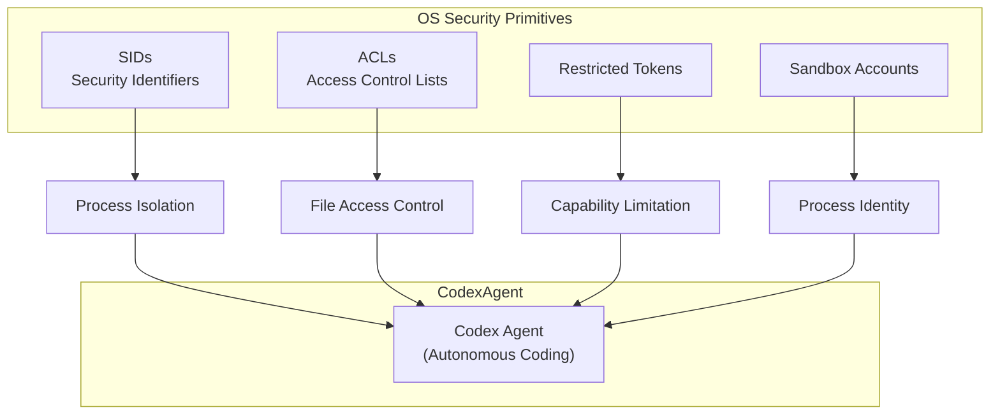

## How OpenAI Built a Secure Windows Sandbox for Codex Agents

OpenAI 詳細介紹了 Codex 在 Windows 環境中的沙箱架構設計，展示了如何用 OS 級別的安全原語來安全執行自主編程代理。該設計使用了四層關鍵機制：SIDs（安全標識符）、ACLs（訪問控制列表）、restricted tokens（受限令牌）和 sandbox accounts（沙箱賬戶），每層都負責不同的隔離維度。設計的精妙之處在於平衡了隔離性和真實開發者工作流，避免了過度限制導致代理無法執行有意義的編程任務。這篇文章展現了 OS 安全原語如何組合才能為 AI agents 提供實用的安全框架。

### 重點
- Codex Windows 沙箱使用 SIDs、ACLs、restricted tokens、sandbox accounts 四層 OS 控制機制
- 平衡隔離性和開發者體驗，避免過度限制導致代理功能受損
- 展示 OS 安全原語組合設計如何支持 AI agents 在本地開發環境中的安全運行

**原文：** [infoq-architecture](https://www.infoq.com/news/2026/06/codex-windows-sandbox-design/?utm_campaign=infoq_content&utm_source=infoq&utm_medium=feed&utm_term=Architecture+%26+Design)

---

### 📄 原文內容

點此展開 / 收合

OpenAI details Codex Windows sandbox architecture, showing how SIDs, ACLs, restricted tokens, and dedicated sandbox accounts enable safe execution of autonomous coding tasks. The design balances isolation with real developer workflows and shows how OS security primitives must be composed for AI agents on local development environments. By Leela Kumili

