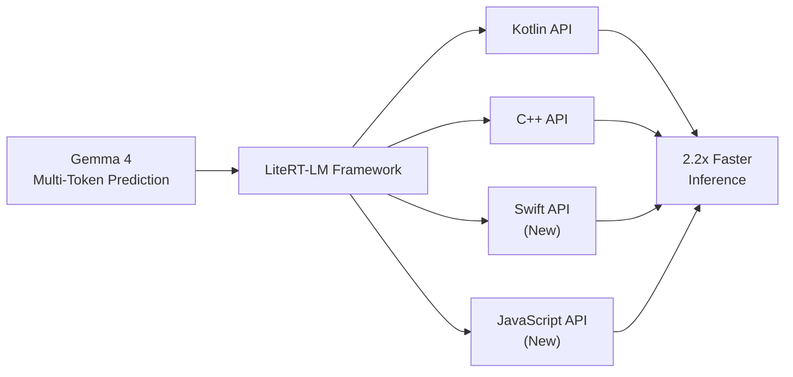

## Google LiteRT-LM Speeds Up Local Inference Up to 2.2x With Gemma 4 Multi-Token Prediction

Google 的 LiteRT-LM 框架現已新增原生支援 Gemma 4 Multi-Token Prediction（多令牌預測）功能，使本地推理速度最高提升 2.2 倍。這個性能提升來自於多令牌預測技術——在單次推理中預測多個令牌，減少往返次數。框架同時擴展 API 支援範圍，除了原有的 Kotlin 和 C++ 外，新增了 Swift 和 JavaScript APIs，讓更多平台的開發者能部署高效的本地推理。這個更新對離線 AI 應用和邊界設備上的推理特別有意義。

### 重點
- Gemma 4 Multi-Token Prediction 將 LiteRT-LM 推理速度提升 2.2 倍
- API 平台擴展：新增 Swift 和 JavaScript，支援 Kotlin、C++、Swift、JavaScript 四大平台
- 多令牌預測減少推理往返次數，特別適合邊界設備和離線應用場景

**原文：** [infoq-ai-ml](https://www.infoq.com/news/2026/06/google-litertlm-gemma4/?utm_campaign=infoq_content&utm_source=infoq&utm_medium=feed&utm_term=AI%2C+ML+%26+Data+Engineering)

---

### 📄 原文內容

點此展開 / 收合

LiteRT-LM brings native support for Gemma 4 Multi-Token Prediction (MTP) drafters, enabling up to 2.2x faster inference. The framework is expanding beyond Kotlin and C++ adding support for new Swift and a JavaScript APIs. By Sergio De Simone

