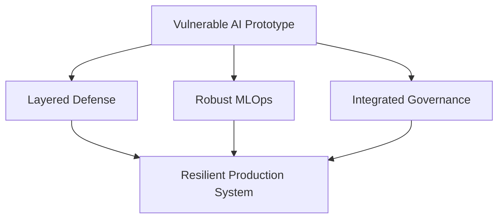

## Article Series: Securing the AI Stack: From Model to Production

這個系列文章由 Claudio Masolo 撰寫，提供了從易受攻擊的 AI 原型演進到有韌性生產系統的完整路線圖。內容架構涵蓋三大支柱：layered defense（多層次防禦策略）、robust MLOps（可靠的機器學習運營）和 integrated governance（整合的治理框架）。該系列強調了防禦需要跨越模型、訓練、部署和運營等多個層面的一致性設計。這是從「機器學習的美好願景」走向「機器學習的實際責任」的必經之路。

### 重點
- 三層防禦支柱：分層防禦（layered defense）、可靠 MLOps、整合治理跨越模型到運營
- 系列提供完整路線圖從原型到生產系統的安全架構演進
- 強調防禦一致性設計的必要性，避免單點薄弱環節

**原文：** [infoq-ai-ml](https://www.infoq.com/articles/secure-ai-stack-model-production-series/?utm_campaign=infoq_content&utm_source=infoq&utm_medium=feed&utm_term=AI%2C+ML+%26+Data+Engineering)

---

### 📄 原文內容

點此展開 / 收合

This series provides your roadmap for the machine age, exploring how to move from vulnerable prototypes to resilient systems through layered defense, robust MLOps, and integrated governance. By Claudio Masolo

