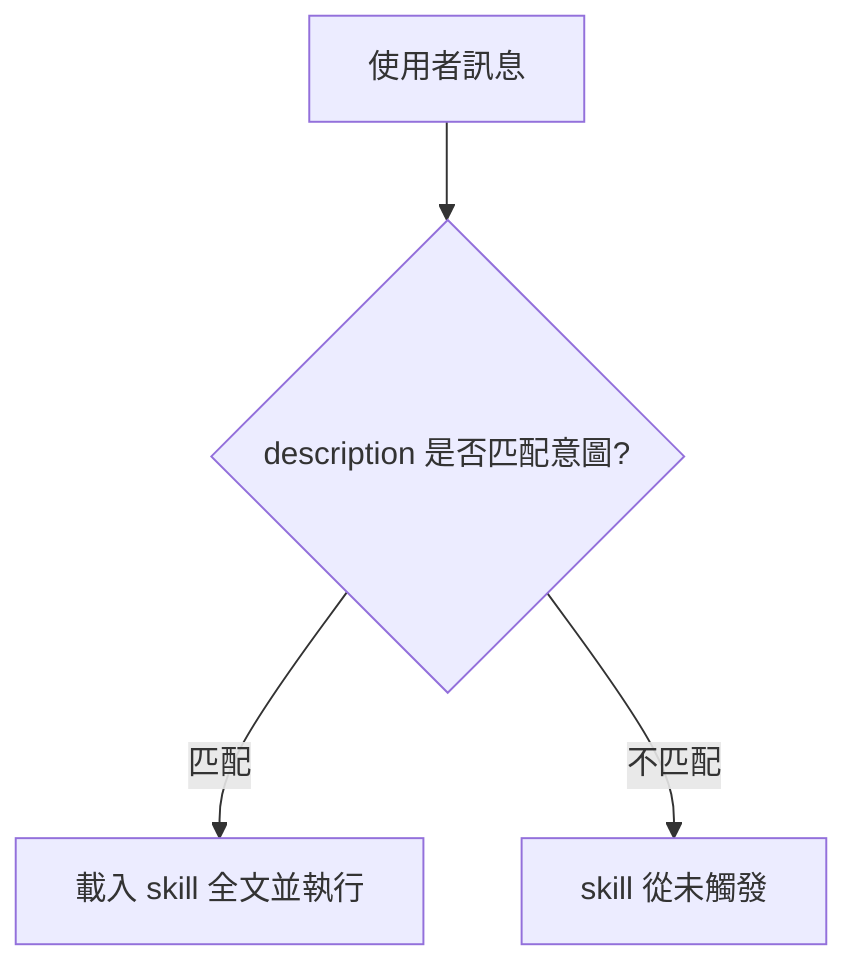
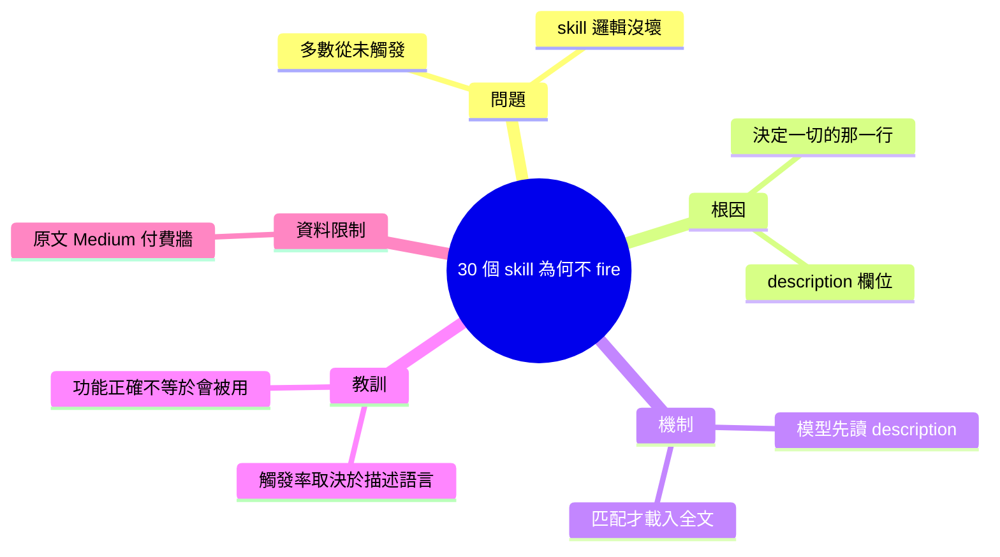

## I wrote 30 Claude Code skills before I understood why most of them never fired

作者撰寫了 30 個 Claude Code skills 後發現大多從未被觸發，經檢查發現問題不在 skill 邏輯本身，而在決定觸發的「那一行」（trigger 定義語言）。這揭示一個關鍵設計原則：Claude Code skills 的執行率完全取決於 trigger 語言的精確度與匹配性，遠勝於底層功能的正確性。開發者應優先投入精力設計 trigger 語句而非堆砌功能。該經驗教訓跨越多個失敗案例，形成了可重用的設計模式。

### 重點
- Trigger 語言定義（那「決定一切的一行」）是 Claude Code skill 是否被執行的決定因素，遠重於功能正確性
- 30 個編寫完成的 skills 中大多失敗的根本原因在 trigger，而非邏輯缺陷
- Skill 開發應從 trigger 設計開始，這是最高槓桿率的改進點

**原文：** [medium-tag-claude](https://pub.towardsai.net/i-wrote-30-claude-code-skills-before-i-understood-why-most-of-them-never-fired-78ee8fe1381c?source=rss------claude-5)

---

<!-- deep-analysis:begin -->
## 📌 摘要 (TL;DR)

- 作者寫了 30 個 Claude Code skills，卻發現「大多數從未被觸發」；問題不在 skill 的功能邏輯，而在決定是否啟動的那一行（原文副標："The skill wasn't broken. The one line that decides everything was."）。
- 在 Claude Code 的 skill 機制裡，「那一行」對應的是 SKILL.md frontmatter 的 `description` 欄位——模型靠它判斷使用者意圖是否匹配，匹配失敗 skill 就不會載入。
- 核心教訓：skill 的觸發率取決於 description / trigger 的描述精確度，而非底層功能寫得多好。
- 實務啟示：開發 skill 應優先投資「描述語言」，寫清楚「何時該用」與觸發關鍵字，遠比堆疊功能重要。
- ⚠️ 資料限制：原文為 Towards AI（Medium）登入／付費牆文章，抓取時陷入轉址迴圈，無法取得完整內文。以下依標題、副標題與 Claude Code skill 觸發機制的公開知識整理，不含原文未證實的細節（如具體 skill 名稱、數據、前後對照範例）。

## 🎯 核心概念

- **技能描述欄位**（description）：SKILL.md frontmatter 裡的一行說明，定義「這個 skill 在什麼情況該被使用」，是觸發判斷的主要依據。
- **觸發語言**（trigger / triggering）：description 中描述使用情境與關鍵字的措辭，決定模型是否把使用者請求對應到該 skill。

## 📖 整理分析

### 1. 問題：skill 沒壞，卻不啟動
原文核心主張（依標題＋副標）：作者累積了 30 個 skill，多數從未 fire。逐一檢查後發現 skill 內部邏輯沒問題，真正失效的是「決定一切的那一行」。

### 2. 「那一行」指的是什麼
依 Claude Code 的公開機制：模型不會先讀完每個 skill 的全文，而是先讀 description。若描述沒涵蓋使用者真正會說的話與情境，模型就不會載入該 skill——功能再完整也等同不存在。

### 3. 設計重心要前移（推論）
基於上述機制可推得：與其不斷加功能，更該把心力放在描述語言——寫明觸發時機、列出使用者可能的說法與關鍵字、避免描述過窄或過於抽象。此為依機制延伸的推論，非原文逐字內容。

### 4. 可重用的教訓
作者將多次失敗收斂成一個原則：skill 的執行率約等於「描述匹配度」，而非「功能正確度」。這對任何要撰寫 skill 的人都通用。

## 🧭 觸發流程圖

## 🧠 Mindmap

<!-- deep-analysis:end -->
### 📄 原文內容

點此展開 / 收合

The skill wasn&#x2019;t broken. The one line that decides everything was. Continue reading on Towards AI »

