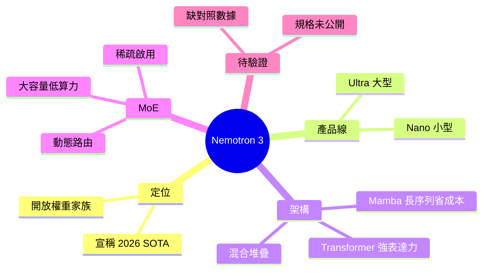

## NVIDIA Nemotron 3: The SOTA Open-Weight AI Model Family of 2026

NVIDIA 發布 Nemotron 3 開源模型家族，採用混合 Mamba-Transformer 架構與 MoE（專家混合）機制，涵蓋 Nano 到 Ultra 等多個規模。該模型系列聲稱達到開源 AI 模型中最高效率。Mamba 融合自注意力機制與線性狀態空間模型優點，MoE 實現動態路由以提升效率。相較於單一 Transformer 或 Mamba，混合架構在推理成本與模型容量間達到更優平衡。

### 重點
- Nemotron 3 採用 Mamba-Transformer 混合 + MoE，多規模覆蓋（Nano~Ultra）
- 開源模型宣稱效率業界最優，優化推理成本與模型參數間的權衡
- Mamba 狀態空間模型結合自注意力，降低推理延遲

**原文：** [medium-tag-llm](https://medium.com/@ffguci8/nvidia-nemotron-3-the-sota-open-weight-ai-model-family-of-2026-4612ae7aefb4?source=rss------large_language_models-5)

---

<!-- deep-analysis:begin -->
## 📌 摘要 (TL;DR)

> ⚠️ **來源限制**：本則為 Medium RSS 預覽，原文全文被付費牆阻擋，僅取得標題與一句導言。以下整理只涵蓋來源中**確實出現**的論點，並補充 Mamba／MoE 等公開技術背景；不含原文未提供的 benchmark 數字、參數量或版本細節。

- NVIDIA 推出開放權重（open-weight）模型家族 **Nemotron 3**，文章定位其為「2026 年最先進（SOTA）的開放權重 AI 模型家族」。
- 產品線從 **Nano 到 Ultra** 涵蓋多種規模，主打可依算力與部署需求選用不同尺寸。
- 核心賣點是**混合 Mamba-Transformer 架構**搭配**專家混合（Mixture of Experts，簡稱 MoE）**，作者宣稱藉此成為「全世界最有效率的開放權重家族」。
- 訴求重點在「效率」——在推理成本與模型容量之間取得比純 Transformer 或純 Mamba 更好的平衡。
- 由於原文內容未公開，上述「最有效率／SOTA」屬作者宣稱，**缺乏可驗證的對比數據**，閱讀時宜保留。

## 🎯 核心概念

- **狀態空間模型**（State Space Model，Mamba 的基礎）：序列長度上接近線性複雜度，記憶體與運算隨上下文長度增長較緩，擅長長序列。
- **自注意力**（self-attention，Transformer 核心）：對序列做兩兩比對，表達力強但複雜度約為序列長度的平方，長上下文成本高。
- **混合 Mamba-Transformer**：把上述兩者交錯堆疊，兼顧 Mamba 的低成本長序列處理與 Transformer 的強表達力。
- **專家混合（Mixture of Experts，MoE）**：模型內含多個「專家」子網路，由路由器（router）對每個 token 動態挑選少數專家啟用，總參數大但每次推理只活化一部分，提升效率。
- **開放權重（open-weight）**：模型權重公開可下載自行部署，但不必然附完整訓練資料或訓練程式碼。

## 📖 整理分析

### 1. 一條從 Nano 到 Ultra 的產品線
來源導言點出 Nemotron 3 是一個「家族」而非單一模型，規模橫跨 Nano（小型、邊緣／低成本場景）到 Ultra（大型、高能力）。這種分級命名讓使用者依硬體與延遲預算選型。原文未列出各尺寸的具體參數量或對應硬體，故此處不補數字。

### 2. 為什麼選混合架構而非純 Transformer
純 Transformer 的自注意力在長上下文下成本隨序列長度平方上升；純 Mamba 雖然在長序列上更省，但在某些需要精細 token 互動的任務上表達力較受限。文章主張把兩者**混合堆疊**，用 Mamba 層承擔大部分序列處理、用 Transformer 層補強表達力，藉此壓低推理成本同時維持品質。這是該模型「效率」訴求的架構基礎。

### 3. MoE 如何貢獻效率
在混合骨幹之上再加 MoE：每個 token 經路由器只啟用少數專家，讓模型「總容量大、單次計算小」。如此可在不等比放大推理成本的前提下擴張參數規模，呼應作者「最有效率開放權重家族」的說法。原文未說明專家數量、啟用比例或路由策略細節。

### 4. 「SOTA／最有效率」宣稱需保留判讀
標題與導言反覆使用「SOTA」「most efficient in the world」等強烈措辭，但預覽中**沒有任何對照組、評測集或數據**支撐。在原文全文或 NVIDIA 官方技術報告可取得前，這些屬行銷／作者宣稱層級，建議讀者待具體 benchmark（如推理吞吐、同尺寸模型品質對比）公布後再下結論。

## 🧠 Mindmap

<!-- deep-analysis:end -->
### 📄 原文內容

點此展開 / 收合

From Nano to Ultra &#x2014; how NVIDIA&#x2019;s hybrid Mamba-Transformer MoE stack became the most efficient open-weight AI family in the world Continue reading on Medium »

