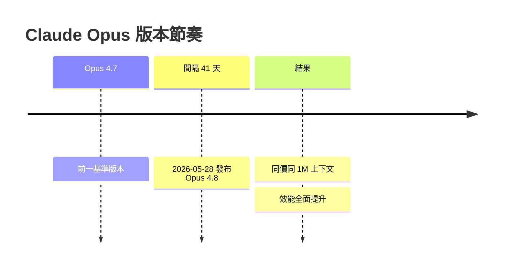
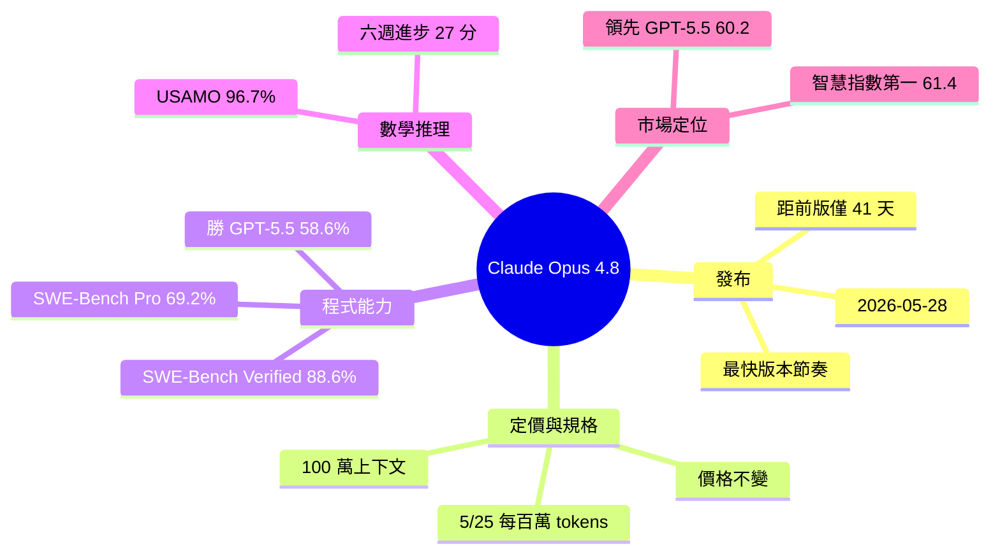

## Claude Opus 4.8: The AI Model That Just Changed the Rules for Builders and Engineers

Anthropic 於 2026 年 5 月 28 日發布 Claude Opus 4.8，距上一版本 4.7 僅 41 天，創造了該公司最快版本週期。新模型保持相同定價（每百萬 tokens 5/25 美元）和 100 萬 token 上下文窗口，但架構完全重新設計。在 SWE-Bench Pro 測試中，Opus 4.8 達 69.2%（前版本 64.3%），在數學競賽 USAMO 2026 上達 96.7%（前版本 69.3%），六週內提升 27 個百分點。Artificial Analysis 排行榜將其列為第一名（61.4 分），超越 GPT-5.5（60.2 分）。在代理編碼任務上，Opus 4.8 的 SWE-Bench Verified 成績為 88.6%，明顯優於 GPT-5.5 的 58.6%。

### 重點
- Claude Opus 4.8：5 月 28 日發布，41 天內迭代，保持 $5/$25 定價，整體架構升級
- SWE-Bench Pro：69.2%（↑ 4.9pp），SWE-Bench Verified：88.6%，USAMO 2026：96.7%（↑ 27pp）
- 超越 GPT-5.5：Artificial Analysis 61.4 vs 60.2，代理編碼任務 88.6% vs 58.6%

**原文：** [medium-tag-llm](https://medium.com/@nareshkukkala/claude-opus-4-8-the-ai-model-that-just-changed-the-rules-for-builders-and-engineers-8ef6181f3d65?source=rss------large_language_models-5)

---

<!-- deep-analysis:begin -->
## 📌 摘要 (TL;DR)

- Anthropic 於 2026 年 5 月 28 日發布 Claude Opus 4.8，距前一版 Opus 4.7 僅 41 天，文章稱這是該公司史上最快的版本節奏。
- 定價維持每百萬 tokens $5 / $25（輸入/輸出），上下文窗口維持 100 萬 tokens，效能提升卻「沒漲一塊錢」。
- 程式基準 SWE-Bench Pro 拿下 69.2%（前版 64.3%）；SWE-Bench Verified 達 88.6%。
- 數學競賽 USAMO 2026 從 Opus 4.7 的 69.3% 跳到 96.7%，六週內進步 27 個百分點。
- Artificial Analysis 智慧指數排名第一（61.4），領先 GPT-5.5（60.2）；在同一個 SWE-Bench Pro 測試上 GPT-5.5 僅 58.6%。
- 對 builder 與工程師而言，核心訊號是「同價更強」改變了模型選型的成本計算。

## 🎯 核心概念

- **SWE-Bench**：評估 AI 解決真實 GitHub issue（程式修補）能力的基準，Pro 與 Verified 是不同難度與驗證方式的子集。
- **USAMO**：美國數學奧林匹亞，用來測試模型的高階數學推理。
- **智慧指數**（Artificial Analysis Intelligence Index）：第三方綜合評測榜，把多項基準合成單一分數做跨模型排名。
- **版本節奏**（version cadence）：兩次模型版本之間的間隔，41 天為 Anthropic 目前最短紀錄。
- **上下文窗口**（context window）：單次請求可處理的 token 上限，此版維持 100 萬。

## 📖 整理分析

### 1. 41 天的最快版本節奏
文章主張 Opus 4.8 在 Opus 4.7 發布後僅 41 天推出，是 Anthropic 跑過最快的版本週期。對使用者的訊號是更新頻率正在加速，模型選型不再是一次性的長期決定。

### 2. 同價更強：定價與上下文不變
新版維持每百萬 tokens $5 / $25 的定價與 100 萬 token 上下文窗口，文章反覆強調「沒有漲一塊錢」。在成本不變下效能跳升，等於每塊錢買到更多智慧。

### 3. 程式能力：SWE-Bench 全面提升
SWE-Bench Pro 從 64.3% 提升到 69.2%，SWE-Bench Verified 達 88.6%。在同一個 Pro 測試上 GPT-5.5 僅 58.6%，差距逾 10 個百分點，文章以此凸顯 Opus 4.8 在代理式編碼（agentic coding）的領先。

### 4. 數學推理：六週進步 27 分
USAMO 2026 分數從 Opus 4.7 的 69.3% 躍升至 Opus 4.8 的 96.7%，六週內增加 27 個百分點。這種大幅跳升反映高階推理能力的快速迭代。

### 5. 綜合榜首：超越 GPT-5.5
Artificial Analysis 智慧指數把 Opus 4.8 列為第一（61.4），領先 GPT-5.5（60.2）。文章將這個排名定位為 builder 與工程師選型時的關鍵依據。

## 🧭 流程圖 / 架構圖

原文為 RSS 截斷、無圖片可引用。以下用文字表格整理文章提到的基準對比（「—」表示原文未提供該數值）：

| 基準 | Opus 4.7 | Opus 4.8 | GPT-5.5 |
|---|---|---|---|
| SWE-Bench Pro | 64.3% | 69.2% | 58.6% |
| SWE-Bench Verified | — | 88.6% | — |
| USAMO 2026（數學） | 69.3% | 96.7% | — |
| Artificial Analysis 指數 | — | 61.4（第 1） | 60.2 |

## 🧠 Mindmap

<!-- deep-analysis:end -->
### 📄 原文內容

點此展開 / 收合

There&#x2019;s a release cycle happening in AI that most people aren&#x2019;t tracking closely enough. Continue reading on Medium »

