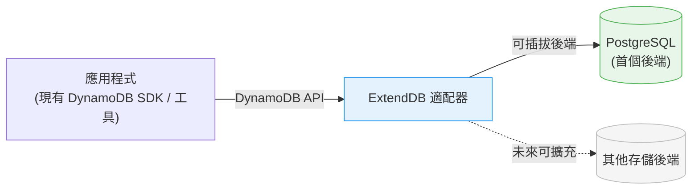
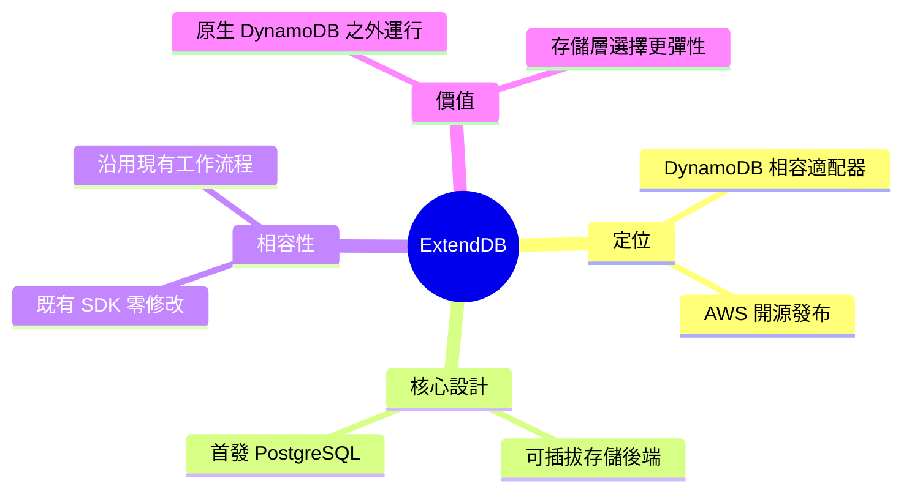

## ExtendDB: Open Source Amazon DynamoDB Compatible Adapter with Pluggable Storage Backends

AWS 正式宣佈開源 ExtendDB，一個與 DynamoDB API 完全相容的適配器。ExtendDB 的核心創新在於支援插件式存儲後端，首個支援 PostgreSQL，讓團隊能用 DynamoDB API 搭配非 AWS 的數據庫。現有的 DynamoDB SDK 和工具可以無需修改就直接運作，這意味著應用從原生 DynamoDB 遷移到 ExtendDB 時零代碼改動。ExtendDB 的開源發佈讓組織獲得更大的靈活性，能在成本、部署地點或合規需求的約束下選擇合適的存儲層。這對正在多雲或混合雲環境中尋求 DynamoDB 相容方案的企業特別有價值。

### 重點
- 支援 DynamoDB API + PostgreSQL 等插件式存儲後端，現有 SDK 無需修改
- 零代碼遷移成本，降低鎖定風險
- AWS 開源項目，適用多雲/混合雲部署場景

**原文：** [infoq-main](https://www.infoq.com/news/2026/06/extenddb-dynamodb-adapter/?utm_campaign=infoq_content&utm_source=infoq&utm_medium=feed&utm_term=global)

---

<!-- deep-analysis:begin -->
## 📌 摘要 (TL;DR)

- AWS 發布開源專案 **ExtendDB**，一個與 Amazon DynamoDB API 相容的適配器（adapter），由 InfoQ 作者 Renato Losio 報導。
- 核心特色是**可插拔的存儲後端**（pluggable storage backends），首個支援的後端為 PostgreSQL，讓 DynamoDB 風格的工作負載可運行在原生 DynamoDB 之外。
- 現有的 DynamoDB SDK 與工具**無需修改**即可運作，沿用既有應用程式與工作流程。
- 對想在原生 DynamoDB 以外（如自管 PostgreSQL）跑 DynamoDB API 的團隊，提供更高的存儲層選擇彈性。

## 🎯 核心概念

- **適配器（adapter）**：在應用與底層資料庫之間提供一層轉譯，使呼叫端維持 DynamoDB API 介面。
- **可插拔存儲後端（pluggable storage backends）**：底層資料庫可替換的設計，ExtendDB 目前以 PostgreSQL 作為首個後端。
- **API 相容（API compatibility）**：讓既有 DynamoDB SDK 與工具不必改寫即可沿用。

## 📖 整理分析

### 1. ExtendDB 是什麼
AWS 發布的 ExtendDB 是一個與 DynamoDB API 相容的適配器。它的定位不是另一個資料庫，而是讓開發者沿用 DynamoDB 的 API，但把實際資料落地到不同的存儲後端。

### 2. 可插拔後端，首發 PostgreSQL
根據報導，ExtendDB 的關鍵設計是支援多種可插拔的存儲後端，並以 PostgreSQL 作為起點。這代表團隊能用熟悉的 DynamoDB 介面，搭配 PostgreSQL 作為底層儲存。

### 3. 既有 SDK 與工具零修改
報導指出，ExtendDB 支援既有的 SDK 與工具而無需修改。對已經建立在 DynamoDB 之上的應用與工作流程而言，這降低了切換到不同存儲層的改動成本。

### 4. 對團隊的意義
ExtendDB 讓團隊能在原生 DynamoDB 之外運行 DynamoDB 風格的工作負載，同時保持與目前應用的相容性，提供存儲層選擇上的更大彈性。

> 註：本文原始來源（InfoQ 新聞稿）篇幅精簡，未提供效能數據、版本號或具體 benchmark；上述內容僅依報導所述事實整理，未額外推測。

## 🧭 架構圖

## 🧠 Mindmap

<!-- deep-analysis:end -->
### 📄 原文內容

點此展開 / 收合

AWS recently announced ExtendDB, a DynamoDB-compatible adapter that lets developers use the DynamoDB API with different storage backends, starting with PostgreSQL. The project supports existing SDKs and tools without modification, giving teams greater flexibility to run DynamoDB-style workloads outside of native DynamoDB while maintaining compatibility with current applications and workflows. By Renato Losio

