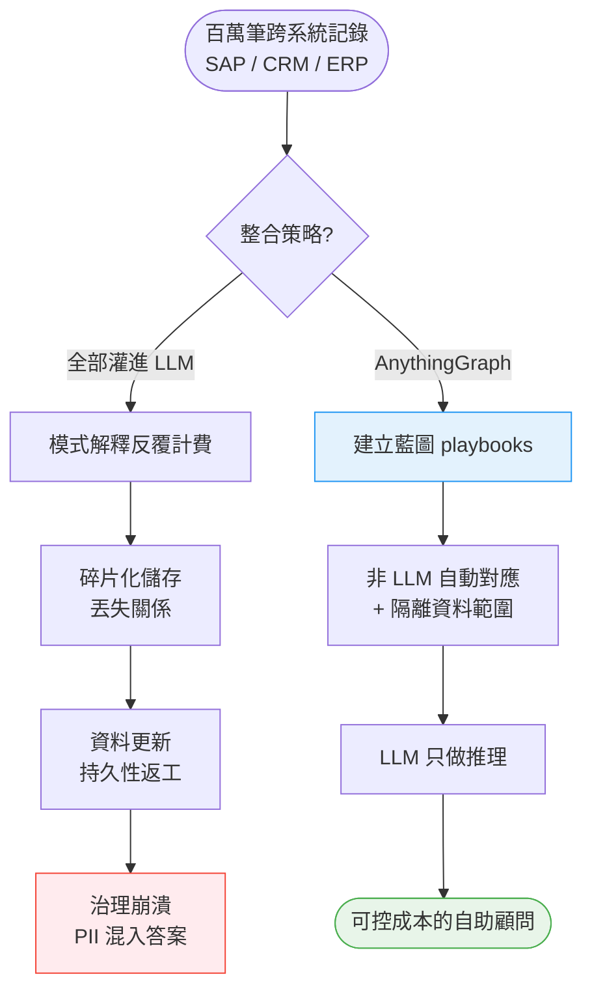
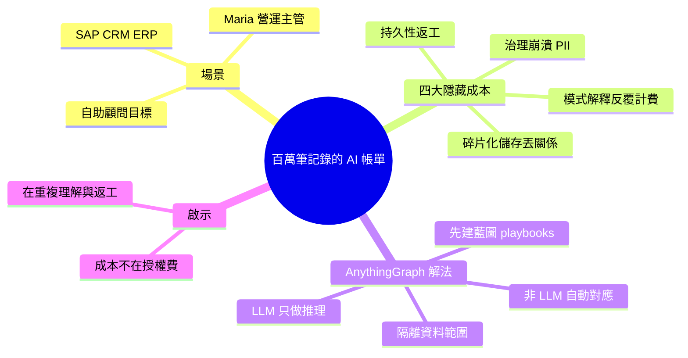

## She Had a Million Records. The AI Bill Was Just Getting Started.

文章以 Maria 為例，說明中型企業在 AI 整合中面臨的隱藏成本。Maria 在企業系統（SAP、CRM、ERP）中存有百萬筆記錄，嘗試將其載入 AI 系統以構建自助顧問。第一項成本是「模式解釋」：LLM 需反覆重讀跨系統的混亂資料（欄位名稱不一致），每次理解都要計費。第二項成本是「碎片化知識儲存」：將列轉換為可搜尋的文字塊會喪失關鍵的層級與存取控制關係。第三項成本是「持久性返工」：每次資料更新（如 98 萬→ 102 萬筆）都需重新嵌入與重新測試提示。第四項成本是「治理崩潰」：整合所有組織資料到單一系統會造成安全風險，財務、人資與客戶 PII 可能混入同一份答案。AnythingGraph 的解決方案是先建立藍圖（playbooks），用非 LLM 機制自動化對應，隔離資料範圍，保留昂貴的語言模型僅供推理。

### 重點
- 四層成本陷阱：模式解釋、碎片化儲存、持續返工、治理崩潰，每層都會產生重複的 token 消耗
- 每次資料更新都需重新嵌入與測試，1% 的資料增幅也會引發數週工作量，成本結構類似每週重新聘請顧問
- 正確做法：先定義藍圖 → 非 LLM 自動對應 → 資料隔離 → 僅用 LLM 做推理，而非讓 AI 當資料架構師

**原文：** [medium-tag-claude](https://medium.com/@anythinggraph/she-had-a-million-records-the-ai-bill-was-just-getting-started-7a33c4fb9fcf?source=rss------claude-5)

---

<!-- deep-analysis:begin -->
## 📌 摘要 (TL;DR)

- 文章以中型企業營運主管 Maria 為主角：她的「真相」散落在 SAP 訂單、CRM 聯絡人、ERP 等系統，共約百萬筆記錄，想把它們餵進 AI 打造自助式顧問。
- 真正的帳單不在模型授權費，而在四項隱藏成本：模式解釋（schema interpretation）、碎片化知識儲存、持久性返工、治理崩潰。
- 第一項成本：大型語言模型（LLM）必須反覆重讀跨系統、欄位命名不一致的混亂資料，每一次「理解」都要計費。
- 第三項成本最隱形：每當資料更新（例如從 98 萬筆增至 102 萬筆），就得重新嵌入（embedding）並重新測試提示（prompt）。
- AnythingGraph 的解法是先建立藍圖（playbooks），用非 LLM 機制自動化對應與隔離資料範圍，把昂貴的語言模型只留給「推理」這一步。

## 🎯 核心概念

- **模式解釋**（schema interpretation）：LLM 為了搞懂各系統不一致的欄位命名，反覆重讀結構，每次都產生 token 費用。
- **碎片化知識儲存**：把資料表的「列」拆成可搜尋的文字塊（chunk）時，會丟失層級關係與存取控制關係。
- **嵌入**（embedding）：把文字轉成向量以供語意搜尋；資料一變動就得重算。
- **治理崩潰**（governance collapse）：把全組織資料灌進單一系統，導致財務、人資、客戶個資（PII）可能混進同一個答案。
- **藍圖**（playbooks）：預先定義好的對應規則，讓自動化由非 LLM 機制執行。

## 📖 整理分析

### 1. 散落各系統的百萬筆真相
Maria 是中型企業的營運主管，多年累積的「真相」分散在 SAP 訂單、CRM 聯絡人、ERP 等系統，總計約百萬筆記錄。她的目標是把這些資料載入 AI，打造一個能自助回答問題的顧問。問題是：把資料倒進 LLM 的那一刻起，帳單才剛開始跳表。

### 2. 成本一：模式解釋的反覆計費
各系統的欄位命名並不一致（同一個概念在 SAP、CRM、ERP 可能叫不同名字）。LLM 每次處理都得重新「讀懂」這套混亂結構，而這種理解動作本身就會消耗 token、產生費用。資料越雜，模型重複解釋的成本越高。

### 3. 成本二：碎片化知識儲存丟失關係
要讓資料可被語意搜尋，常見做法是把資料表的列轉成一段段文字塊。但這個切割過程會丟掉關鍵的「層級關係」與「存取控制關係」——原本資料庫裡誰屬於誰、誰能看誰的結構被打散，答案因此可能失真或越權。

### 4. 成本三：持久性返工
資料不是一次性的。每當底層記錄更新——文章舉例從 98 萬筆增加到 102 萬筆——就必須重新嵌入並重新測試提示。這是一條永遠跑不完的維護迴圈，也是最容易被忽略的長期成本。

### 5. 成本四：治理崩潰
為了讓 AI 無所不答，最直覺的做法是把全組織資料整合進單一系統。但這會造成嚴重安全風險：財務數字、人資資料與客戶個資（PII）可能被混進同一份回覆，治理與權限邊界形同瓦解。

### 6. AnythingGraph 的解法
AnythingGraph 主張先建立藍圖（playbooks），用非 LLM 機制自動化欄位對應、並隔離資料的存取範圍，再把昂貴的語言模型保留給最後的「推理」環節。換句話說：對應與治理交給確定性的規則，模型只在真正需要思考時才出場，藉此壓低反覆計費與返工成本。

## 🧭 流程圖 / 架構圖

對比「直接灌進 LLM」與「AnythingGraph 藍圖優先」兩種路徑：

## 🧠 Mindmap

<!-- deep-analysis:end -->
### 📄 原文內容

點此展開 / 收合

Imagine Maria, head of operations at a mid-size company. She has years of truth scattered everywhere &#x2014; SAP orders, CRM contacts, ERP&#x2026; Continue reading on Medium »

