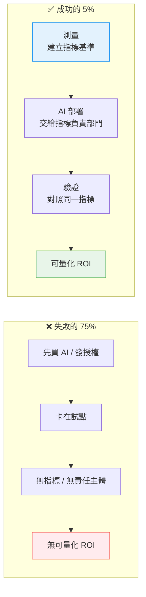
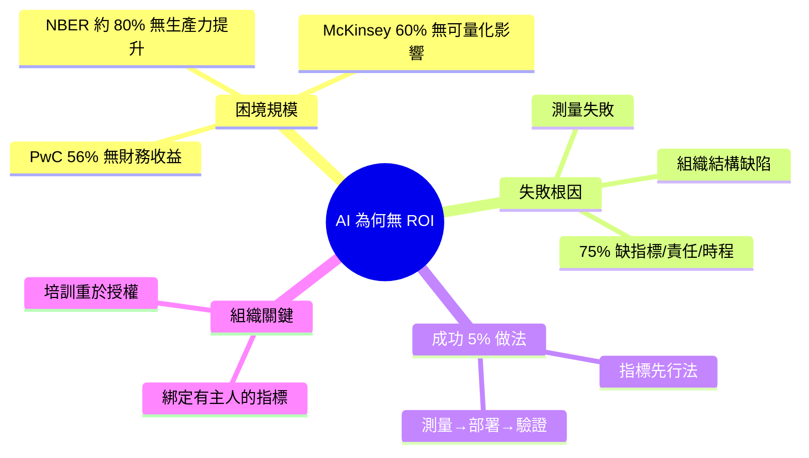

## Why 80% of companies see no ROI from AI

企業 AI 投資回報率困境的實證分析：56-80% 企業無法實現可量化的成效，原因並非 AI 本身無用，而在於測量失敗和組織結構缺陷。核心統計：PwC 56% 無財務收益、McKinsey 60% 無可量化影響、NBER 約 80% 無生產力提升。75% 失敗案例缺乏明確的成果指標、責任主體或超越試點的時程表。成功的 5% 則採用「指標先行法」（測量 → AI 部署 → 驗證），並由擁有關鍵指標的部門負責（銷售轉換率、內容成本、發布週期），同時結合人員培訓而非單純投入授權。

### 重點
- 80% 失敗的根本原因：成功 5% 採「指標先行」（先定義轉換率/成本/時間等商業指標，再部署 AI），而失敗的 80% 先部署、後期待；隱形成本（AI 花費埋沒在 SaaS 預算中）導致無法追蹤
- 隱性收益問題：56% 生產力提升發生在個人任務層級，90% 以上對管理層不可見（如員工把 12 小時工作縮短至 30 分鐘卻未被計入財務報表）
- 組織結構缺陷：HR/IT 管理 AI 部署但不擁有銷售轉換率、創意輸出品質等相關指標，導致領導層只看到成本無法看到收益；四階段成熟度模型，80% 停留在第 1 階段（臨時聊天），成功案例達到第 3-4 階段（商業智能和自主代理）

**原文：** [medium-tag-claude](https://medium.com/@artificialstudioAI/why-80-of-companies-see-no-roi-from-ai-9f1bd2c50f83?source=rss------claude-5)

---

<!-- deep-analysis:begin -->
## 📌 摘要 (TL;DR)

- 企業導入 AI 的比例創新高，但 **56–80% 的公司拿不到可量化的回報**——問題不在 AI 本身，而在「測量失敗」與「組織結構缺陷」。
- 三份研究互相印證困境：**PwC 指 56% 企業無財務收益**、**McKinsey 指 60% 無可量化影響**、**NBER 研究約 80% 看不到生產力提升**。
- **75% 的失敗案例**有共同特徵：沒有明確的成果指標、沒有負責的責任主體、也沒有「超越試點（pilot）」的時程表。
- 真正拿到價值的 **5% 採用「指標先行法」**：先建立測量基準 → 再部署 AI → 最後驗證成效，順序剛好相反於多數失敗者。
- 成功者把 AI 交給**「擁有關鍵指標」的部門**負責（如銷售轉換率、內容成本、發布週期），並**搭配人員培訓**，而不是單純買授權（license）發下去。

## 🎯 核心概念

- **指標先行法**（metrics-first approach）：先確立要改善的關鍵指標與基準值，再導入 AI，最後用同一指標驗證，形成「測量 → 部署 → 驗證」閉環。
- **試點（pilot）**：小規模實驗階段；失敗企業常卡在這裡，缺乏推進到正式營運（production）的時程表。
- **投資回報率**（ROI, Return on Investment）：本文衡量 AI 成效的核心標準，多數企業無法把 AI 投入換算成可量化的財務或生產力數字。

## 📖 整理分析

### 1. 困境的規模有多大

本文用三組數據描繪 AI 投資回報的落差：**PwC 調查 56% 企業沒有財務收益**、**McKinsey 指 60% 沒有可量化影響**、**美國經濟研究局（NBER）研究約 80% 看不到生產力提升**。換句話說，AI 採用率雖在歷史高點，但能轉換成實際回報的只是少數，落差來自結果無法被測量。

### 2. 為什麼大多數企業失敗

作者強調：**失敗的根因不是 AI 無用，而是測量失敗與組織結構缺陷**。在失敗案例中，高達 **75% 同時缺三樣東西**——明確的成果指標、明確的責任主體、以及把專案推進到試點之後的時程表。沒有指標就無法證明價值，沒有負責人就沒人推動，沒有時程表就永遠停在實驗階段。

### 3. 成功的 5% 做了什麼

拿到價值的少數企業反其道而行，採用**「指標先行法」**：**先測量**現況基準、**再部署** AI、**最後驗證**是否真的改善了那個指標。這個順序確保每一筆 AI 投入都對應到一個可被檢驗的數字，而不是先買工具再回頭找用途。

### 4. 把 AI 綁定到「有主人的指標」

成功者不把 AI 當成 IT 的玩具，而是交給**實際擁有某個關鍵指標的業務部門**負責——例如銷售轉換率、內容生產成本、產品發布週期。指標有了主人，改善就有了動力與問責。

### 5. 培訓比授權更關鍵

本文指出，成功企業把資源投在**人員培訓**，而非單純發放軟體授權。買 license 只是給了工具，真正讓 ROI 兌現的是讓員工懂得把 AI 嵌進既有工作流程，改變實際的工作方式。

## 🧭 流程圖 / 架構圖

失敗者與成功者的根本差異，在於「測量」與「部署」的先後順序：

## 🧠 Mindmap

<!-- deep-analysis:end -->
### 📄 原文內容

點此展開 / 收合

AI adoption is at record highs but most companies see no measurable return. Here&#x2019;s what the 5% that actually gets value from AI is doing&#x2026; Continue reading on Medium »

