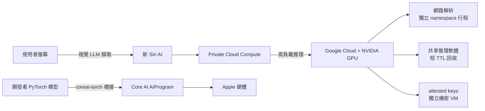
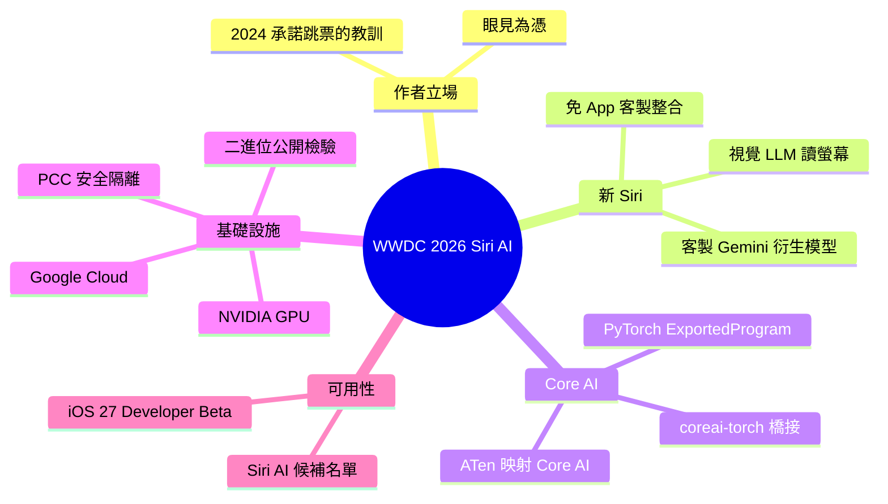

## Siri AI at WWDC 2026

Apple 在 WWDC 2026 發布 Siri AI 功能，採用客製化的 Gemini 衍生模型。新 Siri 運用視覺 LLM 從用戶螢幕提取資訊，免去應用開發者需寫整合代碼的負擔。基礎設施跨越 Apple silicon 與 Google Cloud（NVIDIA GPU），透過 Private Cloud Compute 架構維持安全隔離：含初始網路解析隔離進程、共享推理軟體短 TTL 回收、attested keys 在獨立 confidential VM 內。新推出的 Core AI 庫整合 Meta PyTorch 生態，透過 coreai-torch 橋接將已有 PyTorch 模型映射到 Core AI 硬體操作。所有二進位檔將開源檢查，iOS 27 Developer Beta 已可申請體驗。

### 重點
- Vision LLM 用於螢幕資訊萃取，架構迴避傳統應用整合負擔，相比 2024 WWDC Apple Intelligence 承諾的技術成熟度大幅提升
- PCC 混合架構：Apple silicon + Google Cloud NVIDIA GPU，透過命名空間隔離、短 TTL 推理進程回收、attested keys 隔離 VM 實現分層安全
- Core AI PyTorch Extensions 可將 torch.export.ExportedProgram 直接映射到 Core AI AIProgram，逐節點遍歷 FX 圖並映射 ATen 運算子

**原文：** [simon-willison](https://simonwillison.net/2026/Jun/8/wwdc/#atom-everything)

---

<!-- deep-analysis:begin -->
## 📌 摘要 (TL;DR)

- Simon Willison 對 Apple 在 WWDC 2026 發表的 Siri AI 採取「眼見為憑」（I'll believe it when I see it）態度，因為 2024 年 WWDC 的 Apple Intelligence 承諾跳票讓人記取教訓。
- 新 Siri 採用 Apple 授權的客製化 Gemini 衍生模型（custom Gemini-derived model），跑在 Apple 自家的 Private Cloud Compute（簡稱 PCC）上，技術上看來可行。
- Siri 用視覺 LLM（vision LLMs）直接從使用者螢幕擷取資訊，省去每個 App 都要寫客製整合程式碼的負擔——這在 2024 年 6 月還不成熟，如今才可行。
- 新的 Core AI 函式庫透過 `coreai-torch` 橋接 Meta 的 PyTorch 生態，讓開發者能在 Apple 硬體上跑自己的模型。
- 重大更新：這些 PCC Gemini 模型其實跑在 Google Cloud 的 NVIDIA GPU 上，Apple 仍維持其安全與隱私保護架構，且所有二進位檔將公開供檢驗。
- iOS 27 Developer Beta 今天即可安裝，但要排候補名單才能用 Siri AI；MacRumors 的 Aaron Perris 已通過候補，近期可望出現可信評測。

## 🎯 核心概念

- **私有雲端運算**（Private Cloud Compute，簡稱 PCC）：Apple 的安全雲端推理架構，將敏感運算隔離以維持隱私。
- **視覺 LLM**（vision LLMs）：能「看懂」螢幕畫面並擷取資訊的多模態模型，免去 App 端客製整合。
- **Core AI**：Apple 新推出、讓開發者在 Apple 硬體上執行自有模型的函式庫。
- **ATen 運算子**（ATen operators）：PyTorch 底層的張量運算單元，`coreai-torch` 將其映射為 Core AI 運算。

## 📖 整理分析

### 1. 作者的懷疑立場
Simon Willison 開宗明義表示，因為 2024 年 WWDC 的 Apple Intelligence 承諾嚴重跳票，他對今年所有發表都採「眼見為憑」策略。不過他也承認，新 Siri AI 功能「以今日技術來看至少是可行的」，因為 Apple 是授權一個可在自家 PCC 上執行的客製化 Gemini 衍生模型。

### 2. 用視覺 LLM 讀螢幕
新 Siri 將運用視覺 LLM 從使用者螢幕擷取資訊。這個設計巧妙地繞過了「每個既有 App 都得自行撰寫整合程式碼」的難題。Simon 特別指出，視覺 LLM 在 2024 年 6 月還是個遠不成熟的類別，這也解釋了為何當年的承諾難以兌現、如今才有機會落地。

### 3. Core AI 與 PyTorch 橋接
Core AI 函式庫被視為讓開發者真正用上 Apple 硬體跑自有模型的好一步。它透過 Core AI PyTorch Extensions（`coreai-torch`）整合 Meta 的開源 PyTorch 生態：開發者把既有 PyTorch 模型匯出為 `torch.export.ExportedProgram`，工具會逐一走訪 FX graph 節點，將 ATen 運算子映射成 Core AI 運算，產生可在 Apple 硬體上執行的 Core AI `AIProgram`。

### 4. 基礎設施其實在 Google Cloud
文章更新揭露關鍵事實：這些 PCC Gemini 模型實際跑在 Google Cloud 上、使用 NVIDIA GPU。根據 Apple 安全研究部落格的〈Expanding Private Cloud Compute〉，Apple 與 Google、NVIDIA 合作，把 PCC 基礎設施延伸到使用 NVIDIA GPU 的 Google Cloud 系統，專門處理代理式工具使用（agentic tool-use）與複雜推理等高負載任務。

### 5. 安全隔離與可驗證性
Google Cloud 上的 PCC 沿用 Apple silicon 版 PCC 的分層防護：每個請求的初始網路資料解析在各自命名空間（namespace）的專屬行程內進行；共享推理軟體以極短的存活時間（TTL）回收；證明金鑰（attested keys）則存放在與外部輸入隔離的獨立機密虛擬機（confidential VM）內。一如既往，所有二進位檔都會公開供外界檢驗。

## 🧭 架構圖

## 🧠 Mindmap

<!-- deep-analysis:end -->
### 📄 原文內容

點此展開 / 收合

Given how badly burned anyone who took Apple's 2024 WWDC Apple Intelligence announcements at face value was, I'm holding to a strict "I'll believe it when I see it" policy for everything they announced today . 
 The new Siri AI features do at least look feasible with today's technology, especially since Apple are licensing a custom Gemini-derived model that they can run on their own Private Cloud Compute . 
 It sounds like they'll be taking advantage of vision LLMs to extract information from the user's screen, which neatly sidesteps the need for every existing application to ship custom code in order to integrate with Apple Intelligence. Vision LLMs were a much less mature category in June 2024. 
 The new Core AI library looks like a good step in enabling developers to finally take full advantage of Apple's hardware for running their own models. It integrates with Meta's open source PyTorch ecosystem, using these Core AI PyTorch extensions : 
 
 Core AI PyTorch Extensions ( coreai-torch ) is a Python package that bridges PyTorch and Core AI. You can use it to bring up an existing PyTorch model — exported as a torch.export.ExportedProgram — into a Core AI AIProgram ready to run on Apple hardware, traversing the FX graph node-by-node and mapping ATen operators to Core AI operations. 
 
 You can install an iOS 27 Developer Beta today, which supposedly has the new features - but you then have to make it through a waiting list for access to the new Siri AI. Aaron Perris from MacRumors reports having made it off the waitlist so we may start seeing credible reports on how well Siri AI works in the very near future. 
 Update : These Private Cloud Compute Gemini models are running in Google Cloud, and using NVIDIA hardware. According to Expanding Private Cloud Compute on Apple's Security Research blog: 
 
 For the most demanding tasks, including agentic tool-use and complex reasoning, we worked with Google and NVIDIA to extend our PCC infrastructure to Google Cloud systems using NVIDIA GPUs, while maintaining Apple's powerful security and privacy protections. [...] 
 PCC on Google Cloud leverages many of the same architectural security patterns as PCC on Apple silicon to implement these layered protections: initial network data parsing for each request happens in a dedicated process within its own namespace, shared inference software is recycled with a short time-to-live duration, and attested keys are held in a separate, dedicated confidential VM isolated from external inputs. [...] 
 As with PCC on Apple silicon, all binaries will be published for public inspection. 
 

 Tags: vision-llms , apple , generative-ai , ai , llms , gemini , nvidia , google

