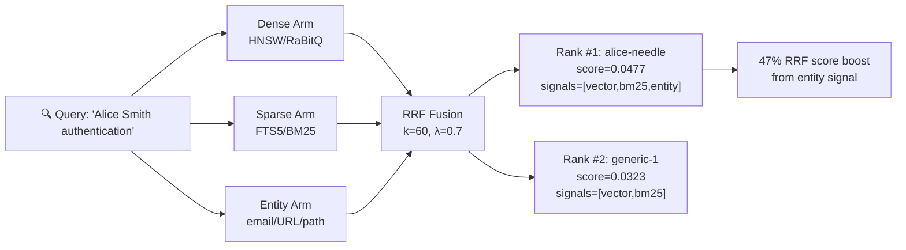

## v3.10.39 — ADR-147 entity arm + signal provenance

ruflo v3.10.39 實現了 ADR-147，為 hybridSearch 添加了第三個 RRF（倒數排名融合）arm——entity arm，與現有 dense（HNSW/RaBitQ）和 sparse（FTS5/BM25）並行運行。新增 entity-tagger.ts 模組，使用正則表達式保守提取電子郵件、URL、POSIX/Windows 文件路徑、引用短語和專有名詞二元組。核心創新是 per-result signal provenance，每個搜索結果記錄來自哪些 arm（vector/bm25/entity）以提高可解釋性。實際測試表明，查詢「Alice Smith authentication」時，目標實體排名上升至第一位，RRF 分數相比二臂方案提升 47%。@claude-flow/memory 從 3.0.0-alpha.19 更新至 3.0.0-alpha.20。

### 重點
- hybridSearch 現支持三臂並行融合（dense/sparse/entity），相比二臂方案 RRF 分數提升 47%，單一查詞『Alice Smith authentication』實證排名躍升至第一位
- entity-tagger.ts 使用正則表達式保守提取電子郵件、URL、POSIX/Windows 路徑、引用短語、專有名詞二元組，優先避免假正例（假負例可接受）
- per-result signal provenance 記錄 ('vector' | 'bm25' | 'entity')[] 信號，支持結果來源可視化與除錯無需重新執行搜索

**原文：** [ruflo-releases](https://github.com/ruvnet/ruflo/releases/tag/v3.10.39)

---

### 📄 原文內容

點此展開 / 收合

First implementation landed from the dream-cycle research cluster ( #2316 - #2324 ). Adds entity matching as a third RRF arm in hybridSearch alongside dense (HNSW/RaBitQ) and sparse (FTS5/BM25), plus per-result signal provenance. 
 What's new 
 @claude-flow/memory 3.0.0-alpha.20 — entity arm + signal provenance in the hybridSearch controller: 
 
 entity-tagger.ts — regex extractor for emails, URLs, file paths (POSIX + Windows), quoted phrases, proper-noun 2-grams. Deliberately conservative: false negatives OK, false positives would dilute RRF. 
 hybridSearch now runs three arms in parallel: dense + sparse + entity (per-token keyword scan, gated on extractEntities(query).length &gt; 0 ). Empty entity set drops the arm rather than passing [] to dilute fusion. 
 signals: ('vector' | 'bm25' | 'entity')[] on every fused result. Computed by pre-fusion set membership; lets callers debug which arms surfaced an entry without re-running the search. 
 
 Capability smoke (end-to-end against built dist) 
 Corpus: 30 generic "authentication" entries + 1 "Alice Smith" needle. Query: "Alice Smith authentication" : 
 score=0.0477 signals=["vector","bm25","entity"] key=alice-needle ← #1
score=0.0323 signals=["vector","bm25"] key=generic-1
score=0.0323 signals=["vector","bm25"] key=generic-0
score=0.0313 signals=["vector","bm25"] key=generic-3
score=0.0301 signals=["vector","bm25"] key=generic-2
 
 Alice ranks #1 with full triplet provenance — runners-up only fire on vector + sparse. ~47% RRF score boost from the entity signal. 
 Packages 
 
 
 
 Package 
 Old 
 New 
 Tags 
 
 
 
 
 @claude-flow/memory 
 3.0.0-alpha.19 
 3.0.0-alpha.20 
 latest, alpha, v3alpha 
 
 
 @claude-flow/cli 
 3.10.38 
 3.10.39 
 latest, alpha, v3alpha 
 
 
 claude-flow 
 3.10.38 
 3.10.39 
 latest, alpha, v3alpha 
 
 
 ruflo 
 3.10.38 
 3.10.39 
 latest, alpha, v3alpha 
 
 
 
 @claude-flow/cli 's @claude-flow/memory dep pinned to ^3.0.0-alpha.20 so wrapper users get the entity arm automatically. v3/pnpm-lock.yaml regen included (lesson from #2311 — bumping a workspace dep without lockfile regen breaks pnpm install --frozen-lockfile ). 
 What this implements vs the dream-cycle ADR 
 ADR-147 ( #2317 ) split the work as P1 "wire FTS5 + RRF fusion" and P2 "entity arm + provenance". The investigation found P1 was already shipped in controller-registry.ts:713 before the ADR was filed — applyRRF(k=60) + applyMMR(λ=0.7) over dense + sparse was already in. This release lands the actual gap, P2 . 
 Tracking note for the dream-cycle process posted on #2324 . 
 Tests 
 
 12 new entity-tagger.test.ts (regex pinning — generic prose returns empty, and/or → empty, "a" over "b" → empty, single capitalized words → empty) 
 2 new graceful-retrieval.test.ts ADR-147 assertions (signal provenance on every fused result; needle-in-haystack) 
 Full memory suite: 416/420 (4 pre-existing Windows-env failures in agent-memory-scope , auto-memory-bridge , benchmark — untouched files) 
 
 Out of scope (follow-ups) 
 
 Dedicated SQL entity index — current per-entity searchKeyword calls are fine for typical query entity counts (1-3); unbounded if a query mentions 20+. A future ADR can add an entity_index table for hard-bound latency. 
 Async writes by default (ADR-147 P3) — orthogonal; consolidator already handles HNSW background rebuild. 
 LoCoMo benchmark publication (ADR-147 P4) — needs harness wiring + dataset access; separate workstream.

