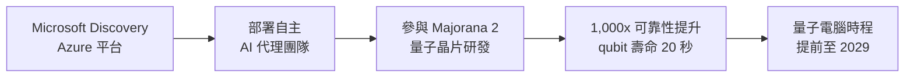
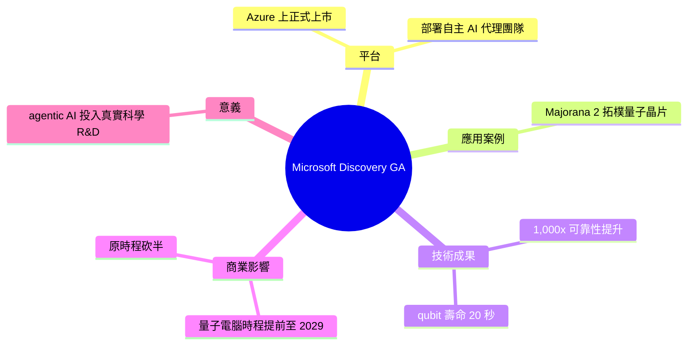

## Microsoft Discovery Reaches GA on Azure, Powering the Agentic AI Behind Majorana 2 Quantum Chip

微軟宣布 Microsoft Discovery 正式上市，這是一個 Azure 平台，用於在科學研究與開發中部署自主 AI agent teams。該平台支持了 Majorana 2 topological quantum chip 的開發，實現了相比前代 1,000 倍的可靠性提升，qubit 壽命達 20 秒。微軟基於此進展，將原定的可擴展量子計算機規模化目標提前達成，從 2031 年縮短至 2029 年，縮減了原時程的 50%。這是 agentic AI 在高風險科學 R&D 領域的實際突破應用，展示了 AI agent teams 在加速科學發現中的潛力。

### 重點
- Microsoft Discovery GA 發布於 Azure 平台，用於部署 AI agent teams 進行科學 R&D
- Majorana 2 quantum chip 達成 1,000x 可靠性提升和 20 秒 qubit lifetimes 的突破
- 量子計算機規模化時間表提前 50%（2029 年而非 2031 年）

**原文：** [infoq-main](https://www.infoq.com/news/2026/06/microsoft-discovery-majorana-2/?utm_campaign=infoq_content&utm_source=infoq&utm_medium=feed&utm_term=global)

---

<!-- deep-analysis:begin -->
## 📌 摘要 (TL;DR)

- 微軟宣布 **Microsoft Discovery** 在 Azure 上正式上市（GA），這是一個用於部署自主 AI 代理團隊（autonomous AI agent teams）來加速科學研發的平台。
- 該平台已實際應用於 **Majorana 2** 拓樸量子晶片（topological quantum chip）的開發。
- Majorana 2 相比前代達成 **1,000 倍可靠性提升**，量子位元壽命（qubit lifetime）達 **20 秒**。
- 基於此進展，微軟將「可規模化量子電腦」的目標時程**提前至 2029 年**，相當於把原訂時程砍半（halving）。
- 對讀者的意義：這是 agentic AI 從 demo 走向高風險、高難度科學 R&D 實戰的一個指標性案例，由 InfoQ 的 Steef-Jan Wiggers 報導。

## 🎯 核心概念

- **Microsoft Discovery**：微軟基於 Azure 的平台，讓使用者在科學研究與開發中部署自主 AI 代理團隊。
- **代理式 AI**（agentic AI）：由多個能自主規劃、執行任務的 AI agent 組成團隊協作，而非單一被動回應的模型。
- **拓樸量子晶片**（topological quantum chip）：微軟採用的量子運算路線，理論上以拓樸特性換取更高的容錯與穩定度。
- **量子位元壽命**（qubit lifetime）：qubit 維持量子態的時間，越長代表越穩定、越可用於實際運算。

## 📖 整理分析

### 1. Microsoft Discovery 正式上市
微軟宣布 Microsoft Discovery 在 Azure 上達到一般可用性（general availability，GA），定位為部署自主 AI 代理團隊以加速科學研發的平台。GA 意味著它從預覽階段轉為正式商用，企業與研究機構可正式採用。

### 2. 支撐 Majorana 2 晶片開發
該平台的代表性成果是支援了 **Majorana 2** 這款拓樸量子晶片的開發。微軟以此作為 agentic AI 在真實、高難度科學問題上能發揮作用的證據——AI 代理團隊參與了晶片的研發流程，而非僅止於概念驗證。

### 3. 可靠性與 qubit 壽命的突破
根據微軟說法，Majorana 2 相比前代帶來 **1,000 倍的可靠性提升**，且 qubit 壽命達到 **20 秒**。在量子運算中，可靠性與 qubit 穩定時間是能否做出實用機器的關鍵瓶頸，這兩項數據是此次發布的核心賣點。

### 4. 量子電腦時程提前至 2029
基於上述進展，微軟把「可規模化量子電腦」的目標時程提前至 **2029 年**，官方描述為把原訂時程砍半（halving）。（註：先前的中文摘要將原始時程記為 2031 年、縮減約 50%；確切原始基準年以微軟官方說法為準。）

## 🧭 流程圖 / 架構圖

## 🧠 Mindmap

<!-- deep-analysis:end -->
### 📄 原文內容

點此展開 / 收合

Microsoft announced the general availability of Microsoft Discovery, its Azure-based platform for deploying autonomous AI agent teams in scientific R&amp;D. The platform powered the development of Majorana 2, a topological quantum chip with 1,000x reliability improvement and 20-second qubit lifetimes. Microsoft now targets a scalable quantum computer by 2029, halving its original timeline. By Steef-Jan Wiggers

