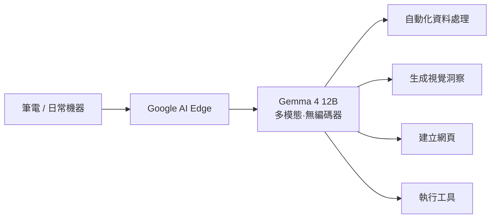
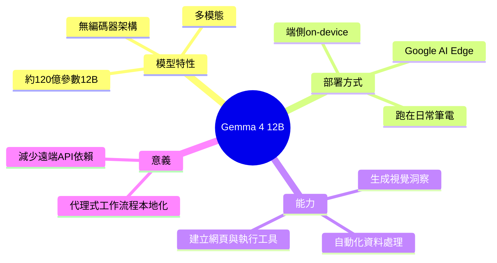

## Gemma 4 12B Enables On-Device, Multimodal Agentic Workflows with an Encoder-free Architecture

Google 發布 Gemma 4 12B，一個 12 億參數的多模態基礎模型，採用無編碼器架構，專為本地 on-device 運行設計。該模型可與 Google AI Edge 整合，支援在筆電等日常計算設備上進行 agentic workflows，包括自動數據處理、生成視覺洞察、網頁生成與工具執行。這使開發者能在本地進行實驗與開發，無需依賴遠端 API，加強邊緣 AI 應用潛力。

### 重點
- 12B 參數無編碼器架構，針對本地邊緣運行最佳化，適合資源受限的筆電環境
- 支援多模態 agentic workflows：自動化數據處理、視覺分析、網頁與工具生成
- 與 Google AI Edge 整合，降低雲端依賴，提升開發者本地實驗的自主性

**原文：** [infoq-main](https://www.infoq.com/news/2026/06/google-gemma4-12b-local-coding/?utm_campaign=infoq_content&utm_source=infoq&utm_medium=feed&utm_term=global)

---

<!-- deep-analysis:begin -->
## 📌 摘要 (TL;DR)

- Google 發布 **Gemma 4 12B**，一個約 120 億參數（12B）的多模態（multi-modal）基礎模型，採用**無編碼器架構**（encoder-free architecture）。
- 官方定位是「將代理式、多模態智能直接帶到你的筆電上」（designed to bring agentic, multimodal intelligence directly to your laptop），主打在一般日常機器上端側（on-device）運行。
- 可與 **Google AI Edge** 整合，讓開發者「在日常機器上於本地建構與實驗」（build and experiment locally, on everyday machines）。
- 文中列出的能力範圍包含：自動化資料處理、生成視覺洞察（generating visual insights）、建立網頁，以及執行工具（executing tools）。
- 對讀者的意義：把代理式工作流程（agentic workflows）放到本地，意味著開發與實驗可不依賴遠端 API，強化邊緣 AI 的應用空間。本篇由 Sergio De Simone 撰寫於 InfoQ。

> ⚠️ 注意：先前 brief 摘要把參數寫成「12 億」，但 12B 應為**約 120 億參數**，此處已更正。本文原始來源篇幅極短，以下分析僅就原文明確陳述內容整理，未補充來源未提及的 benchmark、版本比較或技術細節。

## 🎯 核心概念

- **無編碼器架構**（encoder-free architecture）：原文標題點名 Gemma 4 12B 採用此設計，但內文未說明其具體機制。一般而言，這類設計指模型不依賴獨立的編碼器模組來處理輸入（如影像），有利於簡化端側部署。（此為背景說明，原文未細述）
- **多模態**（multi-modal）：模型可處理多種型態的輸入／輸出，對應原文提到的「視覺洞察」等能力。
- **代理式工作流程**（agentic workflows）：讓模型自主串接多步驟任務（如資料處理、呼叫工具）以達成目標，而非單次問答。
- **端側 / 本地運行**（on-device）：模型直接在使用者的筆電等裝置上執行，而非透過雲端遠端 API。
- **Google AI Edge**：Google 用於端側部署的整合層，本篇指其為 Gemma 4 12B 在本地建構與實驗的搭配工具。

## 📖 整理分析

### 1. 定位：把智能搬到筆電上
原文引用 Google 的說法，將 Gemma 4 12B 定位為「把代理式、多模態智能直接帶到你的筆電上」。重點不在於更大的模型，而在於將原本多在雲端執行的能力下放到「日常機器」（everyday machines）。

### 2. 與 Google AI Edge 的整合
模型可與 Google AI Edge 結合，讓開發者「在本地建構與實驗」。這條整合路徑是本篇強調的關鍵——它讓本地開發成為可行的工作流程，而不只是把模型權重放到裝置上。

### 3. 列舉的能力範圍
原文明確列出四類用途：自動化資料處理（autonomous data processing）、生成視覺洞察、建立網頁（building webpages），以及執行工具（executing tools）。這幾項合起來描繪出一個能在本地自主完成多步驟任務的代理。

### 4. 為何值得關注
把代理式 + 多模態能力放到端側，潛在價值在於降低對遠端 API 的依賴、改善資料隱私與離線可用性，並擴大邊緣 AI 的開發空間。（原文未提供延遲、成本或準確度的量化數據）

## 🧭 架構概念圖

下圖依原文陳述，視覺化 Gemma 4 12B 在本地裝置上的整合與能力範圍（非原文附圖，為依文字整理）：

## 🧠 Mindmap

<!-- deep-analysis:end -->
### 📄 原文內容

點此展開 / 收合

Google says Gemma 4 12B is "designed to bring agentic, multimodal intelligence directly to your laptop", further noting that the new model can be combined with Google AI Edge to "build and experiment locally, on everyday machines". This integration allows for a wide range of capabilities, from autonomous data processing to generating visual insights and even building webpages or executing tools. By Sergio De Simone

