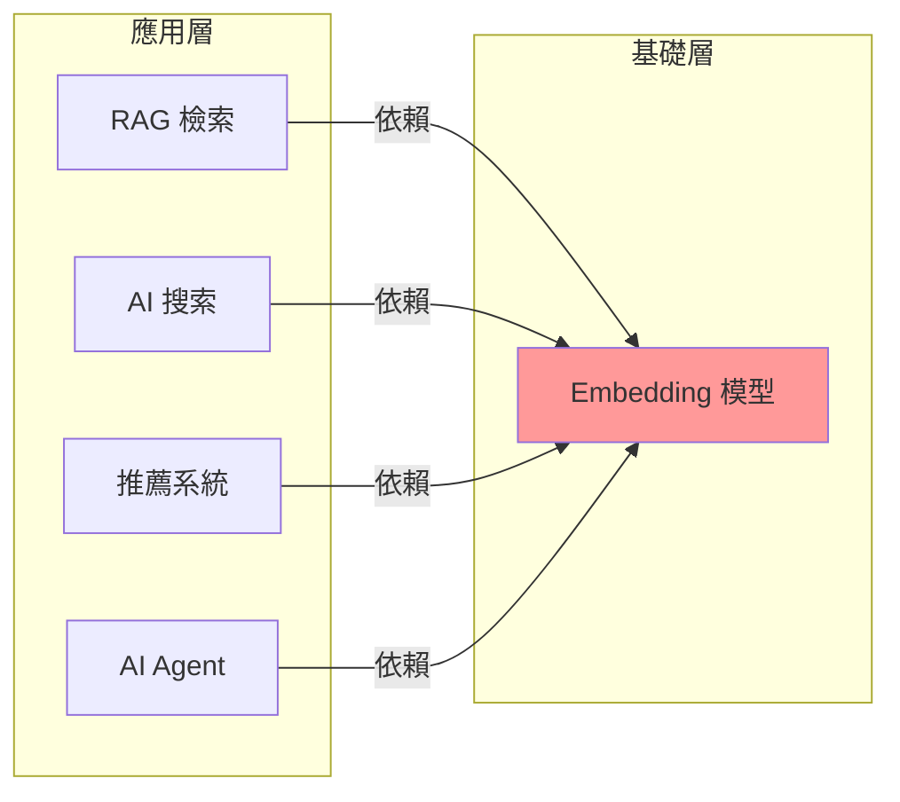

## The Most Important AI Breakthrough Most Developers Are Still Overlooking: Embeddings

該文概述 embedding 模型（嵌入模型）作為 AI 開發中被低估卻至關重要的技術基礎。Embedding 驅動了檢索增強生成（RAG）系統、AI 搜索引擎、推薦系統和下一代智能 AI Agent，是大多數現代 AI 應用的隱形支柱。開發者與企業常將焦點集中在大語言模型的選型與微調，卻忽視 embedding 層在應用性能、檢索精度與成本優化中的核心地位。Embedding 模型的品質直接影響 RAG 系統的信息檢索精度、推薦系統的相關性，以及 Agent 系統的推理能力。選擇與優化合適的 embedding 方案，往往比單純升級 LLM 更能提升應用效果。

### 重點
- Embedding 為多應用基礎：RAG、搜索、推薦系統、Agent 均依賴高質量 embedding
- 被忽視的基礎設施：開發者常專注 LLM 選型，卻低估 embedding 層對應用效果的影響
- 優化 embedding > 升級 LLM：在成本和效果的權衡中，embedding 最佳化往往更有 ROI

**原文：** [medium-tag-llm](https://cletusajibade.medium.com/the-most-important-ai-breakthrough-most-developers-are-still-overlooking-embeddings-7c5eaaf0ee44?source=rss------large_language_models-5)

---

### 📄 原文內容

點此展開 / 收合

How embedding models power RAG, AI search, recommendation systems, and the next generation of intelligent AI agents. Continue reading on Medium »

