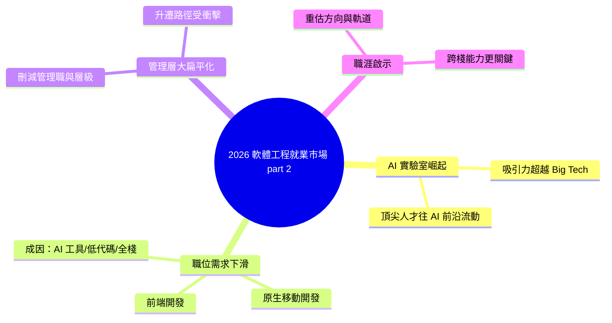

## State of the software engineering job market in 2026, part 2

據 Pragmatic Engineer 2026 年上半年的獨家數據，全球軟體工程師就業市場出現了結構性變化。首先，AI 研究實驗室的職位吸引力明顯超越傳統大科技公司（Google、Meta、Amazon 等），反映了人才對 AI 前沿工作的渴望。其次，原生移動開發和前端開發職位需求大幅下滑，與 AI 工具、低代碼平台和全棧開發趨勢有關。第三，管理層面臨「大扁平化」趨勢，公司減少管理職位或層級數，這對職業晉升路徑產生深遠影響。這些變化深刻反映了 AI 時代對技術職業生涯規劃和人才流動的重塑。

### 重點
- AI labs 職位吸引力超越 Big Tech（Google、Meta、Amazon）
- 原生移動與前端開發職位需求明顯下降，受 AI 工具和低代碼平台衝擊
- 管理層「大扁平化」——組織減少層級，職位晉升路徑縮減

**原文：** [substack-pragmatic-engineer](https://newsletter.pragmaticengineer.com/p/the-job-market-in-2026-part-2)

---

<!-- deep-analysis:begin -->
> ⚠️ 註：本則來源僅提供文章標題與前導摘要（原文為 Pragmatic Engineer 付費電子報，內文未隨資料提供）。以下整理依據既有的 brief 摘要與標題進行，未補充原文未出現的具體數字或人名。

## 📌 摘要 (TL;DR)

- Pragmatic Engineer（作者 Gergely Orosz）於 2026 上半年發布「軟體工程就業市場現況」系列第二篇，引用其獨家數據分析全球工程師職場的結構性轉變。
- 趨勢一：AI 研究實驗室（AI labs）的職位吸引力，已明顯超越傳統大科技公司（Big Tech，如 Google、Meta、Amazon），反映頂尖人才往 AI 前沿流動。
- 趨勢二：原生移動開發（native mobile）與前端開發（frontend）職位需求大幅下滑，與 AI 工具、低代碼（low-code）平台及全棧化趨勢相關。
- 趨勢三：管理層出現「大扁平化」（the great flattening），公司刪減管理職與組織層級，衝擊既有的升遷路徑。
- 對讀者的意義：在 AI 時代規劃技術職涯時，「去哪家公司、做哪個方向、走管理還是技術」三個決策的權重正被重新洗牌。

## 🎯 核心概念

- **大扁平化**（the great flattening）：公司減少管理職位數量或壓縮組織層級，使結構更扁平。
- **AI 研究實驗室**（AI labs）：專注於前沿 AI 模型研發的機構，在此文中被視為與傳統大科技公司競爭人才的新極點。
- **低代碼**（low-code）：用視覺化／少量程式碼即可建構應用的平台，被列為前端職位需求下滑的原因之一。

## 📖 整理分析

### 1. AI 實驗室吸引力超越大科技
據摘要，文章的獨家數據顯示，工程師對 AI 研究實驗室職位的興趣，已超過 Google、Meta、Amazon 等傳統大科技公司。這代表頂尖人才的流向出現轉折：過去 Big Tech 是人才終點站，如今 AI 前沿研究成為更具號召力的目的地。（原文未提供的具體佔比與調查方法，此處不臆測。）

### 2. 原生移動與前端職位下滑
摘要指出，原生移動開發與前端開發的職位需求大幅下降。文中將此歸因於三股力量：AI 編碼工具提升單一工程師產出、低代碼平台降低介面開發門檻，以及全棧（full-stack）開發趨勢讓專職前端／行動的需求被稀釋。對應的職涯訊號是：單一前端或行動專精的市場空間正在收斂。

### 3. 管理層的大扁平化
摘要描述公司正進行「大扁平化」——刪減管理職位或壓縮層級。這直接影響傳統「工程師 → 經理 → 總監」的升遷階梯：管理缺口變少，晉升競爭加劇，部分人才可能被推回或留在技術職（IC）軌道。

### 4. 對職涯規劃的整體啟示
三股趨勢綜合來看，AI 時代正重塑人才流動與職涯路徑：選擇前沿 AI 方向、保持跨棧（全棧）能力、以及對「管理 vs. 技術」軌道的取捨，成為 2026 年工程師需要重新評估的核心決策。（此為依摘要綜整的推論，非原文逐字結論。）

## 🧠 Mindmap

<!-- deep-analysis:end -->
### 📄 原文內容

點此展開 / 收合

Deepdive into the tech jobs market with exclusive data revealing AI labs are more attractive than Big Tech, native mobile & frontend roles are declining, management&#8217;s &#8220;great flattening&#8221;, and more

