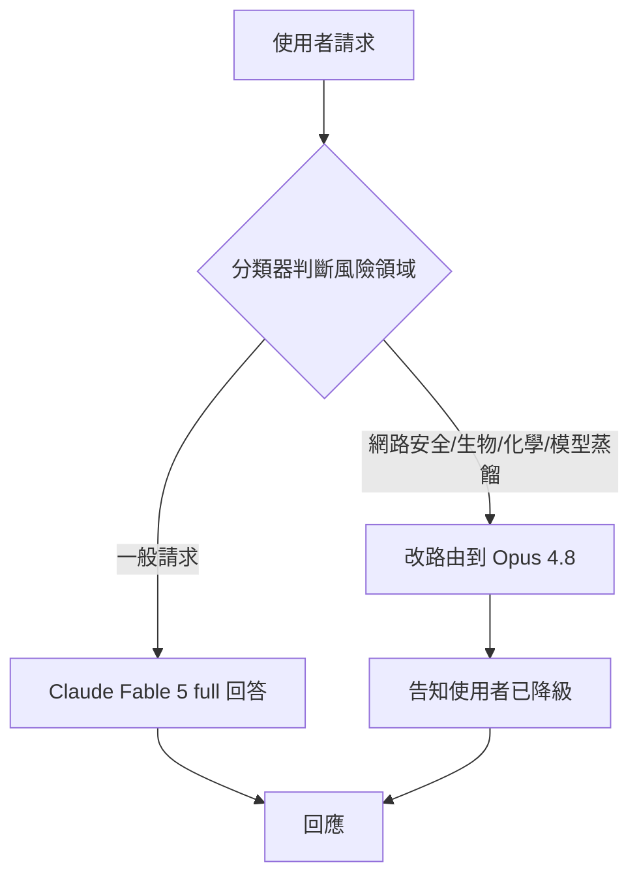
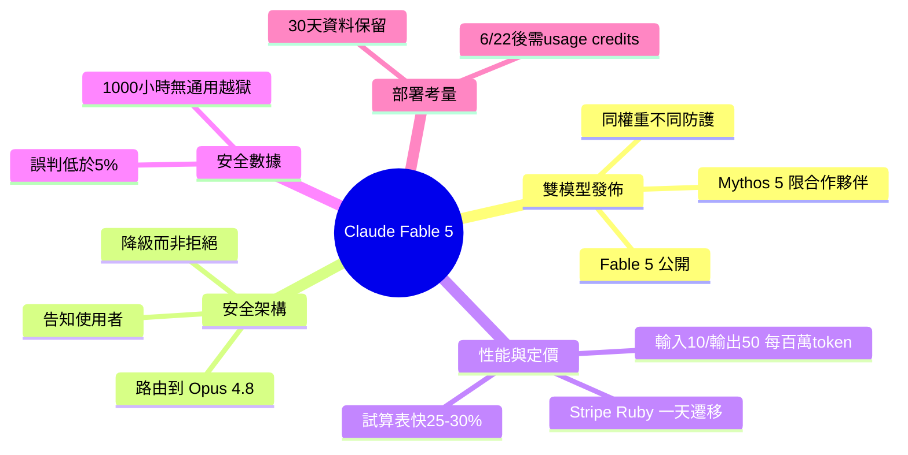

## A frontier model you can ship, and the safeguards that decide what it answers

Anthropic 發佈 Claude Fable 5（Mythos 級模型），其創新之處不在原始性能而在安全架構設計。Fable 5 採用「降級而非拒絕」的分類器策略，將高風險請求（涉及網路安全、生物化學、模型萃取）轉向較弱的 Opus 4.8 模型，而非直接拒絕。定價為每百萬輸入令牌 10 美元、輸出 50 美元，約為舊版本一半，並支持長期任務如 Ruby 代碼遷移一日內完成（對手競品需時兩個月）。30 天數據保留政策要求企業在部署前評估，且約 5% 請求會因假陽性誤判路由至備用模型。

### 重點
- 分類器降級策略覆蓋三大風險領域（網路安全、生物化學、模型萃取），以優雅降級取代絕對拒絕，提升可用性
- 成本結構：輸入 $10/百萬令牌、輸出 $50/百萬令牌，相較前代下降 50%；長期任務效率提升 25-30%（如表格任務）
- 企業部署需注意 30 天強制數據保留政策、~5% 假陽性誤判率、基於任務單位成本而非單純令牌成本的經濟模型重新計算

**原文：** [medium-tag-claude](https://medium.com/@mganeshhemanth/a-frontier-model-you-can-ship-and-the-safeguards-that-decide-what-it-answers-64020f2791ab?source=rss------claude-5)

---

<!-- deep-analysis:begin -->
## 📌 摘要 (TL;DR)

- Anthropic 同時釋出兩個共用相同權重、僅安全防護不同的模型：對所有人開放的 **Claude Fable 5**，以及僅供審核合作夥伴的 **Claude Mythos 5**。本文作者主張，真正值得研究的不是性能數字，而是它的安全架構。
- 最關鍵的設計是「降級而非拒絕」：當分類器（classifier）偵測到請求落在網路安全、生物、化學或模型蒸餾（model distillation）等高風險領域時，系統不直接回絕，而是把該請求改路由到較弱的 **Claude Opus 4.8**，並明確告知使用者已發生此事——作者稱之為「優雅降級」（graceful degradation）。
- 定價為每百萬輸入 token 10 美元、輸出 50 美元，文中稱「不到 Mythos Preview 的一半」。
- 性能佐證：在 Stripe 的 Ruby 程式碼庫評測中，Fable 5 在一天內完成了團隊原估超過兩個月的全庫遷移；試算表工作快 25–30%，一項物理研究 36 小時完成（對手需 4 天）。
- 安全數據：誤判（false positive）觸發率低於 5% 的對話；外部漏洞獎勵計畫跑超過 1,000 小時未找到通用越獄（universal jailbreak）。但部署前須注意：所有流量強制 **30 天資料保留**。

## 🎯 核心概念

- **優雅降級**（graceful degradation）：面對高風險請求時，以「轉用能力較弱的模型」取代「直接拒絕」的安全策略。
- **分類器**（classifier）：即時判斷請求風險領域、決定是否觸發降級路由的把關元件。
- **模型蒸餾**（model distillation）：用一個強模型的輸出去訓練另一個模型，本文將其列為會觸發降級的受限領域之一（即防止他人萃取模型能力）。
- **通用越獄**（universal jailbreak）：一種能穩定繞過所有安全防護的攻擊手法。

## 📖 整理分析

### 1. 同權重、雙防護的發佈策略

Anthropic 把同一套底層權重包成兩個產品：**Fable 5** 對外普遍開放，**Mythos 5** 只給通過審查的合作夥伴。兩者差別不在智力而在「防護層」。作者的核心論點是：當底層能力相同，決定模型「能回答什麼」的不再是模型本身，而是外圍那層安全機制——這才是這次發佈真正的看點。

### 2. 降級而非拒絕：安全架構的轉向

傳統安全做法是偵測到危險就回絕（refuse）。Fable 5 改成：分類器一旦在網路安全、生物、化學、模型蒸餾等領域標記到風險請求，就把請求改丟給 **Opus 4.8** 這個能力較弱的舊模型來回答，而非留給 Fable 5，且會告知使用者「這件事發生了」。好處是使用者仍拿得到回應、體驗不中斷；代價是這些領域的答案品質被刻意壓低。

### 3. 性能佐證：把「值得 ship」講清楚

標題說「a frontier model you can ship」，文中用具體案例支撐：在 Stripe 的 Ruby 程式碼庫上，Fable 5 一天內跑完團隊原本手動估計逾兩個月的全庫遷移；試算表類工作完成速度快 25–30%；一項物理研究 36 小時完成，而對手模型需要 4 天。搭配「不到前代一半」的定價（輸入 $10／輸出 $50 每百萬 token），構成「能力夠強且可實際投產」的論述。

### 4. 安全測試數據與其代價

防護的可信度由幾個數字支撐：誤判觸發率低於 5% 的對話；外部漏洞獎勵計畫累計超過 1,000 小時未產出通用越獄；某合作夥伴回報「零筆有害的單輪網路攻擊請求被照做」，並擋下 30 種公開越獄技巧。但同一套機制也有摩擦面——低於 5% 的對話會因誤判被降級路由，意味著少數正當請求也會落到較弱的 Opus 4.8。

### 5. 部署前必看：30 天資料保留

作者特別點出企業導入前的決策關鍵：Anthropic 現在對 Fable 5／Mythos 5 的**所有流量強制 30 天保留**。官方說明為非訓練用途、有記錄的人工存取，且「在幾乎所有情況下」30 天後刪除。另有時程限制：6 月 22 日前 Fable 5 含在訂閱方案內，之後須用使用額度（usage credits），等容量恢復才再開放。對受監管或重視資料治理的團隊，這條政策可能比性能更影響採用決策。

## 🧭 安全路由流程

## 🧠 Mindmap

<!-- deep-analysis:end -->
### 📄 原文內容

點此展開 / 收合

Anthropic put a Mythos-class model into general release as Claude Fable 5. The capability headlines are real, but the part worth studying&#x2026; Continue reading on Medium »

