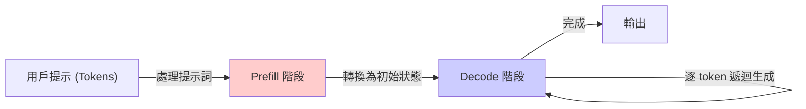

## What Really Happens When You Talk to an LLM

該系列文章開篇「AI 基礎設施工程」系列，第一週聚焦 LLM 核心概念。文章分解講解訓練（training）與推理（inference）兩個不同階段的計算特性與資源成本。深入解釋 Token 的定義、Prefill 階段（模型處理提示詞）與 Decode 階段（逐個生成回應 token）的機制。文章旨在系統化介紹 LLM 運作的底層原理，幫助開發者與基礎設施工程師瞭解對話系統的實際處理流程與瓶頸。適合想深入理解 LLM 效能特徵、延遲特性與成本考量的技術人員。

### 重點
- 訓練 vs 推理階段：兩個截然不同的計算流程，成本與延遲特性迥異
- Prefill 與 Decode 拆解：prefill 一次性處理整個提示詞，decode 逐 token 遞迴生成
- 基礎設施視角優化：理解 token 流動與階段特性，找出系統瓶頸與優化空間

**原文：** [medium-tag-llm](https://medium.com/@harshdaga18/what-really-happens-when-you-talk-to-an-llm-0811448b2c0f?source=rss------large_language_models-5)

---

### 📄 原文內容

點此展開 / 收合

AI Infrastructure Engineering &#x2014; Week 1: LLMs, training vs. inference, tokens, prefill, and decode. Continue reading on Medium »

