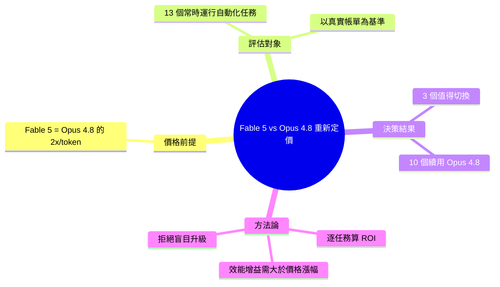

## Claude Fable 5 vs Opus 4.8: I Repriced My 13 Automations

Anthropic新發布的旗艦模型Claude Fable 5定價為Opus 4.8的2倍（per token），但實務應用中未必划算。作者對13個自動化任務進行成本重估，發現只有3個任務的性能提升足以justify更高成本，其餘10個應繼續使用Opus 4.8。本分析強調選擇高成本模型時，需進行詳細的成本效益評估，而非盲目升級新版本。

### 重點
- Fable 5定價為Opus 4.8的2倍per token
- 13個自動化任務中僅3個值得切換至Fable 5
- 應基於實際效能提升決策，而非版本優先度

**原文：** [medium-tag-claude](https://medium.com/@automation.labs/claude-fable-5-vs-opus-4-8-i-repriced-my-13-automations-12fde8e71810?source=rss------claude-5)

---

<!-- deep-analysis:begin -->
> ⚠️ 來源限制：此筆輸入僅含標題、RSS 摘要與一段預覽文字（原文正文在 Medium 付費牆後，未取得）。以下整理嚴格依據可得資訊，未對「13 個自動化任務清單」「決策表內容」「各任務基準分數」等未公開細節進行補完。

## 📌 摘要 (TL;DR)

- Anthropic 推出新旗艦模型 **Claude Fable 5**，每 token 價格正好是 **Claude Opus 4.8 的 2 倍**（原文用字：「exactly 2× per token」）。
- 作者經營 13 個「常時運行」（always-on）的自動化任務，逐一以新價格重算成本效益。
- 結論：13 個任務中只有 **3 個**的效能提升足以正當化（justify）切換到 Fable 5，其餘 10 個建議續用 Opus 4.8。
- 核心主張：面對價格翻倍的新模型，應做逐任務的成本效益評估，而非全面盲目升級。
- 原文附有一份「決策表」（decision table）說明哪些任務該換、哪些不該——惟具體表格內容未在預覽中公開。

## 🎯 核心概念

- **常時運行任務**（always-on jobs）：持續或高頻觸發的自動化流程，token 用量累積大，因此對單價變動最敏感。
- **逐 token 定價**（per-token pricing）：本文比較的價格基準是「每 token」成本，Fable 5 為 Opus 4.8 的 2 倍。
- **切換正當性**（earn the switch）：作者用語，指某任務的品質/成功率提升需大到足以抵銷 2× 成本，才「值得換」。

## 📖 整理分析

### 1. 價格前提：2× 不是小數字
原文明確指出 Fable 5 的每 token 成本是 Opus 4.8 的整整 2 倍。對單次、低頻的人工查詢，2× 或許無感；但對 13 個常時運行的自動化任務而言，單價翻倍會直接放大為可觀的月度帳單，因此值得逐項重算。

### 2. 重新定價的對象：13 個自動化任務
作者把自己實際在跑的 13 個 always-on 自動化任務當成樣本，逐一重新計算在 Fable 5 價格下的成本。這是一個以「真實營運帳單」而非「benchmark 分數」為出發點的評估角度。（13 個任務的具體名稱與用途未在預覽公開。）

### 3. 結論：只有 3 個值得換
評估結果是 13 個中僅 3 個任務的效能增益足以抵銷 2× 成本；其餘 10 個維持 Opus 4.8 更划算。換言之，新旗艦不是「全面取代」舊模型，而是「在特定高價值任務上選擇性使用」。

### 4. 方法論啟示：升級要算帳，不要追新
本文的可遷移觀點是：模型迭代時，正確做法是把每個工作負載當成獨立的成本中心去算 ROI——效能提升必須大於價格漲幅才換。對重度使用 LLM 自動化的團隊，這是一套可複用的決策框架。

## 🧠 Mindmap

<!-- deep-analysis:end -->
### 📄 原文內容

點此展開 / 收合

Anthropic&#x2019;s new flagship costs exactly 2&#xd7; per token. Only 3 of my 13 always-on jobs earn the full switch &#x2014; decision table inside. Continue reading on Medium »

