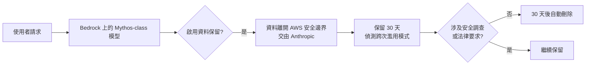
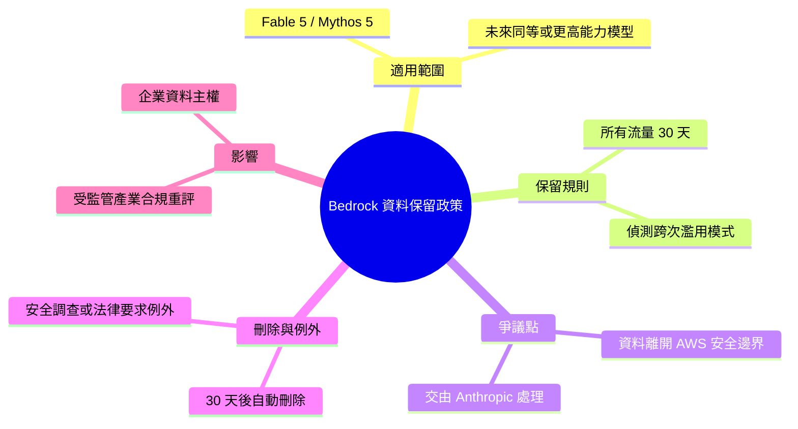

## AWS Bedrock to require sharing data with Anthropic for Mythos and future models

AWS Bedrock 和 Anthropic 宣佈針對 Fable 5、Mythos 5 以及未來同等或更高能力模型的新數據政策：Anthropic 要求將所有流量數據保留 30 天，用於檢測單次交互中不可見的濫用模式。啟用數據保留後，用戶數據將離開 AWS 的數據和安全邊界。30 天後數據自動刪除，除非涉及安全調查或法律要求。該政策對企業用戶有重大隱私和數據主權影響，特別是在規管嚴格的行業。

### 重點
- Anthropic 在 AWS Bedrock 上要求 Fable 5/Mythos 5 用戶強制選擇 30 天數據保留期，用於濫用檢測
- 用戶數據在保留期間會離開 AWS 的數據安全邊界，轉由 Anthropic 管理
- 數據保留政策是 Anthropic 較高能力模型（Mythos 級別）的必須條件，對企業隱私合規構成重大影響

**原文：** [hackernews](https://news.ycombinator.com/item?id=48473166)

---

<!-- deep-analysis:begin -->
## 📌 摘要 (TL;DR)

- AWS 與 Anthropic 公告：在 Bedrock 上的 Fable 5、Mythos 5，以及未來「同等或更高能力」的模型，Anthropic 將要求對所有流量保留資料（data retention）30 天。
- 保留目的是偵測「單次互動中看不到的濫用模式」（patterns of misuse not visible from a single exchange）——即跨多次請求才看得出的濫用行為。
- 關鍵爭議點：一旦啟用資料保留，使用者資料將「離開 AWS 的資料與安全邊界」（leave AWS's data and security boundary），交由 Anthropic 處理。
- 30 天後資料自動刪除，除非涉及安全調查或法律強制保留的少數情況。
- 對企業用戶（尤其受監管產業）有資料主權與隱私影響：原本選擇 Bedrock 的理由之一就是資料留在自家雲邊界內。

## 🎯 核心概念

- **資料保留**（data retention）：服務商在一段期間內留存使用者送出的流量資料，而非用後即刪。
- **安全邊界**（security boundary）：資料受特定雲供應商（此處為 AWS）安全與合規控制涵蓋的範圍；資料一旦離開該範圍，控制權與合規假設隨之改變。
- **Mythos-class 模型**：公告用語，指 Mythos 5 等級及以上能力的模型，是這次新政策的適用門檻。

## 📖 整理分析

### 1. 政策內容：強制 30 天保留
根據 AWS 官方部落格與此 HackerNews 討論引述，針對 Bedrock 上的 Fable 5、Mythos 5 及未來相似或更高能力的模型，Anthropic 要求對「所有流量」（all traffic）保留 30 天。這不是可選的加值功能，而是使用這類模型的前提條件。

### 2. 為什麼要保留：偵測跨次濫用
Anthropic 給的理由是：有限期間的資料保留能讓它偵測「從單一交換中看不到的濫用模式」。換言之，某些濫用（如分散在多次請求中的攻擊或規避行為）只有在累積觀察多筆流量後才能辨識，單看一則請求無法判斷。

### 3. 最大爭議：資料離開 AWS 邊界
公告明言：一旦 opt into 資料保留，「你的資料會離開 AWS 的資料與安全邊界」。這正是 HackerNews 討論的焦點——許多企業選用 Bedrock，正是因為相信資料留在自己的 AWS 環境內。資料轉交 Anthropic 處理，改變了原先的合規與信任假設。

### 4. 刪除與例外
根據 Anthropic 支援文件，30 天後資料自動刪除。例外是「少數情況」：屬於安全調查的一部分，或法律要求保留時。也就是說「自動刪除」有但書，不是無條件保證。

### 5. 對企業與受監管產業的影響
對金融、醫療等受監管產業，資料主權（data sovereignty）與第三方資料處理是合規重點。此政策可能迫使這些用戶重新評估是否使用 Mythos-class 模型，或在合約、DPA（資料處理協議）層面重新審視風險。

## 🧭 流程圖

## 🧠 Mindmap

<!-- deep-analysis:end -->
### 📄 原文內容

點此展開 / 收合

&gt; For Fable 5, Mythos 5, and future models on Bedrock with similar or higher capability levels, Anthropic will require 30-day retention for all traffic on Mythos-class models. Retaining data for a limited period allows Anthropic to detect patterns of misuse that are not visible from a single exchange. Once you opt into data retention, your data will leave AWS’s data and security boundary. From the announcement here: https:&#x2F;&#x2F;aws.amazon.com&#x2F;blogs&#x2F;aws&#x2F;anthropic-claude-fable-5-on... &gt; After 30 days, the data is deleted automatically, except in the rare cases where it&#x27;s part of a safety investigation or we&#x27;re legally required to keep it. From: https:&#x2F;&#x2F;support.claude.com&#x2F;en&#x2F;articles&#x2F;15425996-data-retenti...

