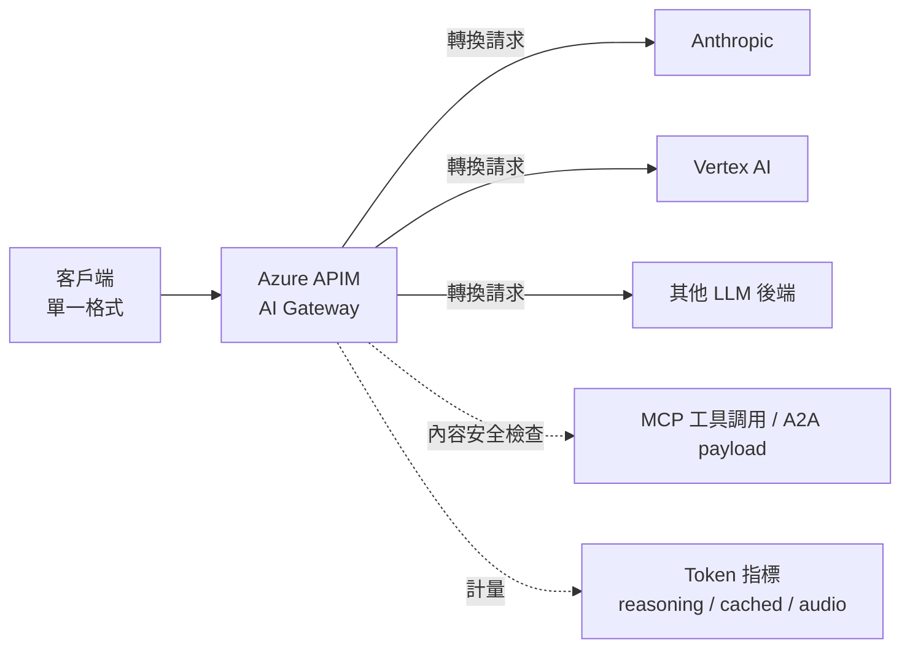
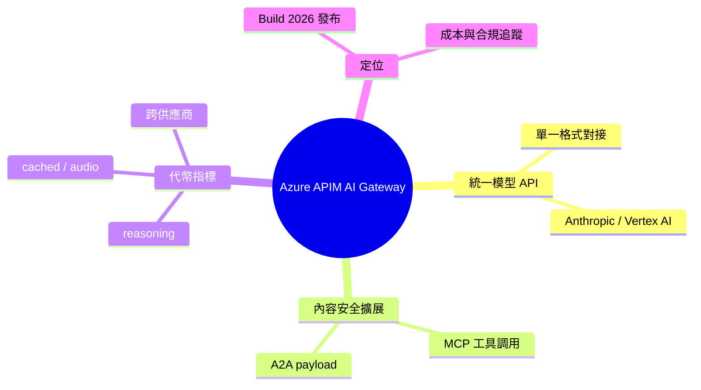

## Azure API Management Ships Unified Model API and MCP Content Safety at Build 2026

微軟在 Build 2026 發布 Azure API Management 的統一模型 API，使客戶端用單一格式與 Anthropic、Vertex AI 等多個 LLM 後端通信，APIM 負責轉換請求。內容安全策略擴展至覆蓋 MCP 工具調用和代理間通訊；代幣指標新增推理、緩存及音頻代幣維度，支援多提供商成本管理和合規追蹤。

### 重點
- 統一模型 API：單一客戶端介面支持 Anthropic Claude、Google Vertex AI 等多個後端
- 安全擴展：內容安全策略涵蓋 MCP 工具調用、Agent-to-Agent 通訊
- 成本可觀測性：代幣指標支持推理代幣、緩存代幣、音頻代幣的多維度追蹤

**原文：** [infoq-main](https://www.infoq.com/news/2026/06/azure-apim-ai-gateway-build/?utm_campaign=infoq_content&utm_source=infoq&utm_medium=feed&utm_term=global)

---

<!-- deep-analysis:begin -->
## 📌 摘要 (TL;DR)

- 微軟在 Build 2026 為 Azure API Management（簡稱 APIM）推出統一模型 API（Unified Model API），讓客戶端只用單一格式發請求，由 APIM 在後端轉換成 Anthropic、Vertex AI 等不同 LLM 供應商的格式。
- 內容安全（content safety）策略的覆蓋範圍從原本的 LLM 流量，擴展到 MCP（Model Context Protocol）工具調用與代理間通訊（Agent-to-Agent，A2A）的 payload。
- 代幣（token）指標新增三個維度：推理（reasoning）、緩存（cached）與音頻（audio）代幣，並可跨多供應商追蹤。
- 對企業而言，這把 APIM 從傳統 API 閘道進一步定位成「AI Gateway」，同時處理多供應商成本管理與合規追蹤。
- 報導作者為 Steef-Jan Wiggers，來源 InfoQ。

## 🎯 核心概念

- **統一模型 API**（Unified Model API）：客戶端用一種格式呼叫，APIM 負責把請求轉譯到各家 LLM 後端，避免為每個供應商寫不同串接。
- **內容安全**（content safety）：對進出流量做安全檢查的策略，現在也涵蓋工具調用與代理間訊息。
- **代理間通訊**（Agent-to-Agent，A2A）：多個 AI 代理彼此交換訊息的通訊型態。
- **AI Gateway**：把傳統 API 閘道的路由、安全、計量能力，套用到 LLM 與代理流量上的角色定位。

## 📖 整理分析

### 1. 統一模型 API：單一格式對接多後端
APIM 新增的統一模型 API 讓客戶端只需以一種格式發送請求，APIM 在中間將請求轉換並轉發到 Anthropic、Vertex AI 等不同後端。這降低了同時整合多家 LLM 供應商時、需為各家維護不同 SDK 與請求格式的成本。（依原文，僅明確點名 Anthropic 與 Vertex AI，其餘以「other backends」概括。）

### 2. 內容安全擴展到 MCP 與 A2A
原本內容安全策略主要套用在 LLM 流量上，現在覆蓋範圍延伸到 MCP 工具調用與代理間（A2A）payload。意義在於：當系統從單一模型呼叫演進到「代理 + 工具」的多跳流程時，安全檢查不再只看模型輸入輸出，也納入工具與代理之間傳遞的內容。

### 3. 代幣指標新增三維度
代幣計量從單純的輸入/輸出，擴展到追蹤推理（reasoning）、緩存（cached）與音頻（audio）代幣，且支援跨供應商。這讓企業能更精細地做成本歸因與合規追蹤——例如區分昂貴的推理代幣與便宜的緩存代幣，並在多供應商環境下統一報表。

## 🧭 流程圖 / 架構圖

## 🧠 Mindmap

<!-- deep-analysis:end -->
### 📄 原文內容

點此展開 / 收合

Azure API Management shipped a Unified Model API that lets clients speak one format while APIM transforms requests to Anthropic, Vertex AI, and other backends. Content safety policies now cover MCP tool calls and Agent-to-Agent payloads alongside LLM traffic. Token metrics expanded to track reasoning, cached, and audio tokens across providers. By Steef-Jan Wiggers

