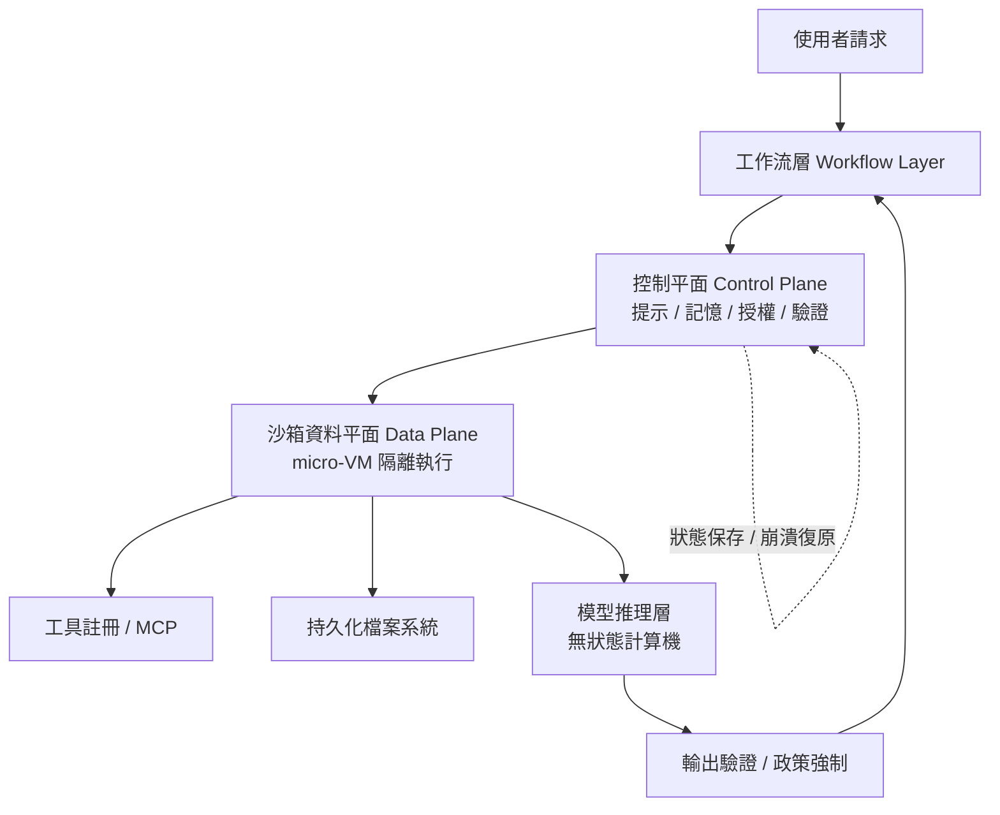
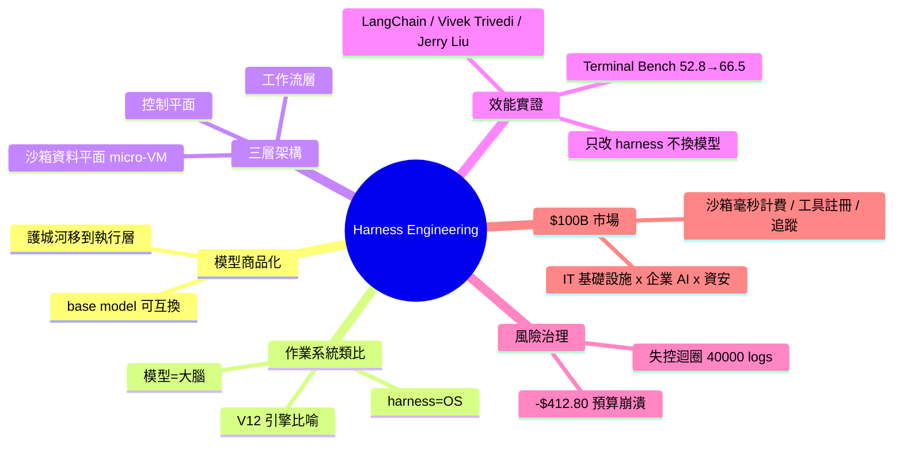

## Harness Engineering: The Next $100B Layer in AI

一篇戰略分析文章，提出「Harness Engineering」是 AI 產業下一個 $100B 商業機會層。核心論點：大語言模型正在商品化，模型本身的性能差異逐漸縮小，而「執行環境」（orchestration、observability、cost 管理、可靠性）才是決定長期競爭力和護城河的關鍵。這個框架重新定位了 AI 價值鏈，從模型開發能力轉向平台基礎設施和運營效率。對於規劃 AI 基礎設施投資的團隊，提供了戰略思考維度的重新調整。

### 重點
- LLM 模型正趨向商品化，差異化優勢逐漸消退，真正的護城河在執行環境
- Harness Engineering 涵蓋 orchestration、observability、成本控制、可靠性管理等平台能力
- 下一個 $100B 機會在於構建高效、可靠、低成本的 AI 執行和管理平台而非模型開發本身

**原文：** [medium-tag-claude](https://medium.com/@sageholloway/harness-engineering-the-next-100b-layer-in-ai-88871e8ec817?source=rss------claude-5)

---

<!-- deep-analysis:begin -->
## 📌 摘要 (TL;DR)

- 作者 Sage Holloway 主張：大語言模型正在快速商品化、彼此「可互換」，真正的護城河是包在模型外層的**執行框架（harness）**，他稱這個新領域為「執行框架工程」（Harness Engineering）。
- 關鍵證據：LangChain 的程式碼代理人只改 harness、完全不換模型，就讓 Terminal Bench 2.0 分數從 52.8 提升到 66.5（約 14 個百分點），證明執行層才是效能來源。
- 反例警示：失控的代理人迴圈曾在一次事件中燒出 40,000 份編譯日誌、造成 -$412.80 的預算崩潰，凸顯「狀態管理、驗證、政策」的必要性。
- 架構上 harness 分三層——工作流層（Workflow Layer）、控制平面（Control Plane）、沙箱資料平面（Sandbox Data Plane，跑在 micro-VM 裡）。
- 商業論點：harness 卡在 IT 基礎設施、企業 AI 支出、資安三者交集，靠沙箱運算（毫秒計費）、安全政策、工具註冊、追蹤平台變現，因此被看成下一個 $100B 市場。
- 對規劃 AI 基礎設施的團隊，這篇重新定位了價值鏈：別只盯模型能力，要押注「把可取得的智慧轉成可上線生產力」的執行層。

## 🎯 核心概念

- **執行框架工程**（Harness Engineering）：圍繞無狀態模型打造的控制系統，負責狀態保存、多階段任務協調、輸出驗證、政策強制、檔案管理、認證與崩潰復原。
- **控制平面**（Control Plane）：harness 的協調中樞，管理提示詞、記憶、授權與驗證。
- **資料平面**（Data Plane）：實際執行程式碼的隔離沙箱，跑在 micro-VM 中。
- **工具註冊／MCP**（Tool Registry / MCP）：模型呼叫外部工具的登記與路由層。

## 📖 整理分析

### 1. 模型是大腦，harness 是作業系統
作者用作業系統類比：原始模型只是「無狀態計算機」，缺乏持久化、協調與驗證能力。架構會自然分裂成「推理層（模型）」與「執行層（harness）」，正如當年作業系統把硬體抽象掉。他另用 V12 引擎比喻——光有強力引擎卻沒有底盤治理，「你沒有一台車，只有一塊很貴、自己在震動的金屬」。

### 2. 迴圈失控那天：為什麼需要治理
文章用「The Day the Loop Ran Wild」一節說明風險：當代理人迴圈不受控，會無止盡自我呼叫，單次事件就產出 40,000 份編譯日誌，並把預算燒到 -$412.80。這正是 harness 要解決的——透過狀態保存、驗證、政策強制與崩潰復原，把模型的不可預測性框進可運維的邊界。

### 3. 效能護城河的實證
Terminal Bench 2.0 的數字是全文最硬的證據：LangChain 的程式碼代理人**完全不動模型**，只修改 harness，分數就從 52.8 跳到 66.5。文中引用 Vivek Trivedi、Jerry Liu 等人觀點佐證——效能增益來自執行環境的工程，而非更大的模型。對企業意味著：選對 / 自建 harness，比追逐最新模型更能拉開差距。

### 4. 四個操作分區與三層架構
harness 由上而下分三層：工作流層、控制平面（協調、提示、記憶、授權、驗證）、沙箱資料平面（micro-VM 隔離執行）。橫向再切成四個操作分區：提示與政策層、持久化檔案系統、工具註冊／MCP、記憶與驗證。這個分工讓「智慧」與「執行」解耦，使系統可被監控、計費與稽核。

### 5. 為什麼是 $100B 市場
作者把 harness 定位在三大支出池的交集：IT 基礎設施、企業 AI 預算、資安。變現路徑包括沙箱運算的毫秒計費、安全政策、工具註冊、以及追蹤（tracing）平台。結論一句話收束全文：「模型是大腦，harness 是作業系統……掌握作業系統的建造者，才是真正收割的人。」

## 🧭 架構圖

## 🧠 Mindmap

<!-- deep-analysis:end -->
### 📄 原文內容

點此展開 / 收合

Why models are becoming commodities and the execution environment is the real platform moat. Continue reading on Medium »

