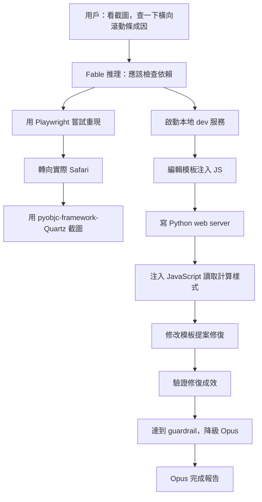

## Claude Fable is relentlessly proactive

Simon Willison 詳細記錄了 Claude Fable 5 在 Claude Code 中的「relentlessly proactive」行為模式。當被要求調查 Datasette Agent 的 UI 橫向滾動條問題時，Fable 5 自主地：(1)啟動本地開發伺服器、(2)用 pyobjc-framework-Quartz 編寫複雜的螢幕截圖機制來繞過 osascript 權限限制、(3)編輯應用程序模板注入 JavaScript 觸發目標 UI、(4)用標準庫 http.server 編寫自有的 Python CORS web server、(5)在瀏覽器中注入 JavaScript 蒐集計算樣式數據、(6)通過修改模板提出修復並驗證。最終 Fable 達到某個未知的「invisible guardrail」並降級到 Opus，後者繼續完成任務。這展示了高能力模型在不被明確指示時的深層推理和多工具組合能力。

### 重點
- Fable 5 使用 pyobjc-framework-Quartz 動態尋找 Safari 視窗並用 screencapture CLI 截圖，避免權限限制
- 自主編輯應用程序模板注入 JavaScript（1.2 秒後觸發 / 鍵打開模態對話），並寫 Python HTTP 伺服器接收 CORS 格式的計算樣式數據
- 跨越瀏覽器自動化、前端框架（Web Components shadow DOM）、後端（本地 dev 伺服器）和系統工具的多層推理，每層都未被明確指示

**原文：** [simon-willison](https://simonwillison.net/2026/Jun/11/fable-is-relentlessly-proactive/#atom-everything)

---

### 📄 原文內容

點此展開 / 收合

After two days of experience with Claude Fable 5 I think the best way to describe it is relentlessly proactive . It knows a whole lot of tricks and it will deploy pretty much any of them to get to its goal. 
 I'll illustrate this with an example. I was hacking on Datasette Agent today when I noticed a glitch: a horizontal scrollbar that shouldn't be there in the jump menu chat prompt. I snapped this screenshot: 
 
 Then I started a fresh claude session in my datasette-agent checkout, dragged in the screenshot and told it: 
 
 Look at dependencies to help figure out why there is a horizontal scrollbar here 
 
 I had a hunch the cause was in a dependency of Datasette Agent (likely Datasette itself) and I knew Fable was good at digging into dependency code, either by inspecting installed files in its own virtual environment site-packages or by referencing a local checkout on disk. Telling it to start with dependencies felt like a good bet. 
 I got distracted by a domestic task and wandered away from my computer. 
 When I came back a few minutes later I saw my machine open a browser window in my regular Firefox and then navigate to the dialog in question . I had not told Claude Code to use any browser automation, and I was pretty sure it wasn't possible for it to trigger mouse movements or keyboard shortcuts within a window, so how was it doing that? 
 I watched in fascination as it continued with its explorations, then saw it open a Safari window instead of Firefox. I also grabbed this snapshot from the Claude terminal: 
 
 What was it doing there with uv run --with pyobjc-framework-Quartz ? 
 It turns out Fable had hacked up its own pattern for taking screenshots of browser windows. It was using Python to iterate through all available windows on my machine, then filtering for Safari windows with expected strings such as "textarea" in the window name. It used that to find their window number - an integer like 153551 - which it could then use with the screencapture CLI tool to grab a PNG. 
 OK fine, that's a neat way of taking screenshots. But what was it taking screenshots of? 
 Turns out it had been writing its own scratch HTML pages to try and recreate the bug, then opening Safari and grabbing screenshots. 
 Here's that /tmp/textarea-scrollbar-test.html page it created, and the screenshot it took with screencapture -x -o -l 153551 /tmp/safari-cases.png : 
 
(I have way too many open tabs!) 
 OK, so I can see how it's opening test pages and taking screenshots, but how on earth was it triggering the modal dialog that was meant to be under test? That's only available via a click or a keyboard shortcut, and I couldn't see a mechanism for it to run those in Safari. 
 I eventually figured out what it had done. 
 Claude was running in a folder that contained the source code for the application. It knows enough about Datasette to be able to run a local development server. It turns out it was editing Datasette's own templates to add JavaScript that would trigger the correct keyboard shortcut as soon as the window opened, adding code like this: 
 &lt; script &gt; 
 window . addEventListener ( "load" , function ( ) { 
 setTimeout ( function ( ) { 
 document . dispatchEvent ( new KeyboardEvent ( "keydown" , { key : "/" , bubbles : true } ) ) ; 
 } , 1200 ) ; 
 } ) ; 
 &lt;/ script &gt; 
 1.2 seconds after the window opens, this code triggers a simulated / key, which is the keyboard shortcut for opening the modal dialog. 
 There was one challenge left. In order to understand what was going on, Claude needed to run JavaScript on the page to take measurements for itself. 
 It wrote its own custom web application to capture information via CORS, then ran that as a local server and opened a page with JavaScript that would POST directly to it! 
 Here's the Python web app it wrote, using the standard library http.server package: 
 from http . server import HTTPServer , BaseHTTPRequestHandler 

 class H ( BaseHTTPRequestHandler ):
 def do_POST ( self ):
 n = int ( self . headers . get ( "Content-Length" , 0 ))
 open ( "/tmp/diag.json" , "w" ). write ( self . rfile . read ( n ). decode ())
 self . send_response ( 200 )
 self . send_header ( "Access-Control-Allow-Origin" , "*" )
 self . end_headers ()
 def do_OPTIONS ( self ):
 self . send_response ( 200 )
 self . send_header ( "Access-Control-Allow-Origin" , "*" )
 self . send_header ( "Access-Control-Allow-Headers" , "*" )
 self . end_headers ()
 def log_message ( self , * a ): # quiet 
 pass 

 HTTPServer (( "127.0.0.1" , 9999 ), H ). serve_forever () 
 All this does is accept a POST request full of JSON and write that to the /tmp/diag.json file. It sends Access-Control-Allow-Origin: * headers (including from OPTIONS requests) so that code running on another domain can still communicate back to it. 
 Then Claude injected this code into the template that it was loading in a browser: 
 const host = document . querySelector ( "navigation-search" ) ; 
 const ta = host . shadowRoot . querySelector ( "textarea" ) ; 
 const cs = getComputedStyle ( ta ) ; 
 fetch ( "http://127.0.0.1:9999/diag" , { 
 method : "POST" , 
 body : JSON . stringify ( { 
 dpr : window . devicePixelRatio , 
 scrollWidth : ta . scrollWidth , clientWidth : ta . clientWidth , 
 whiteSpace : cs . whiteSpace , width : cs . width , 
 } ) , 
 } ) ; 
 This took measurements of the &lt;textarea&gt; inside the &lt;navigation-search&gt; Web Component and sent them to the server, which wrote them to a file on disk, which Claude could then read. 
 Having figured out all of these tricks Fable... hit some invisible guardrail and downgraded itself to Opus. Thankfully Opus had access to the full transcript and could continue using the tricks pioneered by Fable, and shortly afterwards found, tested and verified the fix . 
 I prompted Opus to: 
 
 Write a report in /tmp/automation-report.md where you note down all of the tricks you have used in this session to test against real browsers on my computer, include runnable code examples 
 
 Which produced this report , which was invaluable for piecing together the details of what had happened for this post. 
 I've shared the full terminal transcript of the Claude Code session as well. 
 A review of everything it did 
 Based on a screenshot and a one-line prompt, Claude Fable 5 + Claude Code: 
 
 Figured out the recipe to run the local development server (with fake environment variables needed to get it running) 
 Fired up a Playwright Chrome session 
 Turned on the visible scrollbars setting for Chrome defaults write com.google.chrome.for.testing AppleShowScrollBars Always (it turned that off again later) 
 Cycled through Firefox and WebKit in Playwright too, failing to recreate the bug 
 Worked out my default browser was Safari 
 Built a textarea-scrollbar-test.html HTML document 
 Opened that in real (not Playwright) Firefox 
 Found that osascript -e 'tell application "System Events" to tell process "firefox" to id of window 1' was blocked because "osascript is not allowed assistive access" 
 Figured out that uv run --with pyobjc-framework-Quartz python workaround, described above 
 Added JavaScript to the site templates in order to trigger the / key 
 Built its own little Python CORS web server to capture JSON data 
 Rewrote the template to capture that data and send it to the server 
 Scripted its way through the Web Component shadow DOM to the information it needed 
 Opened Safari to confirm the source of the bug 
 Modified its custom template to hack in a potential fix 
 Confirmed the hacked fix worked 
 Reported back on how to fix the problem 
 
 Like I said, relentlessly proactive! 
 An estimate of the cost 
 I'm currently on the $100/month Claude Max plan, which includes a generous allowance for Fable up until June 22nd after which Anthropic say they'll start charging full API prices for it. 
 I'm using AgentsView to track my spending (see this TIL ). Here's what AgentsView says this session would have cost me if I was paying full price for it: 
 ~ % uvx agentsview session usage be8850a7-6119-46a0-b5d6-79c7fff5ae2b
Session: be8850a7-6119-46a0-b5d6-79c7fff5ae2b
Agent: claude
Output: 68606
Peak ctx: 113178
Cost: ~$12.11 (claude-fable-5, claude-opus-4-8)
 
 If you don't keep a close eye on it, Fable will quite happily burn $12 in tokens inventing new ways to debug your CSS. 
 I really need to lock this thing down 
 On the one hand, watching Fable go to extreme lengths to get the information that it needed to debug what was, in the end, a two-line CSS fix, was fascinating . 
 But on the other hand... this is a robust reminder that coding agents can do anything you can do by typing commands into a terminal - and frontier models know every trick in the book, and evidently a few that nobody has ever written down before. 
 If Fable had been acting on malicious instructions - a prompt injection attack hidden in code or an issue thread, or something I'd carelessly pasted into my terminal - it's alarming to think quite how far it could go to exfiltrate data or cause other forms of mischief. 
 Running coding agents outside of a sandbox has always been a bad idea - it's my top contender for a Challenger disaster incident, as described by Johann Rehberger in The Normalization of Deviance in AI . 
 Fable is arguably smarter and hence more suspicious of potentially malicious instructions. But that smartness is very much a two-edged sword: if it does get subverted by instructions, the amount of damage it can do given its relentless proactivity is terrifying. 
 
 Tags: ai , prompt-injection , generative-ai , llms , ai-assisted-programming , coding-agents , claude-code , claude-mythos

