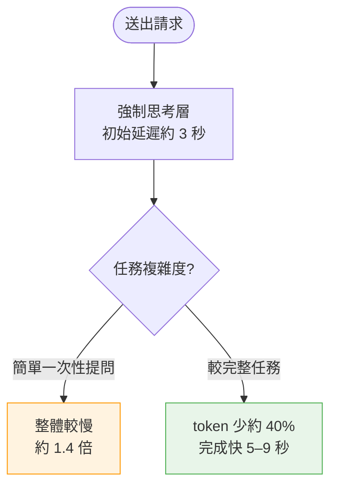
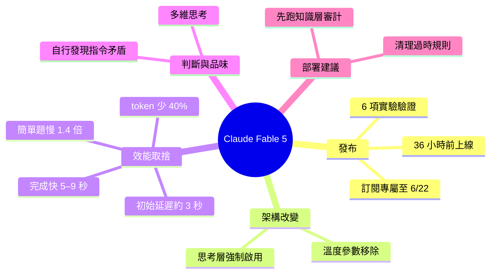

## The Ultimate Guide to Claude Fable 5

Claude Fable 5 發布後進行的 6 項實驗結果分析。核心改變包括：思考層（thinking）強制啟用、溫度參數移除、6 月 22 日前訂閱專用。實測性能：初始延遲約 3 秒，但同時輸出 token 減少 40% 並完成速度快 5-9 秒，簡單一次性問題約慢 1.4 倍。最重要的進展是模型具備「判斷力、品味與多維性」，能獨立發現指令文件的矛盾。建議在部署前運行「知識層審計」提示詞來識別不合適的舊規則。

### 重點
- 思考層必須啟用、溫度參數移除、輸出 token 減少 40% 但完成快 5-9 秒
- Fable 5 定價約提升 3 倍，但性能增益對複雜工作有實質價值
- 關鍵進展：模型具備判斷力能識別指令文件矛盾，建議部署前先做知識層審計

**原文：** [substack-product-compass](https://www.productcompass.pm/p/claude-fable-5-guide)

---

<!-- deep-analysis:begin -->
## 📌 摘要 (TL;DR)

- Claude Fable 5 在本文發布前約 36 小時上線，作者隨即跑了 6 項實驗檢驗實際變化
- 兩項架構級調整：思考層（thinking）改為強制啟用、溫度（temperature）參數被移除
- 發布初期為訂閱用戶專屬，限定 6 月 22 日前
- 效能呈現權衡：初始延遲約 3 秒，但輸出 token 減少約 40%、整體完成快 5–9 秒；單純的一次性提問反而慢約 1.4 倍
- 作者認為最大的躍進是模型展現出「判斷力、品味與多維思考」——能自行發現指令文件裡互相矛盾的規則
- 部署前的第一個建議動作：先跑一段「知識層審計（knowledge layer audit）」提示詞，找出並清掉過時或衝突的舊規則

## 🎯 核心概念

- **思考層（thinking）**：模型在輸出答案前的內部推理階段；Fable 5 將其改為強制開啟，無法關閉。
- **溫度（temperature）**：控制輸出隨機性與發散程度的參數；此版本移除，開發者不再能用它微調生成風格。
- **模型靜默切換（silent model swap）**：導言提到「模型何時被悄悄替換」，指使用情境下底層模型可能在未明示的情況下切換。
- **知識層審計（knowledge layer audit）**：用一段提示詞掃描指令／規則文件，揪出已不適用或彼此矛盾的舊規則。

## 📖 整理分析

### 1. 發布節奏與取得門檻

Fable 5 在本文撰寫前約 36 小時推出，初期僅開放給訂閱用戶，且這個專屬窗口限定到 6 月 22 日。作者沒有空談規格，而是直接以 6 項實驗來驗證它與前代的差異。

### 2. 架構級改變：強制思考、拿掉溫度

最底層的兩個變化是行為模式的轉變：思考層從可選變成強制啟用，代表每次回答都會先經過內部推理；同時 temperature 參數被移除，意味著過往靠調溫度來控制輸出發散度的做法在此版本失效。這兩點會直接影響既有 prompt 與整合流程的設計。

### 3. 效能權衡：慢啟動換快完成

實測數據呈現明確的取捨。強制思考讓初始延遲增加到約 3 秒，因此對「簡單、一次性」的提問反而慢了約 1.4 倍。但對較完整的任務，模型的輸出 token 減少約 40%，整體完成時間快了 5–9 秒——換言之，它想得更久、但講得更精簡、收尾更快。任務愈複雜，這個交換愈划算。

### 4. 判斷力、品味與多維思考

作者把這版最重要的進展定位在「能力」之外的「判斷」：模型展現出判斷力、品味與多維思考，最具代表性的例子是它能在指令文件裡**自行發現互相矛盾的規則**，而不是照單全收地執行。這把模型從「指令執行者」推向「會質疑輸入合理性」的協作者。

### 5. 第一個該跑的提示詞：知識層審計

承接上一點，作者給出的實務建議是：在把 Fable 5 接進正式流程前，先用一段「知識層審計」提示詞掃過你既有的規則／指令文件。因為模型現在會認真看待這些規則，過時或衝突的舊條文反而會誤導它——先清乾淨，再部署。

## 🧭 效能取捨對照

## 🧠 Mindmap

<!-- deep-analysis:end -->
### 📄 原文內容

點此展開 / 收合

Fable 5 dropped 36 hours ago. 6 experiments later: what changed, when your model silently swaps, and the first prompt you should run.

