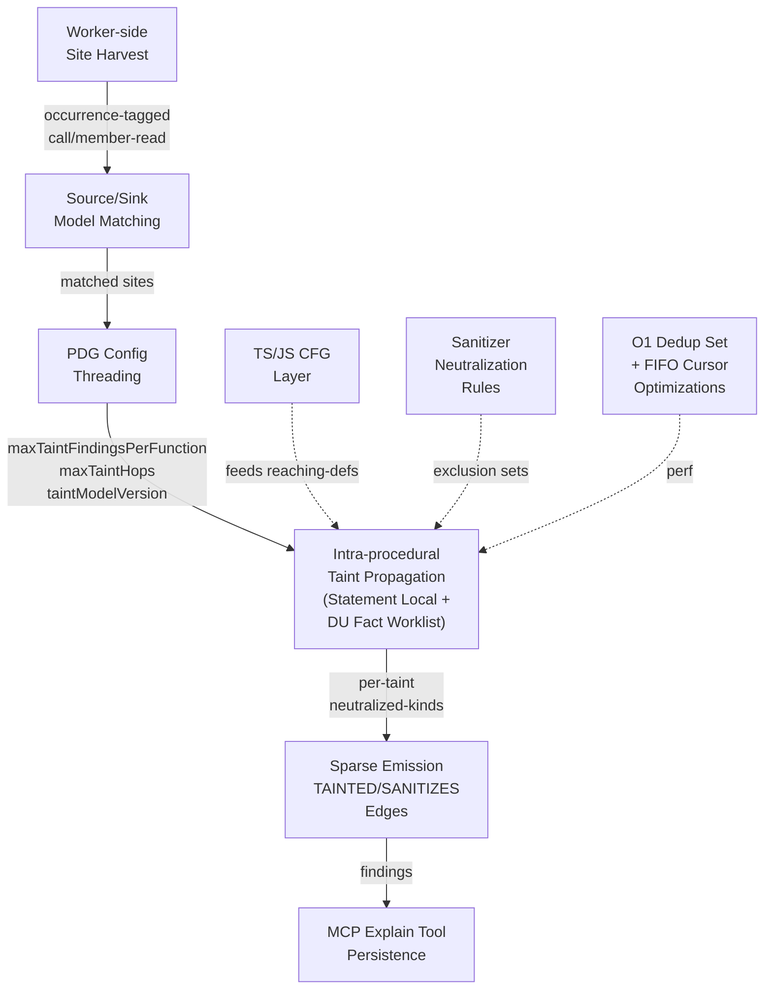

## rc/14397dd4aa99ed35f27bcc3f97952afa05aa6552: feat(taint): intra-procedural taint analysis (#2083) (#2164)

GitNexus 污點分析完整實現文檔，涵蓋 7 核心層次。(1) Worker-side 站點收集：標註呼叫/成員讀取/新運算式，支持巢狀鏈接及擴展/樣板標記；(2) 內建 TS/JS source/sink/sanitizer 模型，含 Express/Node 規範及站點匹配器；(3) 純 intra-procedural 傳播引擎，採陳述式局部規則 + 資料流工作表，支持衛生檢查排除集合；(4) PDG 配置線程化，引入 maxTaintFindingsPerFunction (200)、maxTaintHops (32)、taintModelVersion 摘要；(5) 稀疏 TAINTED/SANITIZES 邊發射，含快速路徑匹配優化；(6) MCP explain 工具用於持久化污點發現；(7) 38 個測試場景、快照驗證、O(1) 成員讀去重、FIFO 頭遊標效能優化。版本化設計確保向後相容性（pdg:1→pdg:2）。

### 重點
- 完整污點傳播框架：worker-side 站點收集→source/sink 匹配→intra-procedural 傳播→稀疏邊發射，含 38 個測試場景、快照驗證確保準確性
- 效能最佳化策略：O(1) 成員讀去重（複合鍵集合）、FIFO 頭遊標替代 shift()（提升 O(N)→O(1)）、快速路徑匹配（僅在 source + sink 皆存在時觸發求解器）
- 版本化與向後相容性：PDG 快取命名空間版本化、taintModelVersion 摘要、M2→M3 升級時完整回寫，使舊版本保留熱快取而無需 --force

**原文：** [gitnexus-releases](https://github.com/abhigyanpatwari/GitNexus/releases/tag/rc%2F14397dd4aa99ed35f27bcc3f97952afa05aa6552)

---

### 📄 原文內容

點此展開 / 收合

feat(taint): harvest occurrence-tagged call/member sites on StatementFacts ( #2083 U1) 
 
 Worker-side site harvest in TsHarvester: call/new/member-read records with 
dotted callee paths, receiver slots, per-argument occurrence tagging with 
nested-site links, per-declarator resultDefs, spread/template/require-literal 
markers. hasTaintSafeSites validation seam. The pdg parse-cache chunk-key 
namespace is versioned (pdg:1 -&gt; pdg:2) instead of a global SCHEMA_BUMP so 
flag-off users keep warm caches; bench fingerprints re-baselined for the 
three call-bearing scenarios (straight-line/dense-bindings byte-unchanged). 
 
 feat(taint): built-in TS/JS source/sink/sanitizer model + site matcher ( #2083 U2) 
 
 Typed spec (kind taxonomy; sanitizers carry neutralizes-kinds), the canonical 
Express/Node model, and matchFunctionSites: ESM alias/namespace + require- 
literal callee resolution, bare-name fallback restricted to true globals, 
sanitizers module-or-global only (never user-shadowable by name), spread/ 
template arg-position rules, deterministic taintModelVersion. 
 
 feat(taint): pure intra-procedural taint propagation engine ( #2083 U3) 
 
 Two-rule model (statement-local + du-fact worklist) with per-taint 
neutralized-kind exclusion sets: sanitizers exclude only the sink kinds 
they neutralize (escape(req.body) suppresses res.send but still fires 
db.query; exec(path.basename(t)) fires), intersection-over-paths so a 
bypass occurrence keeps the taint live, kill locality on resultDefs, 
propagate-through args+receiver with viaCall hops, one path per finding, 
deterministic caps, coverage-gap statuses. Test-first: 38 scenarios on 
real harvested CFGs. 
 
 feat(taint): thread taint caps + model version through pdg config/meta ( #2083 U5) 
 
 resolvePdgConfig gains maxTaintFindingsPerFunction (200), maxTaintHops (32), 
and the taintModelVersion digest; RepoMeta.pdg + RunScopeResolutionInput 
surfaces added. The key-union comparator trips full writeback on M2-&gt;M3 
upgrade and on model-version change without --force (mode-flip tested). 
No CLI flags or rc keys (programmatic parity with the other caps). 
 
 feat(taint): in-phase taint emit with sparse TAINTED/SANITIZES edges ( #2083 U4) 
 
 run.ts pdg window: match-first fast path (solver only when a function has 
both a matched source and sink) -&gt; computeReachingDefs with the shared RD 
fact derivation -&gt; computeTaintFlows -&gt; per-finding TAINTED (versioned 
hop-encoded reason via the shared path codec, statement-level occurrence 
identity) + per-kill SANITIZES, dedup-before-budget, truncate-and-warn. 
All emit counters surfaced (aggregate warn for gaps/drops, debug for 
volume); PROF gains taint=. Flag-off golden untouched. 
 
 feat(mcp): explain tool for persisted taint findings ( #2083 U6) 
 
 Anchorless calls enumerate the sparse TAINTED table (bounded, deterministic, 
limit-clamped); anchored calls (file or symbol via resolveSymbolCandidates) 
return full decoded hop detail. sinkKind rides a version-1 codec header 
(1;|hops — no other persisted channel exists; U4/U6 ship together). 
RepoMeta.pdg probe yields a no-taint-layer note instead of an error. 
TAINTED/SANITIZES pinned OUT of VALID_RELATION_TYPES (KTD9a negative- 
membership tests); generators + canonical skill docs + mirrors updated. 
 
 test(taint): acceptance fixture battery, snapshots, and bench gates ( #2083 U7) 
 
 pdg-repo taint-cases fixtures complete the six plan shapes; committed 
findings/kills snapshot via a shared pure-path harness that also feeds the 
AE2 exact-equality assertion (stored TAINTED == pure-path findings, the 
no-explosion gate). New taint-dense bench scenario with four --check gates: 
per-function findings pinned AT the cap, absolute reason-byte + site-bytes 
disk ceilings (the load-bearing R10 gate), zero-match pass &lt; 0.5x match- 
dense, N-linearity. Pre-existing scenario baselines untouched. 
 
 refactor(taint): share one pointKey helper across propagate + emit ( #2083 review) 
 
 Extract pointKey(ProgramPoint) to cfg/reaching-defs.ts (colon-separated, 
matching the codebase block:stmt id convention) and import it in both 
propagate.ts and emit.ts, replacing the two divergent locals (':' vs '.'). 
Edge-id material now uses the colon form; ids are in-memory only and no 
test asserts the pointKey segment shape. 
 
 fix(taint): discriminate taint state by source occurrence ( #2083 review) 
 
 Two distinct sources flowing into one variable at one def point no longer 
collapse to a single TAINTED edge: the taint-state key gains a root 
source-occurrence discriminator ({point, siteIndex} — the same fields 
recordFinding's identity uses, excluding kind). Def-&gt;use fact lookup keys 
on the source-independent (binding, def-point) portion. Same-source 
multi-path flows still share one state so their exclusion sets intersect 
(the raw arm soundly wins); termination holds (finite keys, monotone 
shrink, no cross-source ping-pong). Restores the KTD6 identity contract. 
 
 fix(mcp): route dotted symbol names in explain to symbol resolution ( #2083 review) 
 
 The fileish classifier matched any dotted name (UserController.create) 
as a file via its extension-like suffix, so symbol resolution never ran 
and the tool returned a silent empty file-anchored result. Tighten the 
classifier to require a path separator or a real source extension (derived 
from the resolver's EXTENSIONS list, multi-language), so dotted/bare names 
route to resolveSymbolCandidates (found / ambiguous / not-found). 
 
 fix(mcp): gate explain no-taint-layer note on taintModelVersion ( #2083 review) 
 
 An M1/M2-era --pdg index has meta.pdg defined (BasicBlock/REACHING_DEF 
recorded) but no taintModelVersion and zero TAINTED rows. The probe keyed 
on generic meta.pdg presence, so explain returned the generic empty note 
instead of the actionable 'no taint layer — run analyze' hint. Gate on 
meta.pdg?.taintModelVersion (the field M3 stamps) so an M2-era index gets 
the layer hint; a taint-stamped index with no findings still gets the 
generic note. 
 
 fix(taint): sequence-expression value flows only the final operand ( #2083 review) 
 
 A comma expression in value position (exec((log(x), 'safe'))) default- 
descended, fanning every operand's occurrences into the enclosing sink 
argument — over-tainting exec's arg 0 with x. Add an explicit walkValue 
case that records earlier operands' uses with occurrence fan-out suppressed 
(new FactAccumulator.suppressOccurrences) and routes only the last operand 
through the value path. Sites-layer only; defs/uses/mayDefs byte-identical 
(cfg + reaching-defs snapshots unchanged). 
 
 perf(taint): FIFO head-cursor worklist + dedup before chainHops ( #2083 review) 
 
 Replace queue.shift() (O(N) dequeue) with a strict-FIFO head cursor plus 
order-preserving prefix reclamation; FIFO is load-bearing because chainHops 
reads the live taints map whose parent/source/viaCall are rewritten 
order-sensitively on monotone shrink, so hop determinism is dequeue-order 
contingent. Extract findingKey() and dedup-check before chainHops in the 
justify branch — already-recorded identities discard their hop chain 
(first write wins), so the ancestry walk was pure waste. The else kill 
branch is untouched. Findings + hops byte-identical (snapshot unchanged). 
 
 perf(taint): O(1) member-read dedup via composite-key set ( #2083 review) 
 
 addMemberRead rescanned the whole per-statement sites array per call to 
dedup by (object, property, parent) — O(n^2) on member-read-dense 
statements. Track a composite-key Set alongside sites for O(1) dedup. 
(The require-literal join is already O(sites) with a no-op body on 
non-require sites, so no early-exit is needed there.) Behavior identical: 
harvest + model-match + taint snapshots unchanged. 
 
 refactor(taint): drop test-only export; source taint caps via emit.ts ( #2083 review) 
 
 Remove the sanitizerNeutralizes export (its only consumers were two test 
assertions — inlined to entry.neutralizes membership). Re-export the 
DEFAULT_PDG_MAX_TAINT_* caps from emit.ts and point run.ts at emit.ts, so 
the pipeline's taint dependency surface is the single orchestration module 
rather than reaching into propagate.ts. 
 
 test(taint): extract the shared TS CFG/taint test harness ( #2083 review) 
 
 The parse/collectFunctions/cfgOf/cfgsOf/importsFor harness was copied 
byte-for-byte across four suites (harvest, model-match, propagate, 
taint-emit). Promote it to test/helpers/ts-cfg-harness.ts and import it. 
site-safety/reaching-defs carry a structurally different inlined builder 
and are left as-is. Pure extraction, no assertion changes. 
 
 test(mcp): harden explain limit-rejection battery ( #2083 review) 
 
 Add NaN, Infinity, -Infinity, and a numeric string to the out-of-bounds 
limit cases — a regression fence over the interpolated LIMIT, confirming 
the Number.isInteger guard rejects every non-integer/non-finite/string 
input before it reaches the query.

