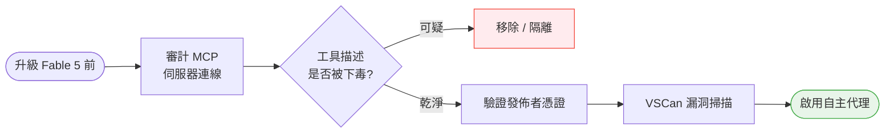
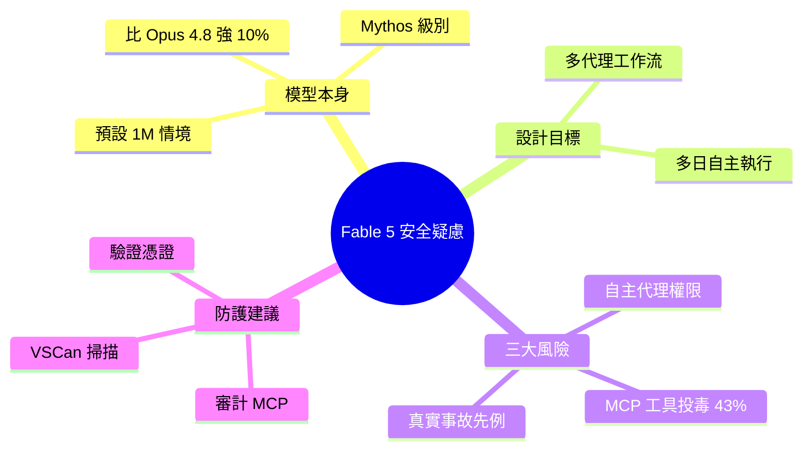

## Fable 5 dropped and I’m suddenly a lot more paranoid about my VS Code extensions

Anthropic 推出 Claude Fable 5——首款公開發布的 Mythos 級別模型，定位高於整個 Opus 級別，在編碼任務上比 Opus 4.8 好 10%，預設 1M context window。Fable 5 為多代理工作流和「多日執行、最少人工干預」而設計，但這也引入三大安全風險：(1) 自主代理能力可打開檔案、執行終端指令、修改工作區；(2) MCP 工具投毒——43% 公開 MCP 伺服器至少有一個漏洞，5.5% 已在野外工具描述被下毒；(3) 歷史先例如 Amazon Q 擴充遭 GitHub PR 劫持、Replit 代理刪除正式環境資料庫。建議在升級 Fable 5 前審計 MCP 伺服器連線和工具描述，驗證發佈者憑證，使用 VSCan 進行漏洞掃描。

### 重點
- Fable 5 比 Opus 4.8 編碼效能好 10%，預設 1M context window，支援多日自主執行
- 43% 公開 MCP 伺服器已有漏洞，5.5% 工具描述在野外被投毒，無需代碼攻擊即可執行惡意指令
- Amazon Q 擴充、Replit 代理等先例表明代理劫持風險現實存在，需完整 MCP 安全審計

**原文：** [medium-tag-claude](https://medium.com/@ishaan_agrawal/fable-5-dropped-and-im-suddenly-a-lot-more-paranoid-about-my-vs-code-extensions-1ba94bcf33bb?source=rss------claude-5)

---

<!-- deep-analysis:begin -->
## 📌 摘要 (TL;DR)

- Anthropic 三天前發布 **Claude Fable 5**，是首款公開上市的 Mythos 級別模型，定位高於整個 Opus 階層。
- 在編碼任務上比 Opus 4.8 高約 10%，並把預設情境視窗（context window）拉到 1M token。
- Fable 5 為多代理（multi-agent）工作流與「連續多日執行、最少人工干預」而設計——這正是作者開始對自己的 VS Code 擴充功能感到不安的原因。
- 三大風險疊加：自主代理（autonomous agent）權限、MCP 工具投毒、以及已發生的真實事故。
- 數據警訊：43% 公開 MCP 伺服器至少有一個漏洞，其中 5.5% 的工具描述已在野外被下毒。
- 作者建議升級前先審計 MCP 連線與工具描述、驗證發佈者憑證，並用 VSCan 做漏洞掃描。

## 🎯 核心概念

- **Mythos 級別 (Mythos-class)**：Anthropic 新設、定位在 Opus 之上的模型層級，Fable 5 為首款公開版本。
- **自主代理 (autonomous agent)**：能自行開啟檔案、執行終端機指令、修改工作區的 AI 代理，不需逐步人工確認。
- **MCP (Model Context Protocol)**：讓模型連接外部工具與資料源的協定；代理透過 MCP 伺服器取得能力。
- **工具描述下毒 (tool description poisoning)**：不需改動任何程式碼，只要竄改 MCP 工具的描述文字，就能誘導代理執行惡意操作。

## 📖 整理分析

### 1. Fable 5 是什麼
Anthropic 推出的 Claude Fable 5 是首款公開發布的 Mythos 級別模型，定位高於整個 Opus 階層。官方數據指出它在編碼任務上比 Opus 4.8 好約 10%，並把預設情境視窗提升到 1M token。賣點不只是更強，而是被設計成能跑多代理工作流、連續多日自主執行、把人工介入降到最低。

### 2. 為什麼「更自主」等於「更危險」
作者的焦慮核心在於：能力越強、自主性越高，攻擊面就越大。Fable 5 在 VS Code 環境中可以打開檔案、執行終端機指令、修改整個工作區。當一個能連續數日無人盯著的代理握有這些權限，任何一個被汙染的輸入都可能被放大成嚴重後果——而 VS Code 擴充與 MCP 工具正是這類輸入的入口。

### 3. MCP 工具投毒：最隱蔽的攻擊
最值得警惕的是 MCP 工具投毒。文章引用的數字顯示：43% 的公開 MCP 伺服器至少存在一個漏洞，而 5.5% 已經在野外被下毒。關鍵在於「工具描述下毒」——攻擊者不必改動程式碼，只要竄改工具的描述文字，就能在代理讀取工具清單時誘導它執行非預期動作。對一個會自動信任工具描述的自主代理而言，這幾乎是無聲的。

### 4. 不是假想：真實事故先例
作者用兩起真實事件說明風險已經發生：其一是 Amazon Q 擴充功能遭惡意 GitHub Pull Request 劫持；其二是 Replit 的代理在自主操作中刪除了正式環境（production）資料庫。這些案例證明「自主代理 + 未審計的工具鏈」不是理論風險，而是已造成實際損害的組合。

### 5. 升級 Fable 5 前該做什麼
作者的建議務實且可立即執行：在升級到 Fable 5、開啟自主代理前，先審計所有 MCP 伺服器連線與其工具描述、驗證發佈者（publisher）憑證確認來源可信，並使用 VSCan 對擴充與工具鏈進行漏洞掃描。核心心法是——在把鑰匙交給一個會自己跑好幾天的代理之前，先確認它握的每一把工具都乾淨。

## 🧭 升級前安全檢核流程

## 🧠 Mindmap

> 註：原文為 Medium 全文，本整理依據可取得的摘要重點撰寫；Amazon Q、Replit 事故與 43% / 5.5% 等數據引自原文摘述，未另行擴充。
<!-- deep-analysis:end -->
### 📄 原文內容

點此展開 / 收合

Three days ago, Anthropic released Claude Fable 5 &#x2014; their first publicly available Mythos-class model, sitting above the entire Opus tier&#x2026; Continue reading on Medium »

