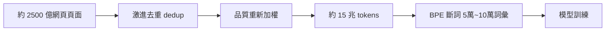
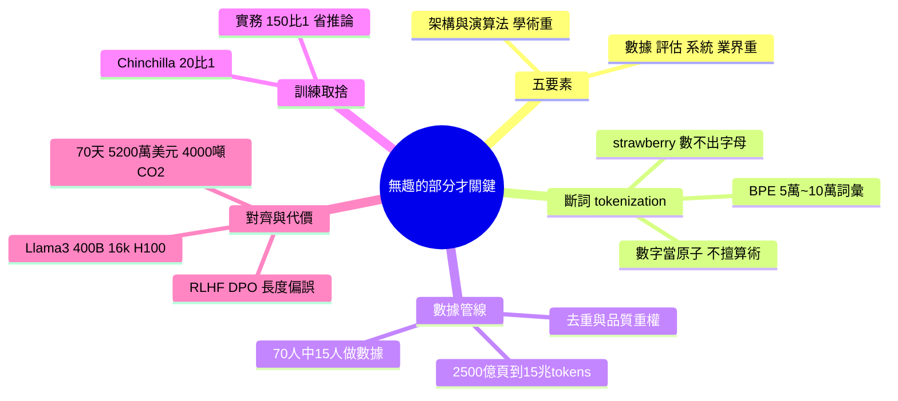

## Nobody Told You the Boring Parts Are What Actually Matter

Stanford 講座揭示 ChatGPT 和 Claude 開發的真實面貌：最關鍵部分並非架構創新，而是被忽視的「無趣」基礎工作——數據處理、評估、系統優化。LLM 訓練涵蓋五個要素：架構、訓練演算法、數據、評估、系統，業界優先化後三者而學術強調前兩者。Tokenization 隱藏影響深遠——使用 5 萬~10 萬 token 的 BPE 導致模型在算術上困頓（數字視為原子單位）及字元層級任務失利（如計數「strawberry」字母因其可能是單一 token）。數據管線從 2,500 億網頁頁面起始，經激進去重和品質重權到約 15 兆 tokens——70 人團隊約 15 人專職數據工作。訓練資料與參數比約 20:1（Chinchilla 論文），實際環境採 150:1 提升效率。RLHF/DPO 副作用：模型學習長度與品質相關（源自標註偏好），導致回應不必要冗長。Llama 3 400B 訓練耗 16k H100 GPU、70 天、$5,200 萬成本、4,000 噸 CO2。

### 重點
- 數據工作遠比架構創新關鍵——2,500 億頁面過濾至 15 兆 tokens，Lima 論文顯示 2k~32k SFT 範例改進甚微，70 人團隊 15 人專職數據
- Tokenization 設計決定模型行為——BPE 5-10 萬 tokens 使模型在算術、字元計數上困頓，是「無趣細節」卻決定實際能力
- Llama 3 400B：16k H100×70 天＝$5,200 萬＋4,000 噸 CO2，RLHF/DPO 副作用造成冗長回應，反映訓練資料品質隱性代價

**原文：** [medium-tag-claude](https://medium.com/@hardik.goel214/nobody-told-you-the-boring-parts-are-what-actually-matter-7a4e54d3b01f?source=rss------claude-5)

---

<!-- deep-analysis:begin -->
## 📌 摘要 (TL;DR)

- 一場 Stanford 講座拆解 ChatGPT 與 Claude 的真實打造過程，結論是：決定成敗的不是架構創新，而是被忽略的「無趣」基礎工作——數據處理、評估與系統優化。
- LLM 訓練可拆成五要素：架構、訓練演算法、數據、評估、系統。業界優先化後三者（數據、評估、系統），學術界則偏重前兩者（架構、訓練演算法）。
- 斷詞（tokenization）的隱藏影響極深：採用 5 萬～10 萬詞彙的 BPE，使模型把數字當成原子單位而不擅長算術，也因「strawberry」可能是單一 token 而數不清字母。
- 數據管線從約 2,500 億網頁頁面起步，經激進去重與品質重新加權，壓到約 15 兆（15T）tokens；70 人團隊中約 15 人專職數據工作。
- 訓練資料與參數的理論最佳比約 20:1（Chinchilla），但實務上採約 150:1 過度訓練，以換取推論階段的效率。
- RLHF／DPO 的副作用：模型從標註者偏好中學到「長度＝品質」，導致回應不必要地冗長。Llama 3 400B 訓練耗用 16k 張 H100、約 70 天、成本約 5,200 萬美元、排放約 4,000 噸 CO2。

## 🎯 核心概念

- **斷詞**（tokenization）：把文字切成模型可處理的最小單位（token）的前處理步驟，其設計會直接限制模型能力。
- **位元組對編碼**（Byte Pair Encoding，簡稱 BPE）：以高頻字元組合建立詞彙表的斷詞演算法，常見詞彙量為 5 萬～10 萬。
- **Chinchilla 比例**（Chinchilla）：DeepMind 論文提出的運算最佳資料量／參數量比例，約 20:1。
- **人類回饋強化學習**（RLHF）／**直接偏好優化**（DPO）：以人類偏好微調模型輸出的對齊方法。

## 📖 整理分析

### 1. 真正重要的是「無趣的部分」
講座的核心命題是：媒體聚焦於模型架構與演算法創新，但實際打造 ChatGPT、Claude 這類系統時，工程團隊的精力主要花在數據、評估與系統三項「無趣」工作上。LLM 訓練的五要素中，業界把後三者（數據、評估、系統）擺在優先，學術界則偏好前兩者（架構、訓練演算法），這正是落地與論文之間的落差所在。

### 2. 斷詞如何暗中限制模型
採用 5 萬～10 萬詞彙的 BPE 斷詞，會把數字當成原子單位，使模型在算術上表現吃力；同時在字元層級任務上失利——例如數「strawberry」有幾個字母時，因為整個字可能被編成單一 token，模型「看不到」內部字元。這說明許多看似推理缺陷的問題，根源其實在前處理設計。

### 3. 數據管線：從 2,500 億頁到 15 兆 tokens
數據工作遠比想像繁重。原始語料從約 2,500 億網頁頁面開始，經過激進去重（deduplication）與品質重新加權後，壓縮到約 15 兆 tokens 才用於訓練。規模上，70 人的團隊裡約有 15 人專職處理數據，凸顯數據工程才是現代 LLM 的人力重心。

### 4. 算多少資料？Chinchilla 與實務取捨
Chinchilla 論文指出運算最佳的資料量／參數量比約為 20:1，但實務上團隊常採約 150:1 的「過度訓練」。原因是把更多資料壓進較小模型，能在推論（inference）階段更省成本——這是訓練成本與長期部署成本之間的權衡。

### 5. 對齊的副作用與訓練代價
RLHF／DPO 雖讓模型更符合人類偏好，卻帶來副作用：因為標註者偏好較長的回答，模型學到「長度與品質相關」，於是傾向給出冗長回應。而訓練本身代價高昂——Llama 3 400B 用了 16k 張 H100、約 70 天、約 5,200 萬美元成本，並排放約 4,000 噸 CO2。

## 🧭 數據管線流程圖

## 🧠 Mindmap

<!-- deep-analysis:end -->
### 📄 原文內容

點此展開 / 收合

A Stanford lecture just explained how ChatGPT and Claude are actually built. The surprising part isn&#x2019;t the AI. It&#x2019;s what the AI people&#x2026; Continue reading on Medium »

