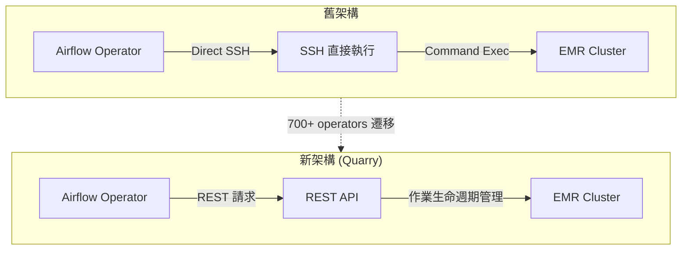

## Slack Eliminates SSH in EMR Pipelines, Migrates 700+ Jobs to Rest-Based Architecture

Slack 將其 Amazon EMR 數據管道從基於 SSH 的執行遷移至 REST 驅動的 Quarry 編排層，涉及 700 多個 Airflow operators。此次遷移消除了生產集群上的直接 SSH 訪問，改進了安全性、可靠性與可觀測性，同時啟用了服務端作業生命週期管理。這一從命令執行到聲明式 REST API 的轉變代表了現代數據平台架構的演進方向。

### 重點
- 700+ Airflow operators 遷移至 REST API（Quarry）編排層，消除直接 SSH 訪問風險
- 啟用服務端作業生命週期模型，改進可觀測性與故障排除能力
- 架構遷移提升安全邊界，代表大規模數據平台現代化方向

**原文：** [infoq-architecture](https://www.infoq.com/news/2026/06/slack-ssh-rest-quarry-migration/?utm_campaign=infoq_content&utm_source=infoq&utm_medium=feed&utm_term=Architecture+%26+Design)

---

### 📄 原文內容

點此展開 / 收合

Slack modernized its data platform by replacing SSH based execution in Amazon EMR pipelines with a REST driven orchestration layer called Quarry. The migration covered 700 plus Airflow operators, improving security, reliability, and observability while eliminating direct SSH access across production clusters and enabling a server side job lifecycle model. By Leela Kumili

