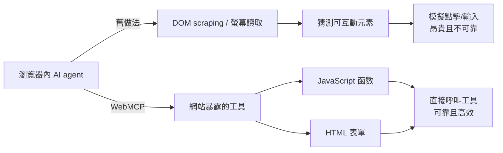
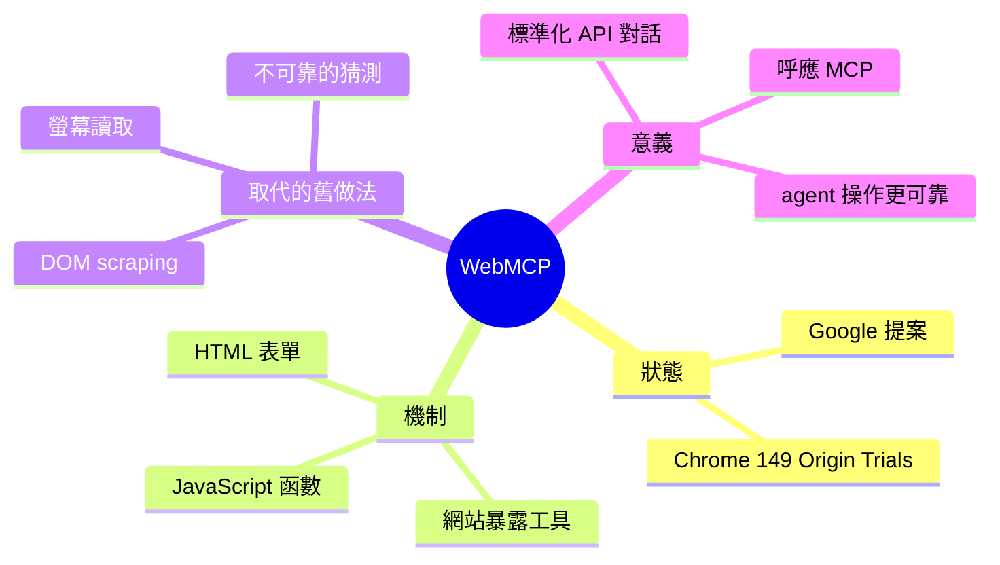

## WebMCP Standard Proposal for Agentic Web Actuation Now Available in Chrome (Origin Trials)

Google 宣佈 WebMCP（Web Model Context Protocol）標準提案進入 Chrome 149 Origin Trials 階段。WebMCP 讓網站向瀏覽器內的 AI agent 暴露工具接口（JavaScript 函數、HTML 表單等），使 agent 可以直接呼叫這些函數而非透過 DOM 解析或螢幕讀取，大幅提升可靠性與效能。這標誌著 web 與 AI agent 互動從「猜測」進入「標準化 API」的新時代。

### 重點
- WebMCP 在 Chrome 149 進入 Origin Trials，讓網站向 agent 暴露工具接口（JS 函數、HTML 表單等）
- 避免不可靠的 DOM 解析與螢幕讀取，改為直接函數呼叫，大幅提升 agent 可靠性
- 標準化的 agent-to-web 互動協議，類似 MCP 在 desktop 的角色，為 web agent 奠定基礎設施

**原文：** [infoq-main](https://www.infoq.com/news/2026/06/webmcp-web-agent-standard-chrome/?utm_campaign=infoq_content&utm_source=infoq&utm_medium=feed&utm_term=global)

---

<!-- deep-analysis:begin -->
## 📌 摘要 (TL;DR)

- Google 宣布 WebMCP（Web Model Context Protocol）標準提案進入 Chrome 149 的 Origin Trials（來源試用）階段，開發者可在真實網站上限時實測。
- WebMCP 讓網站主動向瀏覽器內的 AI agent 暴露「工具」——例如 JavaScript 函數與 HTML 表單，agent 可直接呼叫這些工具來模擬使用者操作。
- 取代過去靠 DOM scraping（DOM 抓取）或螢幕讀取（on-screen reading）的做法，後者既昂貴又不可靠，本質上是「猜測」網頁該怎麼操作。
- 報導由 Bruno Couriol 於 InfoQ 撰寫，定位這是 web 與 AI agent 互動從「猜測」走向「標準化 API」的轉折點。

## 🎯 核心概念

- **WebMCP**（Web Model Context Protocol）：讓網站把可被 agent 呼叫的工具暴露給瀏覽器內 AI 的標準提案，名稱呼應既有的模型情境協定（Model Context Protocol，簡稱 MCP）。
- **Origin Trials**（來源試用）：Chrome 讓開發者在 API 正式標準化前，於正式環境網站上限時啟用實驗性功能、回報實測結果的機制。
- **DOM scraping**（DOM 抓取）：agent 解析網頁的 DOM 結構，反推有哪些可互動元素、該點哪裡的傳統做法。
- **In-browser AI agent**（瀏覽器內 AI 代理）：直接在瀏覽器中執行、能代替使用者操作網頁的 AI。

## 📖 整理分析

### 1. WebMCP 進入 Chrome 149
Google 宣布 WebMCP 標準提案進入 Chrome 149 的 Origin Trials。這代表它從紙上提案進到可實測階段：開發者能在自己的網站上啟用這個實驗性介面，實際讓瀏覽器內的 AI agent 與網頁互動，並把回饋帶回標準制定流程。

### 2. 網站主動暴露工具
WebMCP 的核心是讓「網站」主動向 agent 暴露 tools（工具），文中明確點名兩類：JavaScript 函數與 HTML 表單。換句話說，網頁開發者可以宣告「這裡有一個可被呼叫的動作」，agent 直接呼叫即可，而不需要自己去拆解整個頁面結構。

### 3. 從「猜測」到「呼叫工具」
在 WebMCP 之前，agent 要操作網頁只能靠兩種手段：on-screen reading（螢幕讀取，昂貴）與 DOM scraping（DOM 抓取，常常不可靠）。兩者的共通問題是「猜測」——agent 必須推測哪個元素是按鈕、哪個欄位要填什麼。WebMCP 改成由網站提供明確的工具介面，讓 agent 可靠地模擬使用者動作，降低出錯率與運算成本。

### 4. 為什麼讀者該關注
這是 web 與 AI agent 互動模式的結構性轉變：從「agent 單方面解析頁面」變成「網站與 agent 以標準化 API 對話」。對開發者而言，意味著未來可以為自家網站設計 agent 友善的工具接口；對整個生態而言，則是把 agent 操作從脆弱的螢幕／DOM 解析，推向更穩定的協定層。

## 🧭 流程圖 / 架構圖

舊做法（猜測）與 WebMCP（標準化呼叫）的對比：

## 🧠 Mindmap

<!-- deep-analysis:end -->
### 📄 原文內容

點此展開 / 收合

Google recently announced that WebMCP is entering origin trials in Chrome 149. The new WebMCP standard proposal lets sites expose tools (e.g., JavaScript functions and HTML forms) to in-browser AI agents, which can thus reliably simulate user actions instead of resorting to possibly expensive (e.g., on-screen reading) and often unreliable guesswork (e.g., DOM scraping). By Bruno Couriol

