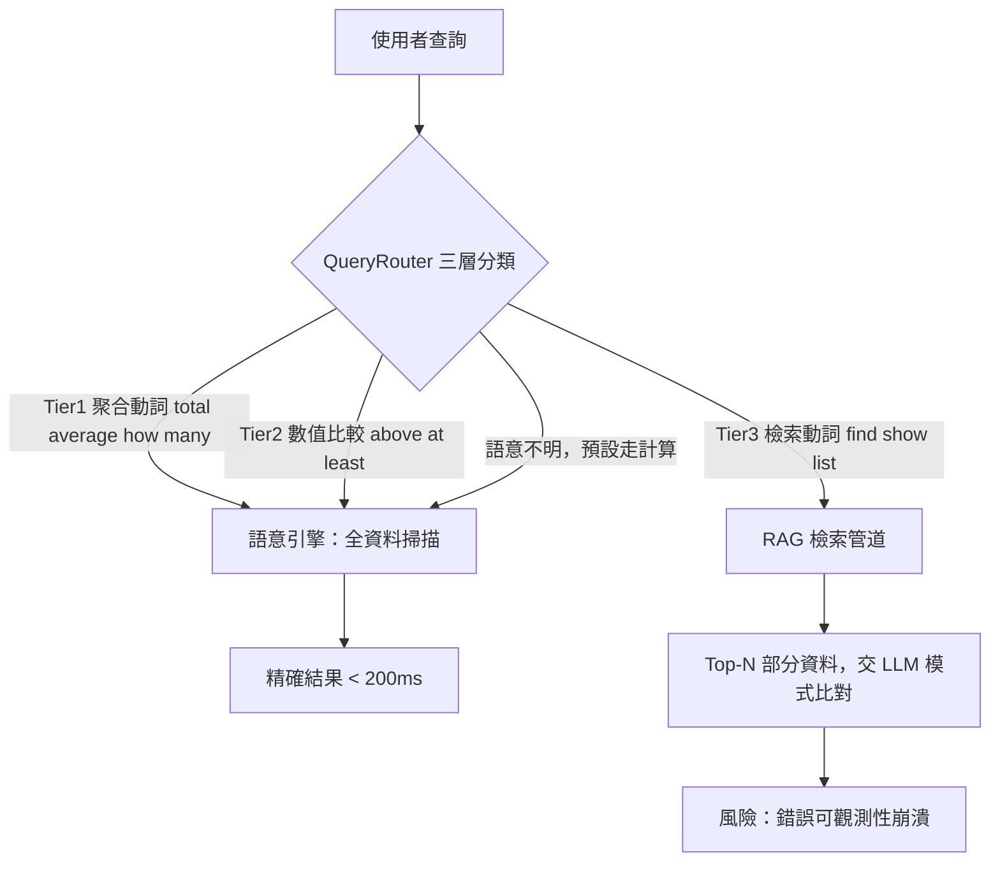
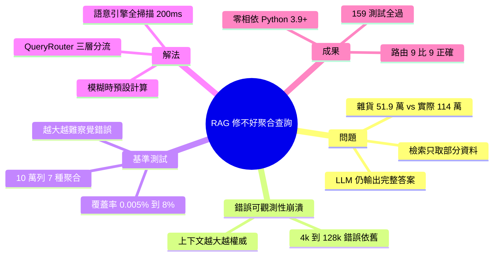

## Larger Context Windows Don’t Fix RAG — So I Built a System That Does

本文挑戰了擴大 RAG 上下文窗口能改善準確性的假設。作者針對 100,000 列數據進行基準測試，發現增加上下文大小反而掩蓋聚合任務（aggregation queries）的錯誤，使其難以檢測。核心主張：計算類查詢應完全繞過 RAG 檢索式管道，改由確定性全掃描引擎處理。這對 RAG 架構設計具有重要意義，揭示不同查詢類型需要根本不同的執行路徑。

### 重點
- 100,000 列基準測試證實：擴大上下文窗口無法改善聚合準確性，反而隱藏錯誤
- 計算查詢應由確定性全掃描引擎單獨處理，不經過檢索式 RAG 管道
- 查詢路由設計：區分 retrieval 型 vs aggregation 型查詢，採用異構處理架構

**原文：** [medium-towards-data-science](https://towardsdatascience.com/larger-context-windows-dont-fix-rag-so-i-built-a-system-that-does/)

---

<!-- deep-analysis:begin -->
## 📌 摘要 (TL;DR)

- 作者建立 CSV 上傳問答系統時發現：問「雜貨總花費」時系統自信地回答 **$519,368.22**，但正確答案是 **$1,140,033.24**，連一半都不到。
- 把上下文窗口（context window）從 4k 撐到 128k token，答案只是變更長、更詳細，錯誤依舊——作者稱此為「錯誤可觀測性崩潰（Error Observability Collapse）」。
- 在 100,000 列信用卡交易資料、7 種聚合查詢（aggregation query）上做基準測試：覆蓋率從 0.005%（5 列）到 8%（8,000 列／約 520K token），錯誤反而越難被人察覺。
- 核心主張：聚合／計算類查詢應**完全繞過 RAG**，改由「確定性全掃描引擎（deterministic full-scan engine）」處理，全資料一次掃描、200ms 內給出精確答案。
- 解法是 QueryRouter 三層分類器，依查詢動詞分流；9 條測試查詢路由 9/9 正確，整套 159 個測試全過，零外部相依、可在 Python 3.9+ 執行。

## 🎯 核心概念

- **聚合查詢（aggregation query）**：需對整份資料做 SUM／AVG／COUNT／MIN／MAX 等運算的查詢，與「找出某幾筆」的檢索查詢本質不同。
- **錯誤可觀測性崩潰（Error Observability Collapse）**：RAG 只取到部分資料卻產出完整、自信的答案，使錯誤難以被人察覺；上下文越大越嚴重。
- **語意引擎（Semantic Engine）**：即確定性全掃描引擎，把查詢解析成資料庫運算、一次掃過全資料回傳精確結果，而非靠 LLM 從片段「猜」。
- **QueryRouter**：在主管線之前的三層分類器，判斷查詢該走計算引擎或 RAG 檢索。

## 📖 整理分析

### 1. 問題：RAG 在計算題上機制性失敗
RAG 的設計是「檢索最相關的前 N 筆」再交給 LLM。但聚合需要看完整份資料，RAG 只餵進片段，LLM 仍會輸出一個看似完整的數字。作者的雜貨總花費案例就是只算到約半數交易，卻回報為「總和」，且語氣毫不遲疑。

### 2. 上下文變大為何讓事情更糟
從 4k 到 128k token，模型回得更長、更有條理，但因為仍只覆蓋部分資料，答案的「錯」被包裝得更權威、更難被抓到。大窗口提升的是說服力，不是正確率——這正是「錯誤可觀測性崩潰」的本質。

### 3. 基準測試：覆蓋率 vs 錯誤可偵測性
作者用 100,000 列資料、5 種上下文大小量化此現象：

| 上下文 | 列數 | 覆蓋率 | 部分加總 | 錯誤可偵測性 |
|---|---|---|---|---|
| ~325 token | 5 | 0.005% | $197.73 | 容易 |
| ~3K token | 50 | 0.05% | $2,003.56 | 中等 |
| ~32K token | 500 | 0.5% | $31,023.21 | 困難 |
| ~130K token | 2,000 | 2.0% | $140,093.16 | 非常難 |
| ~520K token | 8,000 | 8.0% | $569,368.22 | 幾乎不可能 |

覆蓋率上升、部分加總越接近真值，反而讓人更難一眼看出「這仍然是錯的」。測試涵蓋 7 種模式：分類別總花費、各類別最高平均交易、特定類別總額、女性顧客數、超過門檻的總花費、花費最低的州、詐欺交易佔比。

### 4. 解法：語意引擎 + QueryRouter
語意引擎把查詢解析成 SUM／AVG／COUNT／MIN／MAX 等運算，全資料一次掃描，200ms 內回傳精確值。QueryRouter 則在前面分流：Tier 1 聚合動詞（total、average、how many、percentage）、Tier 2 數值比較（greater than、above、at least）走語意引擎；Tier 3 檢索動詞（find、show me、list、fetch）走 RAG。語意不明時**預設走計算**，因為「錯的 RAG 答案看起來像對的」，而解析失敗會直接拋出明確錯誤、相對安全。

### 5. 結果與成本
9 條查詢（7 聚合、2 查找）路由 9/9 正確，計算類全部在 200ms 內給出精確結果。整套 159 個測試（87 個引擎測試、72 個路由測試）全過，零外部相依、可在 Python 3.9+ 執行。作者結論：正確聚合其實「計算上極其廉價」，問題是架構選錯了執行路徑，而非模型不夠強——補一層只花微秒的輕量分類器，就能保證所有分析查詢的確定性正確。

## 🧭 流程圖 / 架構圖

## 🧠 Mindmap

<!-- deep-analysis:end -->
### 📄 原文內容

點此展開 / 收合

Increasing context size in RAG systems doesn’t improve accuracy for aggregation tasks—it makes errors harder to detect. In this article, I benchmark retrieval-based pipelines against a deterministic full-scan engine across 100,000 rows and show why computation queries must be routed away from RAG entirely. 
 The post Larger Context Windows Don’t Fix RAG — So I Built a System That Does appeared first on Towards Data Science .

