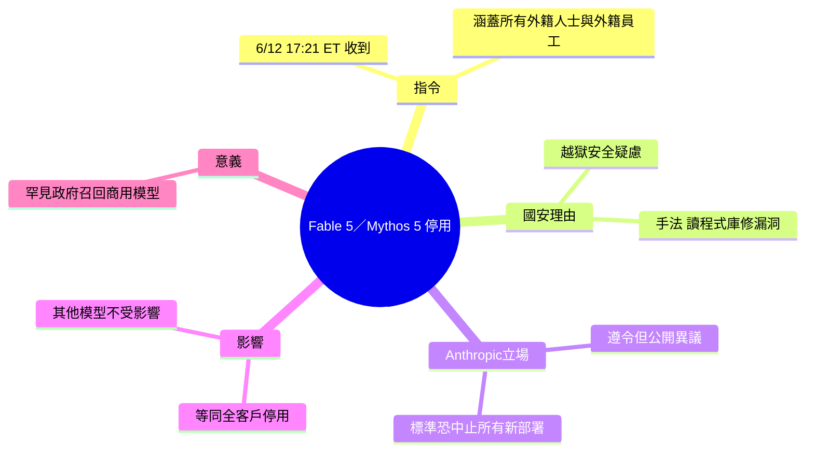

## Statement on US government directive to suspend access to Fable 5 and Mythos 5

Anthropic 於 6 月 13 日發布聲明，確認美國政府於 6 月 12 日發布出口管制令（export control order），要求公司立即禁用 Fable 5 與 Mythos 5 模型的全域存取，涵蓋所有使用者（含外籍人士與外籍員工），理由為國安考量。Anthropic 遵守法令但公開表達異議：政府僅識別「一個狹隘的潛在越獄漏洞」（narrow potential jailbreak），Anthropic 認為此標準若業界通用將「本質上阻止所有前沿模型的新部署」。公司主張同類功能存在於競爭對手模型，且正努力恢復存取。此案代表美國首次對已商用部署的大型語言模型實施政府禁令。

### 重點
- 禁用產品：Fable 5、Mythos 5；禁用範圍涵蓋全球所有用戶（含外籍人士）——出口管制極嚴格
- 政府理由：識別「狹隘潛在越獄」；Anthropic 異議點：此標準過於寬泛，若推廣將阻止業界新模型部署
- 政策含義：美國首次對已部署商用大模型直接下禁令，標誌政府對 AI 安全治理政策的激進轉向

**原文：** [hackernews](https://www.anthropic.com/news/fable-mythos-access)

---


<!-- deep-analysis:begin -->
## 📌 摘要 (TL;DR)

- 美東時間 2026 年 6 月 12 日傍晚 5:21，Anthropic 收到美國政府指令，須立即停止所有外籍人士（foreign nationals，含美國境內外、含外籍員工）存取 Claude Fable 5 與 Mythos 5；實務上等於對全體客戶停用這兩款模型。
- 官方理由為國家安全：政府稱掌握可越獄（jailbreak）Fable 5 安全防護的手法。據 Axios 報導，導火線是另一家公司聲稱成功越獄 Mythos，驚動白宮，商務部長 Howard Lutnick 並去函執行長 Dario Amodei。
- 政府展示的越獄手法相當狹隘——要求模型「讀取特定程式庫並修補軟體漏洞」；Anthropic 反駁此能力在其他競品模型上「廣泛可得」。
- Anthropic 遵令停用，但公開表達異議：主張若「發現一個狹隘的潛在越獄」就足以召回商用模型，將「實質上中止所有前沿模型的新部署」。
- 其餘 Anthropic 模型不受影響；公司表示正努力盡快恢復存取。
- 多家媒體（Bloomberg、Axios）將此視為美國政府首次對已商用部署的前沿 AI 模型下令限制存取，標誌 AI 監管與地緣政治的新轉折。

## 🎯 核心概念

- **出口管制**（export control）：限制特定技術或產品流向外國人或外國的法律工具；此處被用來限制外籍人士存取 AI 模型。
- **越獄**（jailbreak）：以特定輸入繞過模型安全防護，使其產生原本應被拒絕的輸出。
- **前沿模型**（frontier model）：能力處於業界最前緣的大型 AI 模型，Fable 5 與 Mythos 5 屬此類，被 Axios 形容為 Anthropic「最強大」的模型。
- **外籍人士**（foreign nationals）：非美國公民或永久居民；本指令涵蓋境內外所有外籍人士，包含 Anthropic 的外籍員工。

## 📖 整理分析

### 1. 指令內容與時間點
Anthropic 表示在美東時間 6 月 12 日下午 5:21 收到政府指令，要求立即暫停 Fable 5 與 Mythos 5 對所有外籍人士的存取，無論其身在美國境內或境外，且明確包含 Anthropic 的外籍員工。為確保合規，公司只能對全體客戶一次性停用這兩款模型。

### 2. 國安理由與越獄爭議
政府引用國安權限，指稱掌握可繞過 Fable 5 安全防護的方法。Anthropic 說信件並未提供具體國安細節；其理解是政府展示了一種狹隘、非通用的手法——請模型「讀取特定程式庫並修補軟體漏洞」。據 Axios，商務部是在另一家公司宣稱能越獄 Mythos 之後才決定行動。

### 3. Anthropic 的反駁立場
Anthropic 認為這種能力在其他模型上廣泛可得，因此單一狹隘越獄不應成為召回商用模型的理由。公司警告：若此標準成為業界通則，將「實質上中止所有前沿模型的新部署」，等於凍結整個產業的迭代節奏。

### 4. 影響範圍與恢復
這次停用僅限 Fable 5 與 Mythos 5，其餘 Anthropic 模型不受影響。公司強調已遵守此一具法律效力的指令，同時正與政府溝通、努力盡快恢復存取。

### 5. 為何重要：監管先例
本案被視為美國政府首次強制召回一款已商用部署的前沿模型，並動用涉及外籍人士的出口管制邏輯。它把 AI 安全（越獄風險）、國家安全與企業營運直接綁在一起，為日後監管如何介入模型部署立下高度爭議的先例。

## 🧭 事件時間線

```mermaid
timeline
    title Fable 5／Mythos 5 停用事件
    6/12 17:21 ET : 收到美國政府指令
    當下 : 立即停用兩款模型 : 涵蓋境內外所有外籍人士與外籍員工
    隨即 : 公開發表異議聲明
    後續 : 表示努力盡快恢復存取
```

## 🧠 Mindmap


<!-- deep-analysis:end -->
### 📄 原文內容

<details>
<summary>點此展開 / 收合</summary>

https:&#x2F;&#x2F;x.com&#x2F;ClaudeDevs&#x2F;status&#x2F;2065597942602531163

</details>