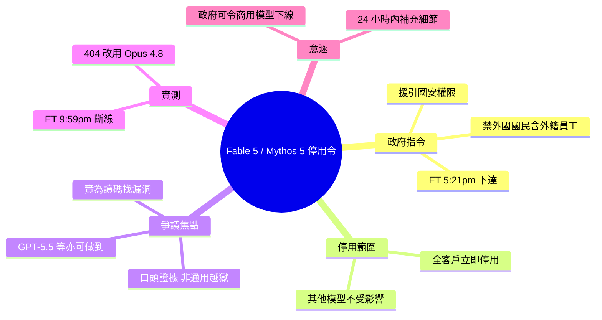

## Statement on the US government directive to suspend access to Fable 5 and Mythos 5

美國政府於 2026-06-12 下午 5:21(ET) 發布出口控制令，以國家安全為由禁止所有人（包括 Anthropic 員工）訪問 Fable 5 和 Mythos 5。Anthropic 被迫立即禁用這兩個模型以符合規定。政府聲稱發現了一個「jailbreak」方法，但 Anthropic 認為安全風險被誇大——該 jailbreak 實際上是讓模型讀取代碼並識別已知漏洞，這是 GPT-5.5 等其他模型也能做到的常規能力。Simon Willison 記錄了實際斷開時間：太平洋時間 6:59pm（東部時間 9:59pm）。

### 重點
- 美國政府發布出口控制令，禁用 Fable 5 和 Mythos 5，其他 Anthropic 模型不受影響
- 政府聲稱的 jailbreak 為「narrow, non-universal」，本質為讓模型分析代碼並識別已知漏洞
- Anthropic 評估：該能力在 GPT-5.5 等公開模型中廣泛可用，安全防護人員日常使用

**原文：** [simon-willison](https://simonwillison.net/2026/Jun/13/us-government-directive-to-suspend-access/#atom-everything)

---


<!-- deep-analysis:begin -->
## 📌 摘要 (TL;DR)

- 美國政府於 2026-06-12 下午 5:21（東部時間 ET）援引國家安全權限，向 Anthropic 發出出口管制令（export control directive），禁止任何外國國民（foreign national）存取 Fable 5 與 Mythos 5——無論其身處美國境內或境外，且涵蓋 Anthropic 的外籍員工。
- 為符合規定，Anthropic 被迫對「所有」客戶立即停用這兩個模型；其餘 Anthropic 模型不受影響。
- 政府信中未說明具體國安疑慮，僅以口頭提供證據，指稱已掌握一種可「越獄」（jailbreak）Fable 5 的方法。
- Anthropic 檢視該示範後認為風險被誇大：手法實際上只是「請模型讀取特定程式碼庫並修補軟體缺陷」，找到的是少數既有的輕微漏洞，連 OpenAI 的 GPT-5.5 等公開模型不需越獄也能發現。
- Simon Willison 跑腳本實測停用時點：太平洋時間 6:59pm（ET 9:59pm）存取被切斷，API 回傳 404 並提示改用 Opus 4.8。
- 重大意涵：這是政府首次展示「可在未經企業同意下，直接令商用 AI 模型於生產環境下線」的監管工具。

## 🎯 核心概念

- **出口管制令**（export control directive）：美國政府援引國安權力、限制特定技術輸出或存取的行政命令；此處被用來限制對 AI 模型的存取權。
- **外國國民**（foreign national）：非美國公民或永久居民者。本令禁止其存取，且明文涵蓋 Anthropic 的外籍員工。
- **越獄**（jailbreak）：繞過模型安全限制、使其執行原本被攔阻行為的手法。本案中指的是讓模型讀程式碼並辨識漏洞。
- **非通用越獄**（narrow, non-universal jailbreak）：僅在特定情境有效、無法被普遍套用的繞過方式——Anthropic 強調政府提供的正是此類。

## 📖 整理分析

### 1. 政府下令、立即停用
Anthropic 於當地時間 2026-06-12 下午 5:21（ET）收到政府指令，要求暫停所有外國國民對 Fable 5 與 Mythos 5 的存取。由於連外籍員工都被涵蓋，淨效果是 Anthropic 必須「abruptly disable」（突然停用）這兩個模型給全體客戶以確保合規。其他 Anthropic 模型則不受影響。

### 2. 模糊的國安理由
政府的信件並未提供國安疑慮的具體細節。Anthropic 的理解是：政府相信自己已掌握一種繞過、或「越獄」Fable 5 的方法。但截至發文，政府只給出「口頭」證據，描述的是一種範圍狹窄、非通用的越獄。

### 3. Anthropic 的反駁：能力早已普及
Anthropic 指出，所謂越獄的本質「essentially consists of asking the model to read a specific codebase and fix any software flaws」（請模型讀取特定程式碼庫並修補任何軟體缺陷）。他們檢視示範後發現，找到的只是少數既有、相對簡單的漏洞，且此等能力在其他公開模型（包括 OpenAI 的 GPT-5.5）上廣泛可得，正是資安防禦者每天用來保護系統的常規操作。

### 4. 實測斷線時間軸
Simon Willison 在 ET 9:01pm 時透過 claude.ai 與 Claude Code 仍可使用 Fable。他寫了一支腳本不斷對 Anthropic API 呼叫 `llm -m claude-fable-5 hi`，記錄到第 36 次（太平洋時間 6:58pm，ET 9:58pm）仍成功，第 37 次（6:59pm Pacific／9:59pm ET）即失敗。回傳為 404 `not_found_error`，訊息為「Claude Fable 5 is not available. Please use Opus 4.8.」

### 5. 為何值得關注
此事件的關鍵不在於越獄本身，而在於監管先例：政府以出口管制為依據，實質迫使一家公司在數小時內讓正在生產環境運行的商用模型對全體客戶下線。Anthropic 表示將在 24 小時內公布更多細節。

## 🧭 時間軸（2026-06-12，ET）

```mermaid
timeline
    title Fable 5／Mythos 5 停用時間軸（東部時間 ET）
    5:21pm : 政府發出出口管制令 : 信中未附國安細節
    9:01pm : Simon 仍可用 claude.ai 與 Claude Code
    9:58pm : API 第 36 次呼叫仍成功
    9:59pm : 存取被切斷 : API 回 404 提示改用 Opus 4.8
```

## 🧠 Mindmap


<!-- deep-analysis:end -->
### 📄 原文內容

<details>
<summary>點此展開 / 收合</summary>

Statement on the US government directive to suspend access to Fable 5 and Mythos 5 
Well this is nuts : 
 
 The US government, citing national security authorities, has issued an export control directive to suspend all access to Fable 5 and Mythos 5 by any foreign national, whether inside or outside the United States, including foreign national Anthropic employees. The net effect of this order is that we must abruptly disable Fable 5 and Mythos 5 for all our customers to ensure compliance. Access to all other Anthropic models will not be affected. 
 We received the directive from the government today at 5:21pm (ET). The letter did not provide specific details of its national security concern. Our understanding is that the government believes it has become aware of a method of bypassing, or "jailbreaking" Fable 5. We reviewed a demonstration of this specific technique being used to identify a small number of previously known, minor vulnerabilities. These vulnerabilities all appear relatively simple, and we have found that other publicly-available models are able to discover them as well without requiring a bypass. [...] 
 To date, the government has only given us verbal evidence of a potential narrow, non-universal jailbreak, which essentially consists of asking the model to read a specific codebase and fix any software flaws. Our understanding is that one potential jailbreak was shared with the government. We have reviewed the report and validated that the level of capability displayed there is widely available from other models (including OpenAI's GPT-5.5 ), and is used every day by the defenders who keep systems safe. We will share more details over the next 24 hours. 
 
 I still have access to Fable via claude.ai and Claude Code now, at 9:01pm ET. 
 Update : I ran this script against the Anthropic API to spot when claude-fable-5 would stop working. My access was cut off at 6:59pm Pacific (9:59pm ET): 
 [2026-06-12T18:56:50-07:00] attempt 35: running uv run llm -m claude-fable-5 hi
[2026-06-12T18:56:55-07:00] success: Hi there! How can I help you today?
[2026-06-12T18:57:55-07:00] attempt 36: running uv run llm -m claude-fable-5 hi
[2026-06-12T18:57:59-07:00] success: Hi! How can I help you today?
[2026-06-12T18:58:59-07:00] attempt 37: running uv run llm -m claude-fable-5 hi
[2026-06-12T18:59:00-07:00] FAILED after attempt 37 with exit code 1

stderr:
Error: Error code: 404 - {'type': 'error', 'error': {'type': 'not_found_error', 'message': 'Claude Fable 5 is not available. Please use Opus 4.8. Learn more: https://www.anthropic.com/news/fable-mythos-access'}, 'request_id': 'req_011CbzRyirV7KZLHYYdBM9od'} 

 Via @AnthropicAI 

 Tags: jailbreaking , ai , generative-ai , llms , anthropic , claude , ai-ethics , claude-mythos

</details>