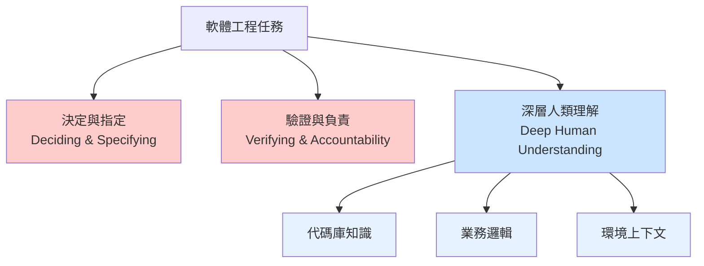
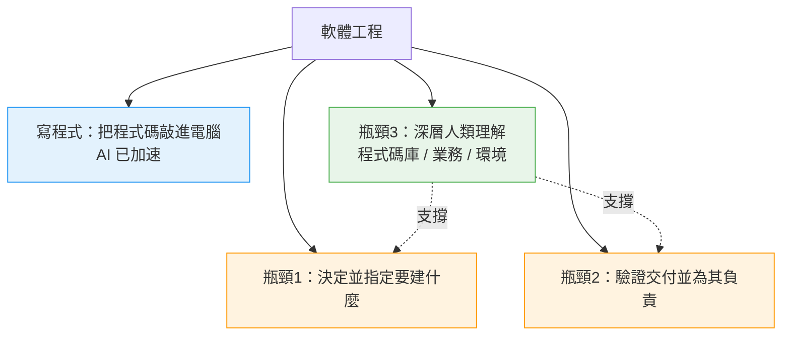
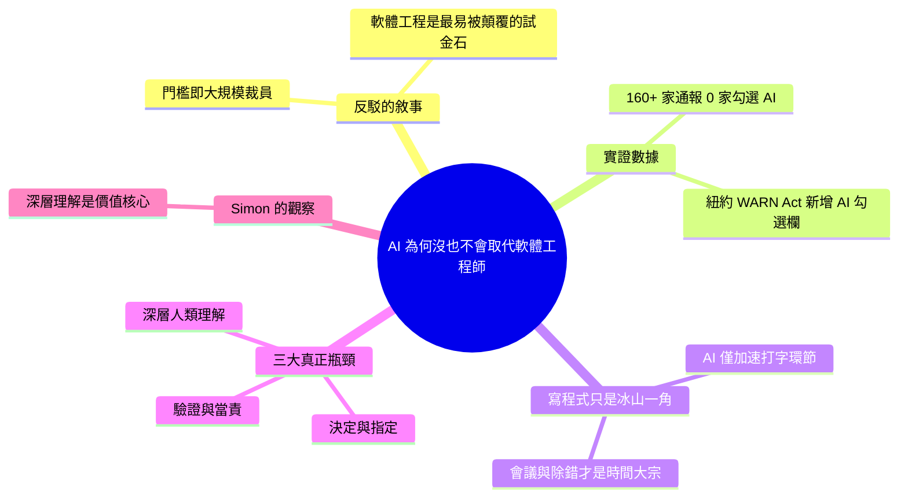

## Why AI hasn’t replaced software engineers, and won’t

Arvind Narayanan 和 Sayash Kappor 的論文質疑「AI 達技術閾值後將大規模裁減軟體工程師」的敘事。實證數據駁斥此論：2025 年 3 月紐約州首次在 WARN Act 申報中增設 AI 披露欄，該年 160+ 家公司申報裁員，然而無任何公司勾選 AI 為原因。論文揭示軟體工程的真正瓶頸並非編碼（AI 已加速此環節），而是三個高級環節：（1）決定與指定要建什麼、（2）驗證與承擔責任、（3）對代碼庫、業務邏輯和環境的深層人類理解。此框架確立了 AI 輔助編碼但無法自動化決策、驗證責任和業務理解的核心邏輯。

### 重點
- 2025 年 3 月紐約州在 WARN Act 申報首次增設 AI 披露欄，160+ 公司申報裁員但無人勾選 AI 作為原因——直接駁斥大規模失業論
- 軟體工程瓶頸三層結構：決定/指定、驗證/責任、人類深層理解——編碼並非瓶頸，AI 已可加速此環節
- AI 無法自動化高級決策、驗證責任和對業務/技術上下文的人類理解，這些才是軟體工程師核心價值所在

**原文：** [simon-willison](https://simonwillison.net/2026/Jun/14/why-ai-hasnt-replaced-software-engineers/#atom-everything)

---

<!-- deep-analysis:begin -->
## 📌 摘要 (TL;DR)

- Arvind Narayanan 與 Sayash Kapoor 發表新文，主張「AI 能力一旦跨過某個門檻就會引發大規模裁員（mass layoffs）」這個敘事，現有證據並不支持。
- 他們刻意挑軟體工程師作為切入點——這是法規障礙極少、最容易被 AI 顛覆的職業；連這行都沒被取代，受到更多保護的其他職業更難被取代。
- 關鍵數據：2025 年 3 月，紐約州成為全美第一個在 WARN Act 裁員通報中新增「AI 揭露」勾選欄的州；上路滿一年、160+ 家公司提交通報，沒有任何一家勾選 AI 為原因。
- AI 真正加速的只是「把程式碼敲進電腦」這個環節，但軟體工程遠不只是打字。
- 文章歸納出三個無法被自動化的真正瓶頸：(1) 決定並指定要做什麼、(2) 驗證並為交付成果負責、(3) 對程式碼庫、業務與環境的深層人類理解（deep human understanding）。
- Simon Willison 以第一手經驗補充：AI 也能幫他「決定」與「驗證」，但唯有「深層人類理解」才是他價值不可被取代的核心。

## 🎯 核心概念

- **WARN Act 裁員預告法**（Worker Adjustment and Retraining Notification Act）：美國法律，要求企業在大規模裁員前須提前正式通報；紐約州新增的「AI 勾選欄」被用來量測 AI 是否為裁員主因。
- **三大瓶頸**（three bottlenecks）：作者透過質性分析（qualitative analysis）歸納出軟體工程中抗拒自動化的三件事——決定與指定、驗證與當責、深層人類理解。
- **深層人類理解**（deep human understanding）：對程式碼庫、業務邏輯與所處環境的深入掌握，是支撐「決定」與「驗證」兩項工作的根基。

## 📖 整理分析

### 1. 反駁「跨過門檻就裁員」敘事
Narayanan 與 Kapoor 的核心論點是：已有足夠證據可以否定「AI 一旦達到某能力門檻、就會造成大規模裁員」的說法。他們特意選擇軟體工程這個「最該被顛覆」的職業當試金石——因為這行法規障礙極少。作者由此推論：既然連這裡都沒發生取代潮，大多數受到更多保護的職業會更安全（cushioned）。

### 2. 數據說話：紐約 WARN Act 的 AI 欄無人勾選
文章端出的第一個好消息是：數據至今不支持「AI 正造成大規模失業」。2025 年 3 月，紐約州成為全美第一個在 WARN Act 通報表中加入「AI 揭露勾選欄」的州。上路滿第一年，超過 160 家公司提交了 WARN 通報，但沒有任何一家勾選 AI 作為裁員原因。

### 3. 寫程式不是瓶頸，那什麼才是？
作者指出，AI 加速的是「把程式碼敲進電腦」這個動作，但軟體工程的內涵遠不只如此。若寫程式不是瓶頸，任務拆解調查（task-breakdown surveys）會把矛頭指向開會與除錯（debugging）。但這又帶出更深的問題：開發者在會議裡到底在做什麼、為何 AI 無法代勞？除錯難道不會隨能力提升而被自動化？要回答，就得回到工程師自己對「什麼工作抗拒自動化」的理解。

### 4. 三大真正的瓶頸
質性分析揭示三個真正的瓶頸：(1) 決定並指定要建什麼（deciding and specifying）；(2) 驗證交付成果並為其負責（verifying and being accountable）；(3) 支撐前兩者所需、對程式碼庫、業務與環境的深層人類理解。前兩項屬於「判斷與當責」，第三項則是讓判斷得以成立的知識根基——這正是 AI 難以接手的部分。

### 5. Simon Willison 的第一手觀察
Simon Willison 以自身經驗呼應：AI 輔助其實也幫得上「決定」與「驗證」這兩步，但真正關鍵、無法外包的是「深層人類理解」。他強調：就算給他全世界所有的 AI 協助，他能產出的價值仍取決於自己對「問題本身」與「代理（agents）所打造的解法」理解得有多深。

## 🧭 流程圖 / 架構圖

下圖拆解文章對「軟體工程」的分解：只有打字環節被 AI 加速，三大瓶頸仍由人類承擔，而深層理解是另外兩者的根基。

## 🧠 Mindmap

<!-- deep-analysis:end -->
### 📄 原文內容

點此展開 / 收合

Why AI hasn’t replaced software engineers, and won’t 
Arvind Narayanan and Sayash Kappor take on the question of AI job losses through the lens of a profession that is uniquely suited to AI disruption - software engineering. 
 
 In this essay, we argue that there is enough evidence to reject the narrative that once AI capabilities reach a certain threshold, it will cause mass layoffs. Given that this is true even in a sector with very few regulatory barriers, most other professions are likely to be even more cushioned. 
 
 The first good news is that the data still doesn't support the idea that AI is causing mass unemployment. 
 
 In March 2025, New York became the first U.S. state to add an AI disclosure checkbox to WARN Act filings. In the full first year, more than 160 companies filed WARN notices. Not a single one checked the AI box 
 
 AI speeds up the typing-code-into-a-computer phase, but it turns out software engineering is about a whole lot more than that: 
 
 If writing code isn’t the bottleneck, what is? The task-breakdown surveys point at things like meetings or debugging. This just leads to more questions: what are developers doing in those meetings and why can’t it be done by AI? Won’t debugging get automated as capabilities improve? To understand the real bottlenecks, we have to get qualitative, and dig into software engineers’ own understanding of what it is they do that resists automation. 
 When we did this analysis, it revealed three things as the real bottlenecks (1) deciding and specifying what to build, (2) verifying and being accountable for what is delivered, and (3) the deep human understanding — of the codebase, the business, and the environment — required to carry out both of these. 
 
 I'm finding AI assistance also helps me with the deciding and verifying steps, but it's the "deep human understanding" that remains key to the value I provide. Give me all of the AI assistance in the world and the value I produce will still be reliant on how deeply I understand both the problems and the solutions that the agents are building for them.

 Tags: careers , ai , generative-ai , llms , arvind-narayanan , ai-ethics

