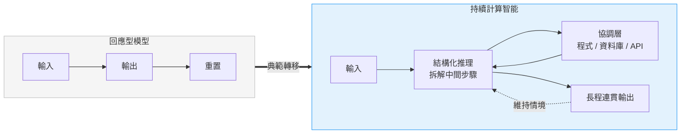
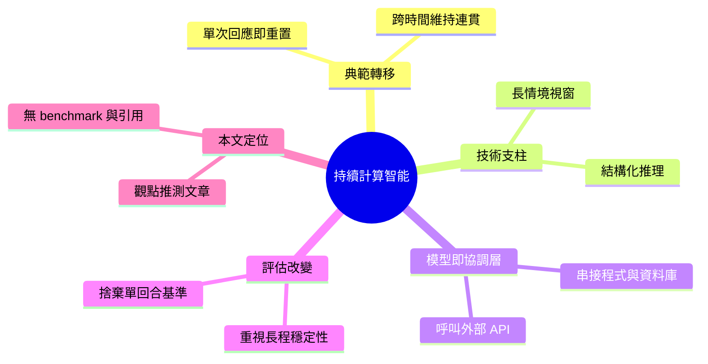

## Claude Fable 5 and the Shift From Response-Based Models Toward Persistent Computational...

本文介紹 Claude Fable 5 模型，並論述過去十年人工智能發展的範式轉變。傳統 AI 從狹義、專化的機器學習任務演進，Claude Fable 5 代表從「回應型模型」(response-based models) 向「持續計算」(persistent computational) 方向轉型。這反映了 AI 能力從單一推理向持續學習與自我改進的深刻轉變。

### 重點
- Claude Fable 5 發佈
- 從回應型模型轉向持續計算架構
- 十年 AI 發展的根本範式轉變

**原文：** [medium-tag-llm](https://medium.com/@AkselAghajanyan/claude-fable-5-and-the-shift-from-response-based-models-toward-persistent-computational-bcafc2c0266e?source=rss------large_language_models-5)

---

<!-- deep-analysis:begin -->
## 📌 摘要 (TL;DR)

- 本文是 Aqwel AI 創辦人、資料科學家 Aksel Aghajanyan 於 Medium（2026 年 6 月）發表的觀點文，以「Claude Fable 5」為引子，論述 AI 正從回應型模型（response-based models）轉向持續計算智能（persistent computational intelligence）。
- 核心論點：系統正脫離「輸入 → 輸出 → 重置」（input, output, reset）的單次互動迴圈，轉向跨時間維持行為連貫性（continuity of behavior across time）。
- 作者點名兩大技術推力：擴大的情境視窗（context window）帶來長程連貫、減少資訊碎裂，以及把任務拆成可評估中間步驟的結構化推理（structured reasoning）。
- 模型角色從孤立的內容生成器，轉為協調程式執行、資料庫、API 的協調層（orchestration layer）。
- 評估標準也須改變：單回合基準（single-turn benchmarking）不足，要看長程穩定性（long-horizon stability）。
- 須留意：全文屬觀點／推測性分析，未引用任何來源、沒有 benchmark 數據，「Claude Fable 5」僅為切入主題的引子，文中並無具體版本規格或測試成績。

## 🎯 核心概念

- **回應型模型**（response-based models）：傳統一次產生孤立輸出、用完即重置的系統。
- **持續計算智能**（persistent computational intelligence）：能在更長、更繁複的流程中維持有用行為的系統。
- **情境視窗**（context window）：模型一次能納入並運作的資訊空間。
- **協調層**（orchestration layer）：模型作為中樞，調度程式執行、資料庫、API 等多個子系統。
- **長程穩定性**（long-horizon stability）：在一連串相依操作中維持可靠與連貫的能力。

## 📖 整理分析

### 1. 從「回應」到「持續」的轉移
作者主張，過去十年 AI 由狹義、專化的機器學習任務演進到通用模型；新一代的關鍵差異，在於脫離「輸入 → 輸出 → 重置」的有界互動迴圈，轉為跨時間維持行為連貫。重點不再只是單次回答的品質，而是能否在多階段工作流程（multi-stage workflows）中持續執行。

### 2. 兩大技術支柱
文章指出兩個推動轉變的能力。其一是擴大的情境視窗，讓模型在長互動中保持一致、降低資訊碎裂（information fragmentation）。其二是結構化推理：把任務拆解成可逐步評估的中間步驟，而非一次產生單一答案。兩者共同支撐長程任務的連貫。

### 3. 模型即協調層
作者描述模型角色的轉變：不再是孤立的生成器，而是協調外部系統的協調層，串接程式執行、資料庫與 API。在此視角下，模型更像調度多個子系統的中樞，而非單純輸出文字。

### 4. 評估方式必須改變
文章認為單回合基準測試已不足以反映真實能力，因為它測不出長程行為。衡量標準應轉向長程穩定性與跨時間連貫——能否在一連串相依操作中維持可靠，而非只看一次問答。

### 5. 應用領域與本文定位
作者以軟體開發為主要實作範例，並把影響延伸到科學研究、教育與分析，認為此方向會隨模型持續擴展而保持核心地位。需提醒：全文是 Aksel Aghajanyan 的個人分析，語氣偏推測（如「將很可能保持核心地位」），未提供任何 benchmark 或外部引用，原文僅附作者頭像、無實質佐證圖表。

## 🧭 流程圖 / 架構圖

兩種典範對比（依原文論述繪製）：

## 🧠 Mindmap

<!-- deep-analysis:end -->
### 📄 原文內容

點此展開 / 收合

Over the past decade, artificial intelligence has undergone a fundamental transformation. What began as narrowly specialized machine&#x2026; Continue reading on Medium »

