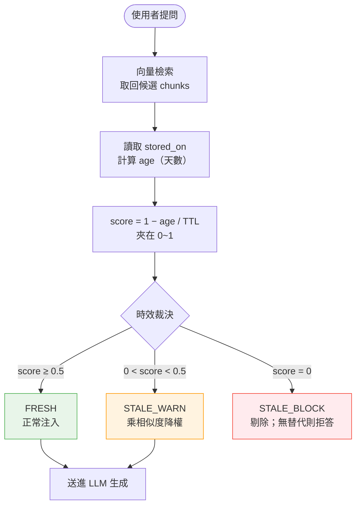
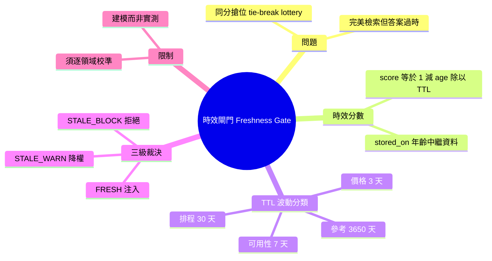

## Your AI Agent’s Memory Has No Expiry Date: I Scored Freshness on a Real Corpus

AI Agent 在使用檢索增強生成（RAG）系統時常面臨隱藏的問題：檢索結果的準確性與數據時效性是兩回事。作者在真實語料上審計發現，Agent 完美檢索到 40 天前的數據，並自信地引用過時的價格信息。檢索系統運作正常，但基礎事實已經過時，造成了 Agent 回答的錯誤。這個問題在生產環境特別危險，因為使用者難以區分完美檢索但陳舊的信息。該發現突出了 RAG 系統的關鍵缺陷：缺乏數據時效性驗證機制。對需要實時數據的應用（如金融、電商定價），這是必須特別關注的問題。

### 重點
- RAG 檢索準確度高不等於信息新鮮；40 天前的準確數據依然陳舊，導致 Agent 虛假信心
- 完美的檢索質量會掩蓋事實過期的根本問題，使用者無法察覺信息時效性缺陷
- 生產環境需補充數據時效性驗證機制，單靠檢索精度不足以確保回答正確

**原文：** [medium-tag-llm](https://medium.com/@spinov001/your-ai-agents-memory-has-no-expiry-date-i-scored-freshness-on-a-real-corpus-ecf3ff08a9bf?source=rss------large_language_models-5)

---

<!-- deep-analysis:begin -->
## 📌 摘要 (TL;DR)

- 作者（Medium 帳號 @spinov001）指出 RAG 系統的隱藏缺陷：一段資料**存入時正確、過陣子變陳舊，但相似度分數不會跟著下降**，於是檢索完美卻回答錯誤。
- 真實案例：查「pro 方案多少錢」時，40 天前的 `$29/mo` chunk 相似度 0.903，竟壓過當前 `$39/mo` chunk 的 0.901——兩者只差 0.002，誰排第一變成靠 embedder 雜訊決定的「同分搶位樂透」。
- 解法是在資料送進模型前加一道**時效閘門（freshness gate）**，用 `score = 1.0 − age / TTL`（夾在 0~1）把「資料年齡」變成排序的第一級訊號。
- TTL 依事實波動性分四類：價格 3 天、可用性 7 天、排程 30 天、參考資料 3650 天；分數對應 FRESH／STALE_WARN／STALE_BLOCK 三級裁決。
- 重要前提：作者坦言這些 TTL 是依 2,190 次生產爬蟲執行觀察到的「來源更新頻率」**建模**而來，**不是實測的衰減率**，必須逐領域重新校準。
- 對金融、電商定價等需要即時數據的應用，這提供了一個只用 Python 標準函式庫、可落地的防呆機制。

## 🎯 核心概念

- **檢索增強生成**（Retrieval-Augmented Generation，簡稱 RAG）：先檢索相關片段、再交給模型生成答案的架構。
- **時效閘門**（freshness gate）：在 chunk 進入模型前，依資料年齡過濾或降權的關卡。
- **存活時間**（Time To Live，簡稱 TTL）：一類事實被視為仍然新鮮的天數上限。
- **時效分數**（freshness score）：`1.0 − age / TTL` 算出的 0~1 數值，衡量資料還有多新。
- **同分搶位樂透**（tie-break lottery）：相似度幾乎相同時，由 embedder 雜訊而非事實新舊決定排序的隨機現象。
- **波動性分類**（volatility class）：依事實多快過期，把 chunk 分成價格／可用性／排程／參考四類。

## 📖 整理分析

### 1. 完美檢索 ≠ 正確答案
問題不在檢索壞掉，而在「相似度高」和「事實仍正確」是兩回事。一段價格資料存入當下是對的，40 天後價格改了，這段 chunk 的向量相似度卻完全沒變，照樣以高分被取回。使用者看到一個自信、流暢、引用「精準」的回答，卻完全無法分辨它其實已經死亡。

### 2. 時效分數公式與四類 TTL
核心機制是一條簡單公式：`score = 1.0 − age / TTL`，結果夾在 `[0.0, 1.0]`。`age` 來自每段 chunk 寫入時必須附上的 `stored_on` 欄位（以絕對天數記）。TTL 依事實波動性分四類——價格 3 天、可用性 7 天、排程 30 天、參考資料 3650 天（約 10 年）。波動越快的事實，TTL 越短，分數掉得越快。

### 3. 三級裁決：FRESH / STALE_WARN / STALE_BLOCK
分數對應三種處置：**FRESH**（score ≥ 0.5）正常注入；**STALE_WARN**（0 < score < 0.5）把相似度乘上分數做降權，讓它沉到後面；**STALE_BLOCK**（score = 0，已超過 TTL）直接剔除，若沒有任何新鮮替代資料，寧可拒答也不引用過時事實。關鍵在於：這道判斷發生在模型推論「之前」，是一條確定性規則，而非交給機率。

### 4. 真實案例：$29 與 $39 的 0.002 差距
作者用一個只有數個 chunk（標記 c1~c6）的示範語料重現問題：查「pro 方案費用」時，naive 檢索把 40 天前的 `$29/mo`（相似度 0.903）排在當前 `$39/mo`（0.901）之上，兩者都同樣通過相關性門檻。加上時效閘門後，舊價 chunk 因超過價格類 3 天 TTL 被 STALE_BLOCK 擋下，系統正確回傳了 `$39/mo`。為了可重現，作者把相似度寫死、不依賴特定 embedding 模型。

### 5. 限制：這是建模，不是實測
作者特別誠實地標註前提：「我並沒有測出『事實每天衰減 X%』——沒人測得出來，那完全取決於這個事實是關於什麼。」這些 TTL 是依 2,190 次自家爬蟲生產執行觀察到的「來源更新頻率」建模而成，**不是量測出的衰減曲線**，套到別的領域時必須重新校準。換言之，閘門解決的是「讓年齡變成可見訊號」，而每類 TTL 該設多少，仍需各自領域的數據支撐。

## 🧭 流程圖：時效閘門 pipeline

## 🧠 Mindmap

<!-- deep-analysis:end -->
### 📄 原文內容

點此展開 / 收合

My agent confidently quoted a price from 40 days ago. The retrieval was perfect. The fact was dead. Continue reading on Medium »

