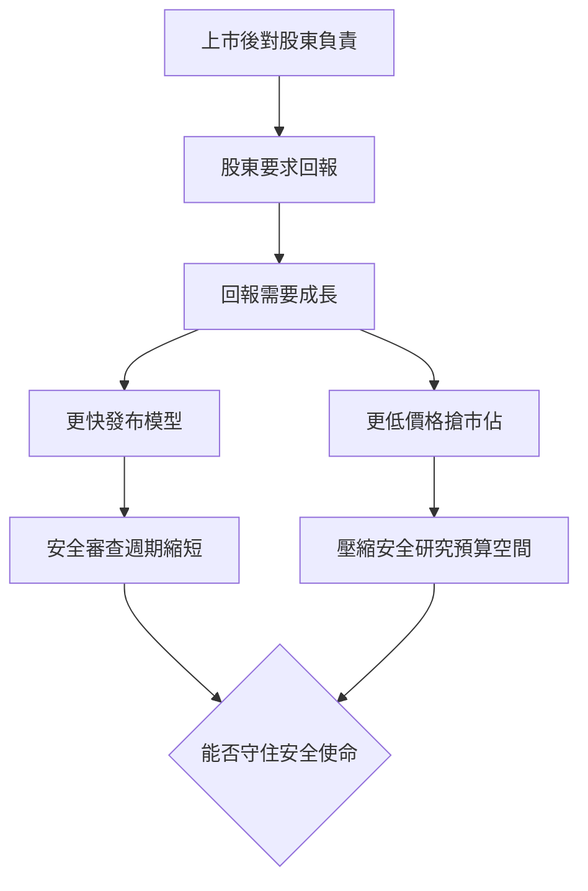
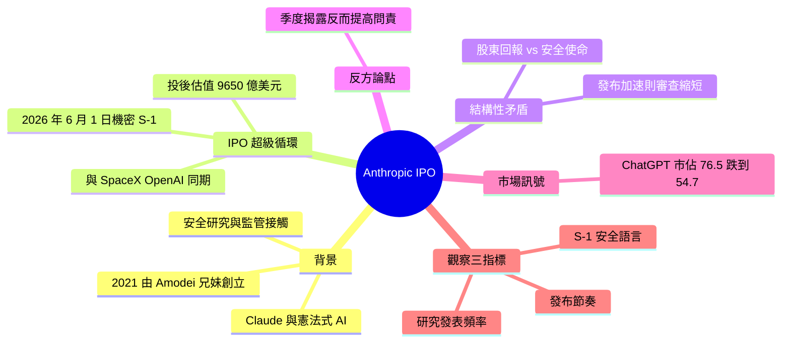

## Anthropic’s IPO and the Problem With Saving the World on Wall Street’s Terms

Anthropic 在 2026 年 6 月 1 日向美國證券交易委員會（SEC）秘密提交了 S-1 表格，啟動首次公開募股（IPO）程序。這是 AI 安全領域領導者進入公開資本市場的重大里程碑。文章標題反映了在華爾街商業框架下實現 AI 安全與造福世界之間的緊張關係，提示 IPO 過程中可能涉及的商業與倫理權衡。

### 重點
- Anthropic 於 2026 年 6 月 1 日秘密提交 S-1，啟動 IPO 程序
- 涉及 AI 安全公司商業化與社會責任的核心衝突
- 標誌著頂級 AI 公司進入公開資本市場的重要轉折點

**原文：** [medium-tag-claude](https://medium.com/@andrianalazana/anthropics-ipo-and-the-problem-with-saving-the-world-on-wall-street-s-terms-df6bb2a7fbe8?source=rss------claude-5)

---

<!-- deep-analysis:begin -->
## 📌 摘要 (TL;DR)

- 2026 年 6 月 1 日，Anthropic 向美國證券交易委員會（Securities and Exchange Commission，SEC）機密遞交 S-1 表格，正式啟動首次公開募股（initial public offering，IPO）。
- 作者 Andriana Lazana 提出核心矛盾：「公開上市公司要對股東負責，股東要回報，回報需要成長」，質疑這套邏輯與 Anthropic 的 AI 安全使命能否並存。
- 文章把此事放進「2026 AI IPO 超級循環」脈絡，與 SpaceX（目標估值 1.75 兆美元）、OpenAI 同期排隊上市；Anthropic 在 Series H 的投後估值達 9,650 億美元，累計募資逾 650 億美元。
- 反方論點：上市帶來季度財報與強制揭露義務，反而可能「提高」而非降低問責，使放棄安全承諾更難不被檢視。
- 市場訊號：ChatGPT 市佔率從 2025 年初的 76.5% 滑落到 54.7%，顯示競爭加劇、成長壓力升高。
- 為什麼關注：這是 AI 安全旗手首次接受公開資本市場考驗，將檢驗「用不同方式做 AI」的承諾能否在商業誘因變複雜後守住。

## 🎯 核心概念

- **首次公開募股（initial public offering，IPO）**：公司首次向公開市場發行股票募資。
- **S-1 表格**：美國公司 IPO 前向 SEC 遞交的註冊文件；「機密遞件（confidential filing）」可在正式公開揭露前先私下送審。
- **憲法式 AI（Constitutional AI）**：Anthropic 訓練 Claude 所用的框架，把模型價值觀變成「明確、可訓練」而非「隱性、不透明」。
- **投後估值（post-money valuation）**：完成該輪募資後的公司總估值。

## 📖 整理分析

### 1. 從安全旗手到上市候選
Anthropic 由 Dario 與 Daniela Amodei 等前 OpenAI 研究員於 2021 年創立，以發表安全研究、主動與監管者接觸著稱，旗艦模型 Claude 建立在憲法式 AI 之上。作者把這段背景當作後續矛盾的對照基準：一家以「安全優先」立身的公司，如今要走進華爾街的遊戲規則。

### 2. 2026 AI IPO 超級循環
6 月 1 日的機密 S-1 並非孤立事件，而是 2026 年 AI 上市潮的一環，與 SpaceX（目標估值 1.75 兆美元）、OpenAI 並列。文中點出 Anthropic 在 Series H 的投後估值已達 9,650 億美元，累計募資超過 650 億美元——龐大的資本規模本身就帶來對成長與回報的期待。

### 3. 結構性矛盾（The Structural Tension）
作者的核心論證是一條壓力鏈：「公開上市公司要對股東負責，股東要回報，回報需要成長。」由此推導——更快的模型發布意味著更短的安全審查週期；更低的價格意味著要靠更高的利潤率來支撐安全研究。商業誘因與安全節奏在此正面相撞。

### 4. 反方論點與市場訊號
文章未一面倒，特別列出反方：上市後的季度財報與公開揭露義務，會讓任何放棄安全承諾的行為更難躲過外界檢視，因此問責反而可能上升。市場面則出現警訊——ChatGPT 市佔率從 2025 年初的 76.5% 跌到 54.7%，顯示競爭與成長焦慮正在加劇，也讓「為成長妥協安全」的誘惑更真實。

### 5. 該盯住的三個訊號
作者給出三個可觀察指標：(1) S-1 文件中如何描述與框定「安全」；(2) 上市後的模型發布節奏是否加速；(3) 安全研究的發表頻率是否下降。結論收束在一句話：真正的考驗「是那些聲稱要用不同方式做 AI 的公司，能否在誘因變複雜時守住承諾」。整體立場屬於審慎而偏懷疑。

## 🧭 結構性矛盾因果鏈

## 🧠 Mindmap

<!-- deep-analysis:end -->
### 📄 原文內容

點此展開 / 收合

On June 1st, 2026, Anthropic quietly filed a confidential S-1 with the SEC. Continue reading on Medium »

