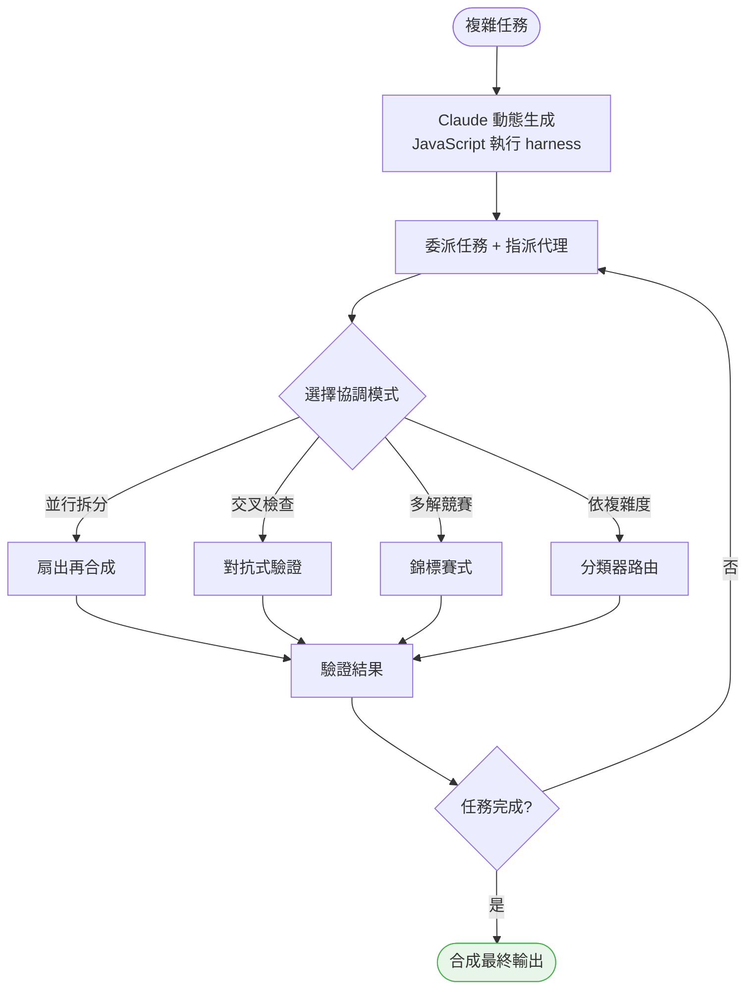
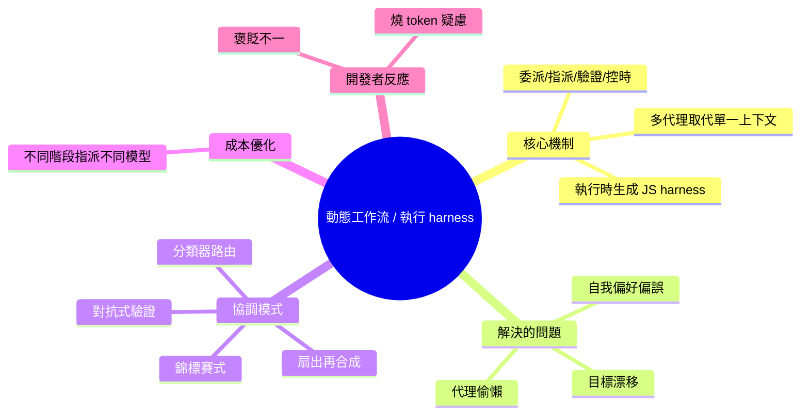

## Anthropic Explains How Claude Builds Its Own Execution Harnesses

Anthropic 公開揭露 Claude Code 最近推出的「動態工作流」（Dynamic Workflows）特性背後的協調系統運作原理。該系統的核心機制是在執行時動態生成自訂的「執行 harness」（execution harness），專門用於協調多個 AI 代理團隊執行複雜任務。Anthropic 詳述了系統如何運行時決定代理分工、溝通模式與工作流編排。這為多代理系統的協調模式與任務分解提供了具體的架構框架。

### 重點
- Claude Code 動態工作流動態生成自訂執行 harness 協調多代理團隊
- 系統在運行時決定代理分工、溝通模式與工作流編排
- 揭露多代理任務協調與執行的具體架構模式

**原文：** [infoq-ai-ml](https://www.infoq.com/news/2026/06/claude-code-harnesses/?utm_campaign=infoq_content&utm_source=infoq&utm_medium=feed&utm_term=AI%2C+ML+%26+Data+Engineering)

---

<!-- deep-analysis:begin -->
## 📌 摘要 (TL;DR)

- Anthropic 公開 Claude Code「動態工作流」（Dynamic Workflows）背後的協調系統：核心是在執行時由 Claude **動態生成自訂的 JavaScript 執行 harness**（execution harness）來協調多個 AI 代理。
- 這個 harness 負責四件事——委派任務、指派代理、驗證結果、決定工作流持續時間（delegate tasks、assign agents、validate results、determine workflow duration）。
- 設計理念是用多個各有角色的獨立代理，取代「單一上下文視窗」（single context window）硬扛複雜任務。
- 系統針對長時間 AI 運作的三大失效：代理偷懶（Agentic Laziness）、自我偏好偏誤（Self-Preferential Bias）、目標漂移（Goal Drift）。
- 提出四種協調模式：扇出再合成（fan-out-and-synthesize）、對抗式驗證（adversarial verification）、錦標賽式工作流（tournament-style）、分類器系統（classifier systems）。
- 支援模型路由（model routing）：不同階段指派不同 Claude 模型，把昂貴模型留給需要推理的步驟以控制成本。
- 開發者反應兩極，有人直言：「總有一天會變好，但現在它只是個很酷的燒 token 方式。」本文由 Robert Krzaczyński 撰於 2026 年 6 月 15 日。

## 🎯 核心概念

- **動態工作流**（Dynamic Workflows）：Claude Code 近期推出的特性，讓模型在執行時自行編排多代理協作流程。
- **執行 harness**（execution harness）：執行時動態生成的 JavaScript 協調程式，負責委派、指派、驗證與控時。
- **代理偷懶**（Agentic Laziness）：AI 在任務完成前提早停手。
- **自我偏好偏誤**（Self-Preferential Bias）：模型在自我評估時偏袒自己的結論。
- **目標漂移**（Goal Drift）：長對話中目標被逐漸稀釋、偏離原意。
- **扇出再合成**（fan-out-and-synthesize）：拆成平行子任務再合併結果。
- **對抗式驗證**（adversarial verification）：審查代理專門挑戰其他代理的發現。
- **錦標賽式工作流**（tournament-style）：多代理用不同方法解同一題並互相競爭。
- **分類器系統**（classifier systems）：依任務複雜度把工作路由給不同代理。

## 📖 整理分析

### 1. 執行 harness 是什麼
Anthropic 揭露，動態工作流的核心不是固定腳本，而是由 Claude 在執行時「即時生成」一段 JavaScript 執行 harness。這段程式扮演協調者角色，明確負責四件事：委派任務、指派代理、驗證結果、決定工作流要跑多久。換言之，模型不只完成任務，還要先寫出「如何分工完成任務」的協調程式碼。

### 2. 為何要多代理，而非單一上下文
文章指出，動態工作流刻意不依賴單一上下文視窗，而是部署多個有特定角色的獨立代理分頭處理任務的不同面向。這個設計直接對應三個長程運作的已知失效：代理偷懶（沒做完就停）、自我偏好偏誤（自評時偏袒自己答案）、目標漂移（互動拉長後目標被稀釋）。用分工加上外部驗證來抵銷單一代理的這些弱點。

### 3. 四種協調模式
Anthropic 列出幾種編排策略：扇出再合成把任務切成平行子任務再合併；對抗式驗證讓審查代理專門挑戰其他代理的發現；錦標賽式工作流讓多個代理用不同方法解同一題、競爭出最佳解；分類器系統則依任務複雜度把工作分派給不同代理。這些模式可組合，分別對應「廣度覆蓋」「正確性把關」「多解擇優」「成本路由」等需求。

### 4. 模型路由與成本
工作流可在不同階段指派不同的 Claude 模型：把能力強（也較貴）的模型留給需要密集推理的環節，簡單環節改用較便宜的模型，藉此優化成本。有開發者認同這點，指出「不需要大量推理的工作流可以改用更平價的模型」。

### 5. 開發者反應兩極
社群評價分歧。有人潑冷水：「總有一天會變好，但現在它只是個很酷的燒 token 方式。」也有人聚焦實用面，肯定模型路由帶來的成本彈性。整體而言，這套機制被視為多代理協調與任務分解的具體架構範例，但離真正「省成本」仍有距離。

## 🧭 流程圖

## 🧠 Mindmap

<!-- deep-analysis:end -->
### 📄 原文內容

點此展開 / 收合

Anthropic has published additional details about the orchestration system behind Claude Code's recently introduced Dynamic Workflows, highlighting how the feature generates custom execution harnesses designed to coordinate teams of AI agents for complex tasks. By Robert Krzaczyński

