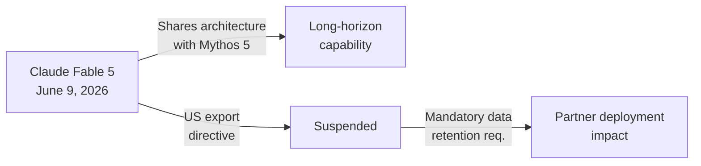

## Anthropic Releases and Temporarily Suspends Claude Fable 5

Anthropic 於 2026 年 6 月 9 日發布 Claude Fable 5，專為長期任務設計的旗艦級模型，但隨後因美國政府出口管制指令而迅速下架。該模型共享 Claude Mythos 5 架構，支援廣泛 token 使用。模型包含強制性資料保留要求，直接影響與 Microsoft 等夥伴的部署計畫。此事件凸顯地緣政治與監管環境如何約束先進 AI 模型的商業發布窗口。

### 重點
- Claude Fable 5 於 6 月 9 日發布、同月內因美國出口指令下架
- 強制性資料保留要求影響 Microsoft 等企業夥伴部署
- 共享 Claude Mythos 5 架構、支援大規模 token 使用

**原文：** [infoq-main](https://www.infoq.com/news/2026/06/claude-5-release/?utm_campaign=infoq_content&utm_source=infoq&utm_medium=feed&utm_term=global)

---

### 📄 原文內容

點此展開 / 收合

On June 9, 2026, Anthropic launched Claude Fable 5, a model designed for long-horizon tasks, but it was taken offline shortly after due to a U.S. government export directive. It shares architecture with Claude Mythos 5, supporting extensive token usage. The model includes mandatory data retention requirements, which have affected its deployment with partners like Microsoft. By Andrew Hoblitzell

