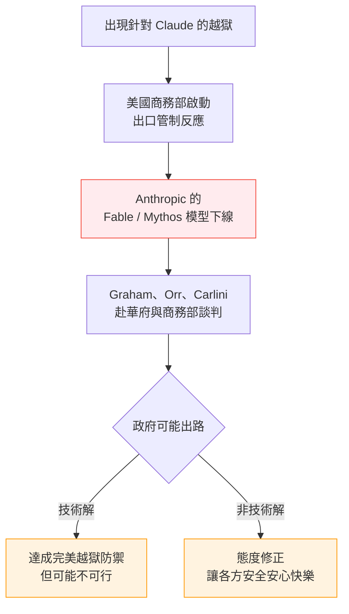
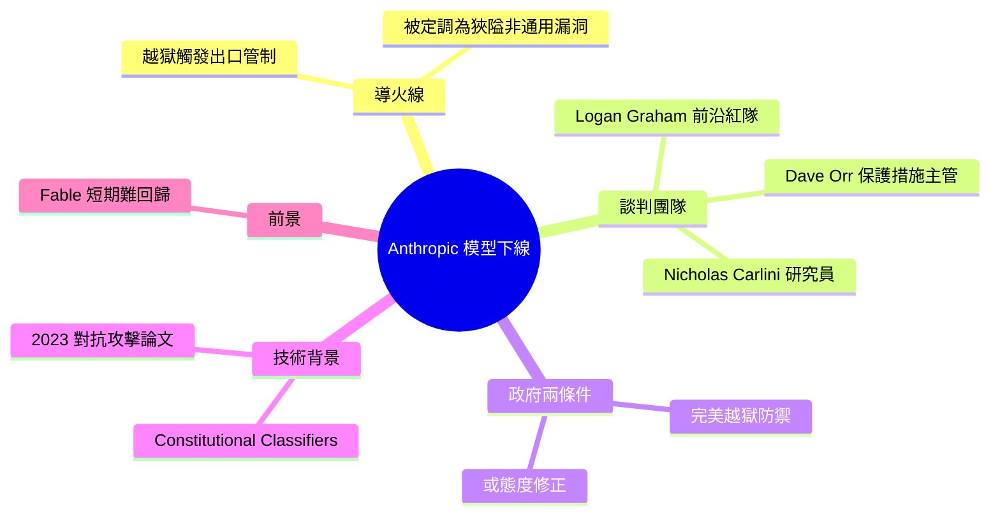

## \"They screwed us\": Personality clashes sent Anthropic's models offline

Axios 深入報導 Anthropic Claude Fable/Mythos 模型因美國政府出口管制而下線的幕後故事，揭示人事衝突與立場不合是觸發點。Anthropic 首席紅隊領導 Logan Graham、保護長 Dave Orr（前 DeepMind 工程總監）及研究員 Nicholas Carlini 與商務部進行協商。政府態度要求實現完美 jailbreak 防禦或改善組織文化（「讓所有人感到安全、安心和快樂」），映照出政府對 Constitutional Classifiers（2026 年 1 月推出）等防禦方案的懷疑。Anthropic 聲稱最近觸發該政策的 jailbreak 為「潛在狹隘、非通用漏洞」，但政府對通用 jailbreak 防禦的可行性表示悲觀。此事件反映了 AI 監管政策與商業利益之間的根本張力。

### 重點
- Anthropic 首席紅隊領導 Logan Graham（前英國首相特別顧問，AI/科技政策背景）與商務部進行 Claude Fable 下線協商
- 政府要求完美 jailbreak 防禦或文化改善；Anthropic 宣稱新推出的 Constitutional Classifiers 可防禦通用 jailbreak，但政府仍持懷疑
- 揭示政府與 Anthropic 在安全標準和防禦可行性上的根本分歧，暗示短期內模型恢復機會渺茫

**原文：** [simon-willison](https://simonwillison.net/2026/Jun/15/axios-clashes-anthropics/#atom-everything)

---

<!-- deep-analysis:begin -->
## 📌 摘要 (TL;DR)

- Simon Willison 轉述 Axios 的調查報導，這是目前關於美國政府以出口管制（export control）逼使 Anthropic 的 Fable / Mythos 模型下線一事，最完整的幕後內幕；報導標題直接引用消息人士的一句「They screwed us」（他們坑了我們）。
- Anthropic 派出三名要角於文章見刊當天赴華府與商務部（Commerce Department）會談：領導前沿紅隊（Frontier Red Team）的 Logan Graham、保護措施主管（Head of Safeguards）Dave Orr（前 Google DeepMind 工程總監），以及研究員 Nicholas Carlini。
- Logan Graham 曾在 Boris Johnson 任內擔任「首相特別顧問」，主管 AI、科學與科技政策，具備相當的政治歷練。
- 政府開出的條件之一是讓模型「完全無法被越獄（jailbreak）」，但 Simon 直言完美的越獄防禦可能根本不可行；替代方案竟是一次「態度修正」（attitude fix），讓各方「感到安全、安心和快樂」。
- Anthropic 堅稱至今沒有任何針對 Claude Mythos 的「通用越獄」（universal jailbreak）被發現，把觸發政府反應的漏洞定調為「潛在的狹隘、非通用越獄」。
- Simon 把此事連結到 2023 年論文〈Universal and Transferable Adversarial Attacks on Aligned Language Models〉，以及 Anthropic 今年 1 月發表的憲法分類器（Constitutional Classifiers）防禦研究。

## 🎯 核心概念

- **越獄**（jailbreak）：繞過模型安全限制、誘使其輸出被禁止內容的攻擊手法。
- **通用越獄**（universal jailbreak）：可廣泛套用、可在不同提問間轉移的越獄；相對於只在特定情境奏效的「狹隘、非通用」漏洞。
- **出口管制**（export control）：美國政府限制特定技術對外輸出的管制措施，是本次模型下線的法源觸發點。
- **前沿紅隊**（Frontier Red Team）：Anthropic 內部專門對前沿模型發動攻擊測試的團隊。
- **憲法分類器**（Constitutional Classifiers）：Anthropic 今年 1 月發表、用來偵測與阻擋越獄的防禦技術。

## 📖 整理分析

### 1. 全網最完整的幕後八卦

Simon Willison 指出，這篇 Axios 報導充斥「熟悉政府想法的消息來源」與「接近 Anthropic 的消息來源」，是他目前所見、關於出口管制造成 Mythos / Fable 模型下線一事最完整的幕後內幕。標題以一句「They screwed us」（他們坑了我們）開場，定調了此事濃厚的人事與立場衝突色彩，而非單純的技術或法規爭議。

### 2. 派往華府的三人組

Anthropic 派出三名要角於文章見刊當天（2026 年 6 月中）赴華府與商務部會談：領導前沿紅隊的 Logan Graham、保護措施主管 Dave Orr（前 Google DeepMind 工程總監），以及 Simon 部落格的常客、研究員 Nicholas Carlini。Simon 另外補充，Logan Graham 在 Boris Johnson 執政期間曾任「首相特別顧問」，負責 AI、科學與科技政策，意味著這支談判團隊並非只懂技術、也帶著政治經驗上桌。

### 3. 政府開出的兩個條件

報導的結語讓 Simon 對 Fable 短期回歸不抱樂觀。政府方的底線之一，是要求 Anthropic 確保模型「完全無法被越獄」——但 Simon 直言，完美的越獄防禦可能根本不可能達成。若做不到，一名熟悉政府想法的消息人士稱，事情最後可能只歸結為一次「態度修正」：與其讓人覺得被輕視，不如讓「每個人都感到安全、安心和快樂」。這個高度主觀、近乎情緒管理的解方，凸顯了監管與技術現實之間的落差。

### 4. 通用越獄與技術防線

此事讓 Simon 聯想到 2023 年論文〈Universal and Transferable Adversarial Attacks on Aligned Language Models〉所描述的攻擊類別，並認為 Anthropic 今年 1 月發表的憲法分類器研究與之直接相關。Anthropic 持續宣稱，至今沒有任何針對 Claude Mythos 的通用越獄被找到，並把觸發美國政府反應的那個漏洞，定調為「潛在的狹隘、非通用越獄」（a potential narrow, non-universal jailbreak）——換言之，雙方對「通用越獄防禦是否可行」的根本判斷並不一致。

## 🧭 事件因果鏈

## 🧠 Mindmap

<!-- deep-analysis:end -->
### 📄 原文內容

點此展開 / 收合

&quot;They screwed us&quot;: Personality clashes sent Anthropic&#x27;s models offline 
Lots of "source familiar with the administration's thinking" and "source close to Anthropic" in this Axios piece, which is the best collection of behind-the-scenes gossip I've seen about the US government export control Mythos/Fable story so far. 
 Logan Graham ( I lead the Frontier Red Team at Anthropic ), Dave Orr (Head of Safeguards, previously a Director of Engineering at Google DeepMind), and blog favorite Nicholas Carlini are reported to be meeting with the Commerce Department today in D.C. Good luck to them! 
 (I just noticed Logan was "Special Adviser to the Prime Minister" in the Boris Johnson era, covering AI, science, and technology policy - so significant political experience.) 
 This closing notes doesn't give me much optimism that we'll be getting Fable back any time soon: 
 
 The bottom line : One option is to make sure Anthropic's models can't be jailbroken — though perfect jailbreak resistance may be impossible. 
 Absent that, a source familiar with the administration's thinking said it may simply come down to an attitude fix where, instead of feeling dismissed, "everyone feels safe, secure and happy." 
 
 This made me wonder if Anthropic ever successfully addressed the class of attacks described in the Universal and Transferable Adversarial Attacks on Aligned Language Models paper from 2023. 
 It looks like their Constitutional Classifiers work (that post is from January this year) is relevant to that. They continue to claim that no "universal jailbreak" has been found against Claude Mythos, classifying the jailbreak that triggered the US government response as "a potential narrow, non-universal jailbreak".

 Tags: jailbreaking , ai , generative-ai , llms , anthropic , claude , nicholas-carlini , ai-ethics , claude-mythos

