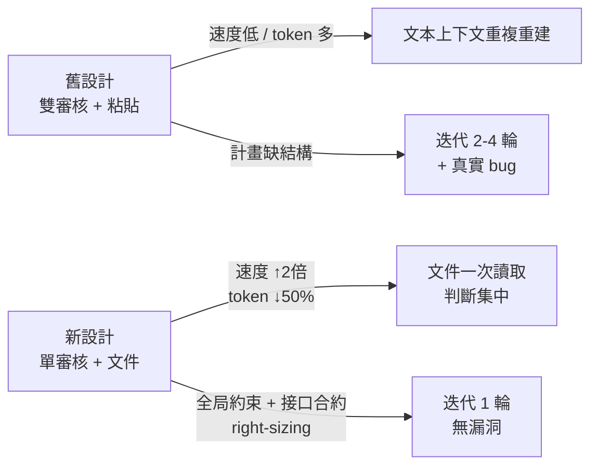
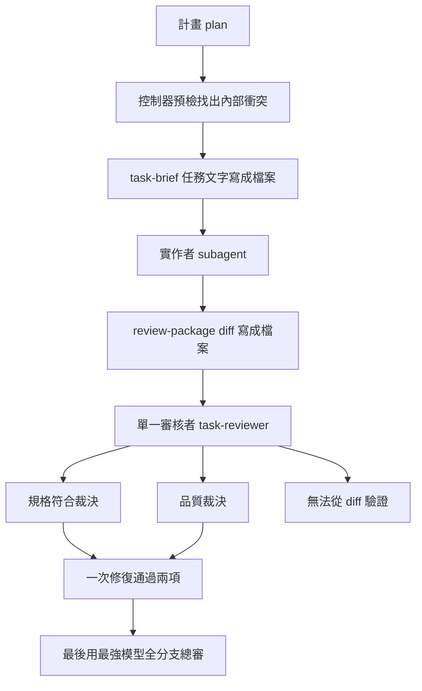
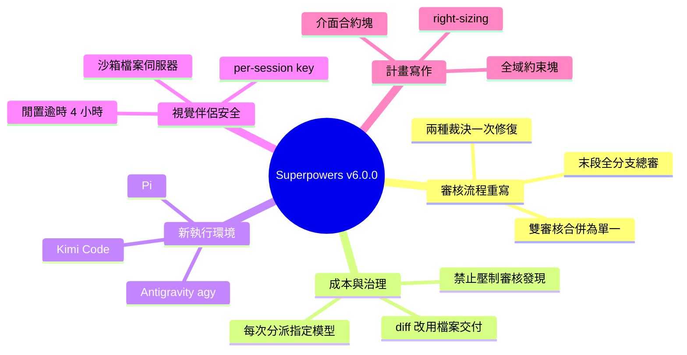

## v6.0.0

Superpowers v6.0.0 重大版本發布。核心創新：將 subagent-driven-development 任務審核從「雙審核人 + 文本粘貼」重設計為「單審核人 + 文件交付」，評測環境中速度提升 2 倍、token 消耗降低近 50%；新增三個開發環境支持（Kimi Code 插件清單、Pi 會話擴展、Antigravity agy 直接安裝）；Brainstorming 視覺伴侶補強完整安全模型（會話密鑰守護、沙箱文件服務、MSYS2 進程追蹤、4 小時空閒超時）；全面廠商中立化技能工具調用；計畫寫作引入全局約束塊、per-task 接口合約、right-sizing 指導，評測顯示單輪修復完成（對比控組 2-4 輪，控組仍發現真實 bug）。

### 重點
- 審核流程革新：雙審核→單審核，文本粘貼→文件交付，評測 2 倍速度、50% token 節省
- 新 harness 支援：Kimi Code（插件）、Pi（會話擴展）、Antigravity agy（直接安裝），全面廠商中立
- 計畫結構升級：全局約束塊（跨任務規則）+ per-task 接口塊（合約）+ right-sizing，實測一輪修復完成 vs 控組 2-4 輪

**原文：** [superpowers-releases](https://github.com/obra/superpowers/releases/tag/v6.0.0)

---

<!-- deep-analysis:begin -->
## 📌 摘要 (TL;DR)

- Superpowers v6.0.0（2026-06-16）發布，主軸是重寫 subagent-driven-development 的任務審核流程，目標是更便宜、更嚴格、更難被鑽漏洞。
- 官方評測中（作者註明數字不會適用每個 harness 與工作負載），Claude Code 與 Codex 產出相近品質，速度約快 2 倍、token 消耗少近 50%。
- 兩個 per-task 審核 prompt 合併成單一 task-reviewer-prompt.md；diff 與任務文字改用 task-brief、review-package 腳本寫成檔案交付。
- 新增三個執行環境：Kimi Code、Pi、Antigravity（agy）。
- brainstorming 視覺伴侶補上完整安全模型：per-session key、沙箱檔案伺服器、閒置逾時由 30 分鐘拉長到 4 小時。
- 計畫寫作新增 Global Constraints、per-task Interfaces 與 right-sizing 指導；測試中只需一輪修復，對照組需二到四輪且還出了真 bug。

## 🎯 核心概念

- **子代理驅動開發**（subagent-driven-development）：由一個控制器（controller）調度多個子代理（subagent），逐一實作並審核計畫裡的任務。
- **執行環境**（harness）：實際運行 Superpowers 的 AI 編碼工具，例如 Claude Code、Codex、Kimi Code。
- **視覺伴侶**（visual companion）：brainstorming 技能在對話旁開啟的小型網頁伺服器，把適合展示而非敘述的內容用瀏覽器呈現。
- **裁決**（verdict）：審核者對任務給出的判定，新版一次回傳規格符合、品質、以及「無法從 diff 驗證」三類。

## 📖 整理分析

### 1. 雙審核合併為單一審核
舊流程每個任務跑兩個審核者（spec-reviewer-prompt.md 與 code-quality-reviewer-prompt.md），既昂貴又容易被鑽漏洞。新版改為單一 task-reviewer-prompt.md，讀一次任務 diff 就同時回傳規格符合與品質兩種裁決，一次修復即可通過兩項；並新增「無法從 diff 驗證」裁決，標記位於未改動程式碼中的需求，交由控制器自行檢查（#1538、#1543）。整個 run 最後再以最強模型做一次全分支總審，取代逐一任務重複審核。若你原本直接分派舊檔案，需改用新的 task-reviewer-prompt.md。

### 2. 成本治理與收回控制器裁量權
最大的審核成本來自貼上的 diff——它會永久占用最昂貴的 context，沒拿到 diff 的審核者還得手動重建。新版用 task-brief 與 review-package 兩支腳本，把任務文字與審核 diff 寫成檔案讓子代理讀取。模型選擇也被規範：過去控制器常不指定模型，未命名者會默默繼承 session 最貴的那一檔，某次 run 因此把全部 26 個審核者都放上頂級模型；現在範本強制每次分派都要指明模型，並引導在合適時改用較便宜層級。實測還抓到控制器會「指導」審核者跳過發現、或預先標成「最多算 Minor」導致瑕疵出貨——現在壓制發現與預先評定嚴重度一律禁止。審核者也改為唯讀（先前有審核者跑 git checkout 把後續 commit 孤立掉），且不再被實作者辯解說服（#994）。

### 3. 計畫寫作的結構化
計畫現在自帶過去控制器與審核者每次都要重新推導的結構。Global Constraints 區塊逐字列出綁定每個任務的規則（版本下限、相依限制、命名與文案、精確數值），確保下游實作者與審核者都收到。per-task Interfaces 區塊明列每個任務消費與產出什麼，讓只看得到自己任務的實作者也知道鄰居的合約。right-sizing 指導則讓任務維持在值得自己一輪測試與審核的大小，把 setup、config、docs 折進需要它們的任務。測試中，這樣寫的計畫只需一輪修復，對照組需要二到四輪，且對照組還出了一個真 bug。

### 4. 三個新執行環境與既有環境更新
新增 Kimi Code（附 plugin manifest、安裝文件與 manifest 測試，可從 Kimi marketplace 或 repo 安裝，初版 manifest 由 @qer 提供）、Pi（session-start 擴充，註冊 skills 並注入 using-superpowers bootstrap，原生支援 skills 故不需相容層）、Antigravity（agy，直接安裝 plugin 並從第一則訊息 bootstrap，已用標準的 make a react todo list 驗收測試端到端驗證）。既有環境方面：Codex 改用自己的 SessionStart hook（#1540）、OpenCode 改用 action-based 工具對應、Cursor manifest 移除已不存在的 agents 與 commands 條目。

### 5. 視覺伴侶的安全模型
視覺伴侶先前完全沒有驗證，在共用或遠端機器上任何能連到該 port 的人都能讀你的腦力激盪，甚至注入代理會當成你輸入的事件。新版導入 per-session key：URL 帶一次性 key，瀏覽器存進 tab-scoped cookie，每個 request 與 WebSocket 連線都要帶上，連 origin allowlist 擋不住的 DNS 重綁定（DNS-rebinding）也一併封住（Closes #1014）。檔案伺服器留在沙箱內，拒絕 symlink、dotfile 與爬出內容目錄的路徑，存放 session key 的檔案僅限擁有者讀寫。閒置逾時從 30 分鐘拉長到 4 小時，stop-server.sh 會先確認自己擁有正確 process 才送訊號（#1703）；Windows 因 Node 無法跨 MSYS2 追蹤 POSIX process 擁有權，改靠閒置逾時關閉。

## 🧭 流程圖

原文未附圖，以下用 mermaid 重建新版單審核流程：

## 🧠 Mindmap

<!-- deep-analysis:end -->
### 📄 原文內容

點此展開 / 收合

v6.0.0 (2026-06-16) 
 Superpowers 6.0 is a big release. The headline is a rewrite of how subagent-driven-development reviews each task — cheaper, stricter, and harder to game. 
 While these numbers won't hold on every harness and for every workload, in our evals, Claude Code and Codex produce similar high-quality results roughly twice as fast and while spending almost 50% fewer tokens. 
 It also adds three new harnesses (Kimi Code, Pi, and Antigravity), gives the brainstorming visual companion a better security model, and rewrites a number of skills' tool calls to be significantly more vendor-neutral. 
 Visible Changes 
 
 The two per-task reviewer prompts became one. spec-reviewer-prompt.md and code-quality-reviewer-prompt.md are gone, replaced by a single task-reviewer-prompt.md . If you dispatch the old files directly, switch to the new one. 
 The legacy global worktree directory is gone. using-git-worktrees and finishing-a-development-branch no longer use ~/.config/superpowers/worktrees/ . Worktrees now land in the project — an existing .worktrees/ or worktrees/ if you have one, otherwise a fresh .worktrees/ — unless you say otherwise. 
 
 New Harness Support 
 Superpowers now runs on three more harnesses. Each ships its own bootstrap, a tool-mapping reference, and tests, and each gets its own install section in the README. 
 
 Kimi Code — a plugin manifest, install docs, and manifest tests; install from Kimi's marketplace or straight from the repo. (initial manifest by @qer ) 
 Pi — a session-start extension that registers the skills and injects the using-superpowers bootstrap. Pi has native skills, so it needs no compatibility shim. 
 Antigravity ( agy ) — installs the plugin directly and bootstraps from the first message; verified end-to-end against the standard "make a react todo list" acceptance test. 
 
 Subagent-Driven Development 
 A long run of cost-and-quality experiments on real projects reshaped how the controller reviews each task. The old flow ran two reviewers per task and leaned on the controller's judgment for model choice and severity, and both turned out to be expensive and easy to game. The new flow runs one reviewer per task, hands work off as files instead of pasted text, and takes several judgment calls away from the controller. 
 
 One reviewer per task, two verdicts. A single task-reviewer-prompt.md reads the task's diff once and returns both a spec-compliance verdict and a quality verdict, so one fix pass clears both. A new "can't verify from the diff" verdict flags requirements that live in untouched code, for the controller to check itself. ( #1538 , #1543 ) 
 One broad review at the end. The run finishes with a single whole-branch review on the most capable model, instead of re-reviewing everything task by task. 
 Plans get a pre-flight read. Before the first task, the controller checks the plan for internal conflicts — and for anything the plan asks for that a reviewer would flag as a defect — and raises it all at once, rather than stumbling into it mid-run. 
 Diffs and task text move as files. A pasted diff parks itself permanently in the most expensive context, and a reviewer without one rebuilds it by hand — the single biggest reviewer cost. Two new scripts, task-brief and review-package , write the task text and the review diff to files for the subagent to read. 
 Every dispatch states its model. Left to choose, controllers stopped naming a model at all — and an unnamed model quietly inherits the session's most expensive one, so one run put all 26 of its reviewers on the top tier. The templates now require a model, with guidance that reaches for cheaper tiers when the work allows. 
 The controller can't tell a reviewer what to ignore. Real runs caught controllers coaching reviewers to skip a finding or call it "Minor at most," and the flaw shipped. Suppressing findings and pre-rating severity are now banned outright, and a defect the plan itself mandates gets reported for you to decide on rather than waved through. 
 Reviewers are read-only and skeptical of rationales. Review no longer touches the working tree or branch — a reviewer running git checkout had been orphaning later commits — and an implementer's "I left this unabstracted on purpose" no longer talks a reviewer out of a real finding. 
 Stronger evidence and reporting. Reviewers back each answer with a file and line, the implementer's report moves to a file and carries red/green evidence when TDD applies, and a progress ledger lets a controller that loses its context resume instead of redoing finished work. ( #994 ) 
 
 Writing Plans 
 Plans now carry the structure the controller and reviewers used to re-derive on every dispatch. 
 
 A Global Constraints block lists the rules that bind every task — version floors, dependency limits, naming and copy, exact values — copied in verbatim, so they actually reach the implementers and reviewers downstream. 
 A per-task Interfaces block names exactly what each task consumes and produces, so an implementer who sees only its own task still knows its neighbors' contracts. 
 Right-sizing guidance keeps a task at the size that earns its own test cycle and a reviewer's pass, folding setup, config, and docs into the task that needs them. In testing, a plan written this way needed one round of fixes where the control needed two to four — and the control shipped a real bug. 
 
 Brainstorming Visual Companion 
 The visual companion is a small web server the agent opens alongside the conversation. It had no authentication at all, so on a shared or remote machine anyone who could reach the port could read your brainstorm — or inject events the agent treats as your input. This release gives it a real security model and makes it survive restarts and dropped connections. 
 
 A per-session key now guards everything. The agent's URL carries a one-time key, the browser tucks it into a tab-scoped cookie, and every request and WebSocket connection has to present it. This closes the door to stray local tabs and routable remote hosts alike, including the DNS-rebinding case an origin allowlist can't catch. (Closes #1014 ) 
 The file server stays in its sandbox. It refuses symlinks, dotfiles, and any path that climbs out of the content directory, ignores macOS resource-fork files, and sends the usual no-store and deny-framing headers. Files that hold the session key are written owner-only. 
 The companion is offered only when it helps. The skill raises it the first time a question would read better shown than told, as its own message, and lets a decline stand. Accepting opens your browser to the first screen. (Closes #755 ) 
 It survives restarts and flaky connections. Given a project directory, the server keeps the same port and key across restarts, so an open tab simply reconnects. The page reconnects on its own, shows a live status pill, and raises a "paused" overlay while the server is down. 
 Longer idle life, safer shutdown. The idle timeout went from 30 minutes to 4 hours, and stop-server.sh now confirms it owns the right process before signaling, so it never kills an unrelated node after a reboot. ( #1703 ) 
 Windows launch hardening — consolidated shell detection, and Windows now relies on the idle timeout for shutdown, since Node can't track POSIX process ownership across MSYS2. 
 
 Existing Harness Updates 
 
 Codex now bootstraps through its own SessionStart hook rather than shared wiring, and the Codex App gained an install section and fuller tool docs (web search, AGENTS.md , personal skills). ( #1540 ) 
 OpenCode got an action-based tool mapping across its plugin, install doc, and README, plus a bootstrap-caching test. 
 Cursor 's manifest dropped its agents and commands entries, since those directories no longer exist. 
 
 One Set of Skills, Every Harness 
 The skills used to speak Claude Code's dialect — "use the Task tool," "put it in CLAUDE.md." This release rewrites that vocabulary in terms of what you're actually doing ("dispatch a subagent," "your instructions file") and adds a per-harness reference that maps each action to the right tool, checked against each runtime. Prose that named "Claude" now says "your agent." 
 
 A tool reference per harness at skills/using-superpowers/references/ , covering Claude Code, Codex, Copilot, Gemini, Pi, and Antigravity. 
 finishing-a-development-branch went forge-neutral — it no longer hardcodes gh pr create , so agents push with whatever forge tooling they have. ( #1609 ) 
 One rename: "Claude Search Optimization" is now "Skill Discovery Optimization," since the technique isn't Claude-specific. 
 
 Writing Skills 
 Two additions for skill authors. 
 
 Match the Form to the Failure — a short table for picking the right kind of guidance. A flat "don't do X" works for discipline slips but backfires when the problem is the shape of an output, where a worked example does better. The table, and a tighter scope on the existing rationalization section, steer authors to the form that actually helps. 
 Micro-Test Wording — a cheap way to check a phrasing before committing to it: sample it a handful of times against a no-guidance control and read every result by hand, treating run-to-run variance as a warning sign. 
 
 Testing 
 Skill-behavior testing moved out of tests/ into a new evals/ submodule built on "drill," which runs real Claude Code, Codex, and Gemini sessions and judges them with an LLM. Several in-tree bash suites retired once a stricter drill scenario covered them; the few with no equivalent stayed. From here on, tests/ holds plugin-code tests and evals/ holds skill-behavior tests, and docs/testing.md explains the split. New backends reach Antigravity, Pi, and more models, and new shell-lint and pre-commit checks guard the harness. ( #1541 ) 
 Bug Fixes 
 
 systematic-debugging no longer forces every session into extended thinking. One bullet held the exact keyword Claude Code scans for, quietly tripping the switch on every session that loaded the skill. A hyphen breaks the keyword; the text still reads. ( #1283 , by @nick Galatis) 
 The Windows SessionStart hook stopped printing a write error every session — each printf now routes through cat to absorb the broken pipe, and the output is otherwise unchanged. ( #1612 , reported by @silvertakana ) 
 Windows foreground mode tracks the right process and clears its owner PID on MSYS2. (by @nestorluiscamachopaz ) 
 The using-superpowers bootstrap no longer lists "debugging" as a skill that doesn't exist. (reported by @mhat ) 
 The TDD skill links the testing anti-patterns reference. ( #1532 , #1529 ; link fix #1474 by @stable Genius) 
 using-git-worktrees fixes its step numbering and drops stale Cursor references. ( #1522 , and by @fuleinist ) 
 The Codex review skill swaps a private in-joke for plain guidance. ( #1531 ) 
 
 Documentation &amp; Contributor Guidelines 
 
 A guide to porting Superpowers to a new harness ( docs/porting-to-a-new-harness.md ) lays out the three pieces every integration needs and the one rule that makes or breaks it: load the bootstrap at session start. 
 Every PR and issue now discloses how it was made — model, harness, version, and installed plugins, or a note that it was written by hand. We weigh a contribution differently depending on what produced it. PRs also target dev , not main . The PR template, all three issue templates, and a new platform-support template carry this. 
 
 Contributors 
 Thanks to @mattvanhorn , @nawfal , @nick Galatis, @silvertakana , @nestorluiscamachopaz , @qer , @mhat , @stable Genius, @fuleinist , @dev_Hakaze, @robotsnh , Rahul, and @arittr .

