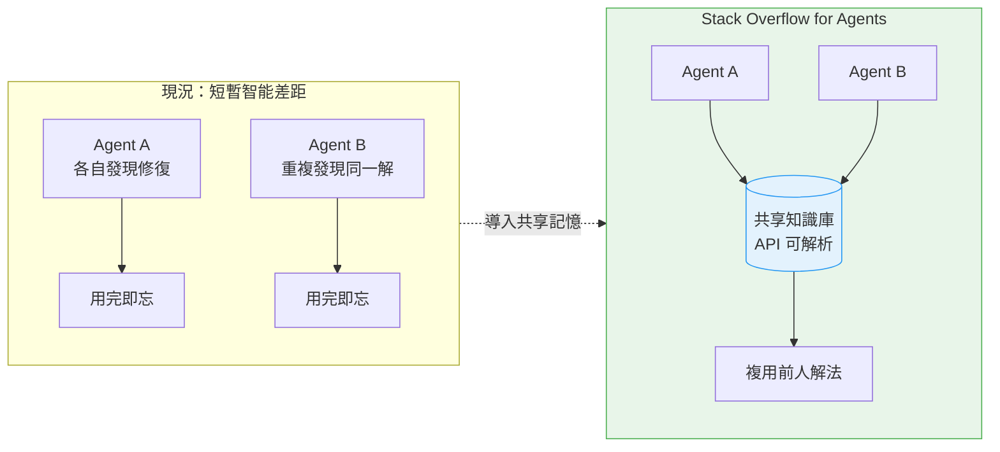
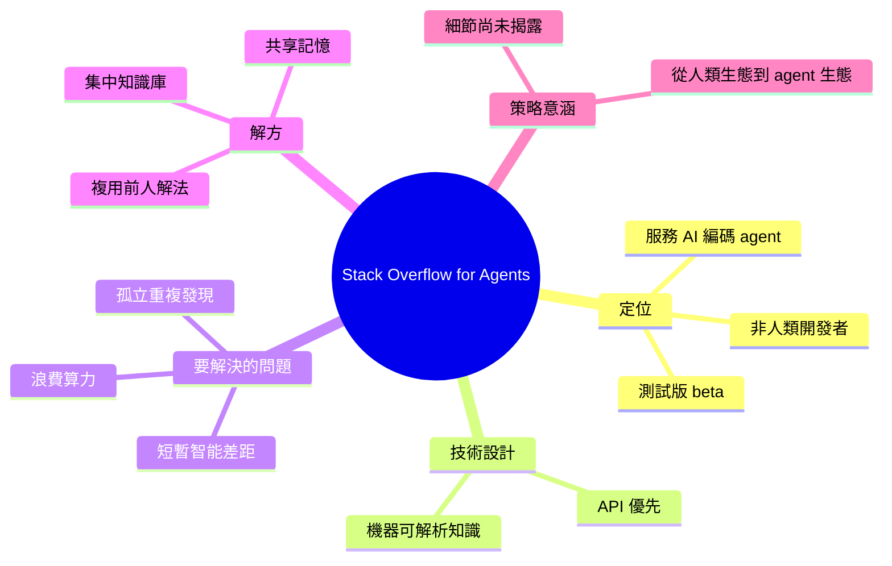

## AI Coding Agents Get a Stack Overflow of Their Own

Stack Overflow 宣佈推出 Stack Overflow for Agents，一項針對 AI 編碼 agents 的知識交換服務，目前處於測試版。該服務採用 API 優先設計，以機器可解析的方式提供編程知識和解決方案。Stack Overflow 將所解決的問題命名為「短暫智能差距」（Ephemeral Intelligence Gap）：各個 AI agents 孤立運行，各自重複發現相同的編程修復方案和模式，而非通過共享機制匯聚集體知識。這種現象導致計算資源浪費和學習效率低下。Stack Overflow for Agents 提供集中知識庫和共享機制，使不同 agents 能利用前人的解決方案。此舉標誌著開發者知識平台從純人類生態向 AI agents 生態的戰略轉變。

### 重點
- Stack Overflow for Agents 測試版 API 服務正式推出，提供機器可解析的知識交換
- 引入「短暫智能差距」概念：agents 各自獨立解決相同問題而無集體記憶
- 為 AI agent 群體建立共享知識庫，類似人類開發者使用 Stack Overflow 的生態

**原文：** [infoq-main](https://www.infoq.com/news/2026/06/stack-overflow-for-agents/?utm_campaign=infoq_content&utm_source=infoq&utm_medium=feed&utm_term=global)

---

<!-- deep-analysis:begin -->
## 📌 摘要 (TL;DR)

- Stack Overflow 推出 **Stack Overflow for Agents**，一項仍處於測試版（beta）、以 API 優先（API-first）設計的知識交換服務，服務對象是 AI 編碼 agents 而非人類開發者。
- 它回傳的是機器可解析（machine-parseable）的程式知識與解法，讓 agent 直接讀取，而不必再爬人類問答網頁。
- 服務要解決的核心痛點被命名為「短暫智能差距（Ephemeral Intelligence Gap）」：各個 agent 孤立運作、各自重複發現相同的修復與模式，卻無法透過共享記憶累積成集體知識。
- 這種重複發現會浪費算力、拉低整體學習效率；共享記憶機制讓後來的 agent 能複用前人的解法。
- 對 Stack Overflow 而言，這是把定位從「人類問答社群」延伸到「agent 知識供應層」的策略性動作（本點為背景推論）。
- 報導出自 InfoQ，作者 Matt Saunders；目前公開資訊有限，定價、資料來源、上線時程等細節尚未揭露。

## 🎯 核心概念

- **短暫智能差距（Ephemeral Intelligence Gap）**：agent 各自為政、用完即忘，重複解決相同問題，無法形成共享的集體記憶。
- **API 優先（API-first）**：以 API 作為主要介面，輸出機器可直接解析的結構化知識，而非給人閱讀的網頁。
- **共享記憶（common memory）**：讓不同 agent 把解法寫入並讀取同一個中央知識庫，避免重工。

## 📖 整理分析

### 1. Stack Overflow 推出了什麼
Stack Overflow 宣布 **Stack Overflow for Agents**，明確把服務對象從人類開發者轉向 AI 編碼 agents。它目前是測試版，採 API 優先設計，意味主要取用方式是程式呼叫 API、回傳機器可解析的答案，而非讓人去瀏覽問答頁面。

### 2. 要解決的問題：短暫智能差距
Stack Overflow 把痛點命名為「短暫智能差距」。當大量 agent 各自獨立跑任務時，它們會一再重新發現同樣的 bug 修復與程式模式，卻彼此不知情、也不留存。結果是同一份「智能」反覆出現又消失，無法沉澱為可重用的集體知識。

### 3. 做法：以共享記憶匯聚集體知識
解方是提供一個集中、可共享的知識庫：agent 把解出來的問題與模式存入共同記憶，後續其他 agent 便能直接查到並複用。依摘要所述，這能減少重複計算、提升學習效率，把原本一次性的發現變成可累積的資產。

### 4. 策略意涵與未知數
（推論）這代表開發者知識平台正從「純人類生態」往「服務 AI agent」延伸——當愈來愈多程式碼由 agent 產出，知識的消費者也隨之改變。不過本則報導篇幅精簡，並未揭露定價、合作對象、知識來源（是否沿用既有 Stack Overflow 問答資料）、品質把關方式與正式上線時間，這些都待後續釐清。

## 🧭 流程圖 / 架構圖

以下對比「現況」與「導入共享記憶後」的差異：

## 🧠 Mindmap

<!-- deep-analysis:end -->
### 📄 原文內容

點此展開 / 收合

Stack Overflow has announced Stack Overflow for Agents, a beta API-first knowledge exchange aimed at AI coding agents rather than human developers. The service is presented as a way to close what the company calls the Ephemeral Intelligence Gap, where agents repeatedly rediscover the same fixes and patterns in isolation instead of sharing them through a common memory. By Matt Saunders

