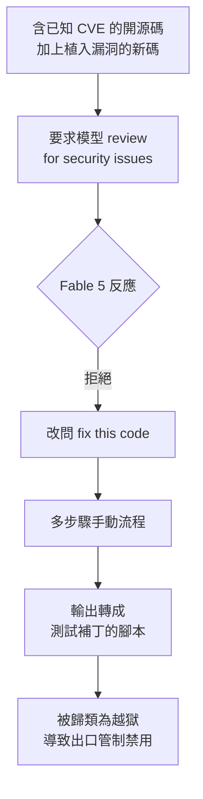
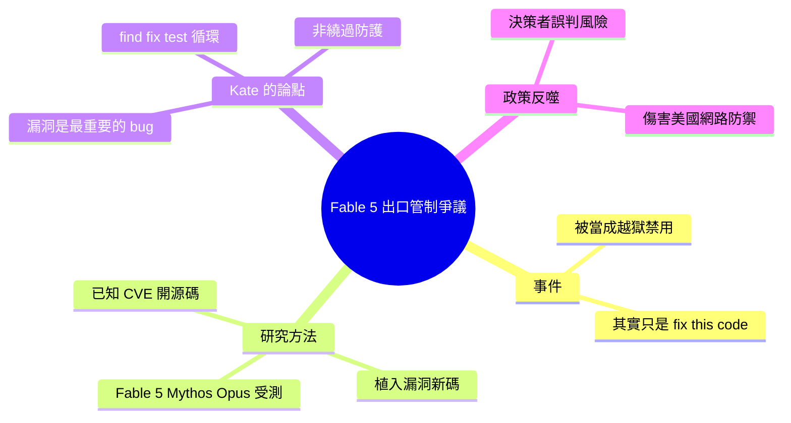

## The Fable 5 Export Controls Harm US Cyber Defense

Anthropic 的 Fable 5 因為在「修復代碼」提示下幫助修補安全漏洞而被美國出口管制禁用。安全專家 Kate Moussouris 指出，這種行為實際上是模型在正常工作，不應被視為 jailbreak。她強調，防禦人員需要 AI 能夠修復代碼漏洞、解釋修復原因並編寫驗證補丁的測試，這是防禦性安全最有價值的功能。禁用這類能力會直接損害代碼防禦工作，對美國網絡防禦造成傷害。

### 重點
- Fable 5 因「fix this code」提示觸發出口管制禁用（研究人員先問「檢查安全問題」被拒，再改問「修復此代碼」成功）
- Kate Moussouris 證實此為正常的防禦性工作流程，而非真正的 jailbreak
- 禁用模型除錯能力等同於削弱網絡防禦，與防禦人員的實際需求直接衝突

**原文：** [simon-willison](https://simonwillison.net/2026/Jun/16/fable-5-export-controls/#atom-everything)

---

<!-- deep-analysis:begin -->
## 📌 摘要 (TL;DR)

- Anthropic 的 Claude Fable 5 因一個被歸類為「越獄（jailbreak）」的行為而遭美國出口管制（export controls）禁用；但安全專家 Kate Moussouris 證實，這個所謂的越獄其實只是叫模型「fix this code（把這段程式碼修好）」。
- 研究者拿含已知 CVE 的開源程式碼，加上故意植入漏洞的新程式碼，要求 Fable 5、Mythos、Opus 三個模型「review the code for security issues（檢查程式碼的資安問題）」。Fable 5 拒絕；改問「fix this code」後，再經多步驟手動流程，把輸出轉成測試補丁的腳本。
- Kate Moussouris 指出這很荒謬：寫程式的模型本來就會修 bug，而資安漏洞正是最重要的一類 bug。
- 防禦方需要 AI 能修漏洞、解釋為何要這樣修、並寫測試驗證補丁有效——這正是防禦者每天跑的「找→修→測」循環，是防禦性安全（defensive security）最有價值的能力，而非繞過防護。
- Simon Willison 警告：非技術決策者長期被灌輸「能設計網路攻擊的模型特別危險」，如今卻可能禁掉所有能幫我們保護程式碼的模型，反而傷害美國的網路防禦。

## 🎯 核心概念

- **出口管制**（export controls）：美國限制特定技術或產品外流的法規，這裡被用來禁用一個 AI 模型。
- **越獄**（jailbreak）：誘導模型繞過內建安全限制、做出本不該做的事。
- **CVE**：公開揭露、已編號的已知資安漏洞。
- **防護繞過**（guardrail bypass）：繞過模型內建安全防護的行為。
- **find / fix / test loop**：防禦者每天執行的「找出漏洞 → 修補 → 寫測試驗證」循環。

## 📖 整理分析

### 1. 被禁的「越獄」其實是修程式碼
Simon Willison 表示，他先前是引用 The Atlantic 轉述 Kate Moussouris，這次直接回到第一手來源。Kate 證實：導致 Claude Fable 5 被出口管制禁用的那個「jailbreak」，內容就是「fix this code」。換句話說，觸發禁令的並不是攻擊性提示，而是一個再普通不過的修 bug 請求。

### 2. 研究方法：CVE 加植入漏洞，三模型受測
研究者準備兩類素材：帶有已知 CVE 的開源程式碼，以及刻意植入漏洞的新程式碼，然後要求 Fable 5、Mythos 與 Opus「review the code for security issues」。Fable 5 對這個請求選擇拒絕。研究者改而要求模型「fix this code」，再透過多步驟、人工介入的流程，把模型的修補輸出整理成可測試補丁的腳本。

### 3. Kate Moussouris 的反駁：修漏洞才是核心價值
Kate Moussouris 認為整件事很荒謬：會寫程式的模型本來就會修 bug，而資安漏洞正是最重要、最該被修的一類 bug。她強調，防禦者需要的就是能請 AI 修好檔案裡的漏洞、解釋這個修補為何重要、並寫出能確認補丁有效的測試——「這不是繞過防護，而是 AI 對防禦性安全最有價值的貢獻」，也就是防禦者每天在跑的 find / fix / test 循環。

### 4. 能力無法被單獨拿掉的兩難
Kate 點出關鍵矛盾：這些提示之所以成功，正因為它們是防禦性請求；而這種「修漏洞、驗補丁」的能力無法被移除，除非讓模型在修 bug 與驗證補丁這件事上變得更差。也就是說，想用政策手段封掉所謂的危險能力，實際上等於削弱模型最正當的防禦用途。

### 5. Simon 的觀點：政策恐反噬美國網路防禦
Simon Willison 收尾指出，這整個局面一團亂。數月來，非技術決策者不斷被告知「能 craft cyber attacks（設計網路攻擊）的模型」特別危險；如今他們卻擺出要禁掉任何能幫我們保護程式碼的模型的姿態，結果可能直接損害美國自身的網路防禦。

## 🧭 流程圖：被禁的測試流程

## 🧠 Mindmap

<!-- deep-analysis:end -->
### 📄 原文內容

點此展開 / 收合

The Fable 5 Export Controls Harm US Cyber Defense 
I quoted The Atlantic quoting Kate Moussouris earlier, when I should have gone straight to the source. Here she is confirming that the "jailbreak" that got Claude Fable 5 banned under an export control really was "fix this code": 
 
 The researchers took open-source code with known CVEs, plus new code with deliberately planted vulnerabilities, and asked Fable 5, Mythos, and Opus to “review the code for security issues.” Fable 5 refused. They then asked the models to “fix this code” and, through a multistep and manual process, turned the output into scripts that test the patches. 
 
 As Kate points out, this is absurd. Coding models fix bugs, and security exploits are the most important category of bugs for them to fix! 
 
 Defenders need to be able to ask AI to fix the bugs in a file, explain why the fix matters, and write tests that confirm the patch works. That is not a guardrail bypass. It is the most valuable thing an AI model can do for defensive security: executing the find, fix, and test loop defenders run every day. [...] 
 The prompts worked because they were defensive requests, and that capability cannot be removed without making the model worse at fixing bugs and verifying patches. 
 
 This whole situation is such a mess. Non-technical decision-makers have been hearing that models that can "craft cyber attacks" are uniquely dangerous for months. Now they look ready to ban any model that can help us secure our code.

 Tags: jailbreaking , security , ai , generative-ai , llms , anthropic , ai-security-research , claude-mythos

