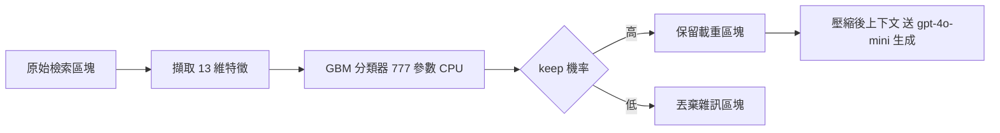
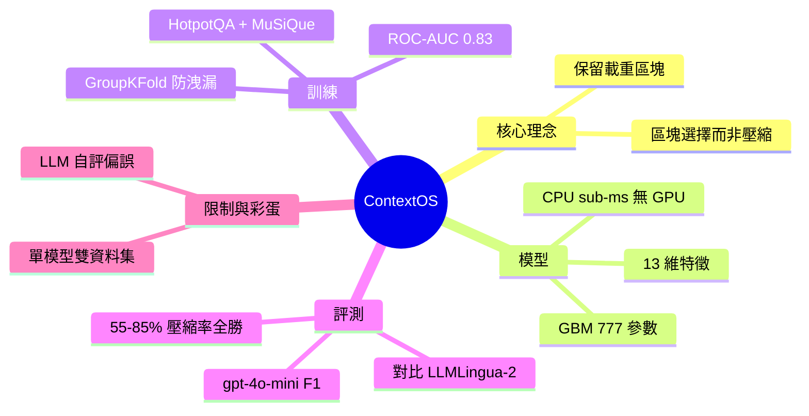

## Beating the State of the Art at Context Compression — With 777 Parameters and No GPU

ContextOS 是一個學習式上下文選擇策略，通過極端參數化實現上下文壓縮的新突破。系統僅使用 777 個參數即可運行，且在無 GPU 的環境下執行。在整個 55-85% 的上下文壓縮率範圍內，ContextOS 超越了現有強基準模型 LLMLingua-2，實現了最先進 (State-of-the-Art) 的性能表現。

### 重點
- ContextOS 參數效率：僅 777 參數，無需 GPU 計算，極低的計算成本
- SOTA 性能：全領域超越 LLMLingua-2，在 55-85% 壓縮率下達成最先進性能
- 實踐意義：大幅降低上下文管理成本，適用邊緣設備和資源受限環境

**原文：** [medium-tag-llm](https://medium.com/@aaryanmhjn/beating-the-state-of-the-art-at-context-compression-with-777-parameters-and-no-gpu-7737729a4428?source=rss------large_language_models-5)

---

<!-- deep-analysis:begin -->
## 📌 摘要 (TL;DR)

- 開發者 Aaryan Mahajan 發表 **ContextOS**：一套給 RAG 用的「學習式上下文選擇」策略，核心主張是「選對區塊，而不是壓縮文字」。
- 選擇器只用 scikit-learn 的 `GradientBoostingClassifier`，總參數僅 **777 個**，推論在 **CPU 上 sub-millisecond** 完成，完全不需 GPU。
- 在 55%、70%、85% 三個壓縮率上全面超越微軟的 SOTA 基線 **LLMLingua-2**，作者宣稱改善幅度約 +5.5 到 +17.4 個 F1 點。
- 訓練資料為 HotpotQA + MuSiQue 兩個多跳問答資料集，選擇器的 ROC-AUC 達 0.83，評測用 `gpt-4o-mini` 當生成器、附 95% bootstrap 信賴區間。
- 為什麼值得看：它示範了用「極小的傳統 ML 分類器 + 預算好的相似度」就能在上下文精簡這件事上贏過重量級 LLM 壓縮方法，成本與延遲都極低。

## 🎯 核心概念

- **上下文選擇**（context selection）：把「精簡上下文」重新定義為「該保留哪些區塊」的二元分類，而非刪字。
- **上下文壓縮 / token 層級壓縮**（token-level compression）：LLMLingua-2 的路線，在字詞層級刪減 token。
- **區塊**（chunk）：檢索回來的文件片段，ContextOS 以「整塊保留或整塊丟棄」為單位。
- **載重區塊**（load-bearing chunk）：對回答鏈關鍵、不可丟的片段。
- **多跳問答**（multi-hop QA）：需要串接多個片段才能回答的問題，是本研究刻意挑的難題。

## 📖 整理分析

### 1. 核心賭注：選區塊，不壓 token
ContextOS 把問題框成「哪些區塊該進最終上下文？」的二元分類，而非像 LLMLingua-2 在 token 層級刪字。作者主張：與其壓縮文字，不如辨識載重區塊、丟掉其餘雜訊，這樣能保住區塊完整性又積極過濾噪音。整篇的口號是「Context is the problem. Selection is the solution.」

### 2. 777 參數、不用 GPU 的策略
選擇器是 scikit-learn 的 `GradientBoostingClassifier`，總參數只有 777 個。輸入是每個區塊的 13 維特徵，輸出 keep 機率，推論只要一次 `predict_proba()`，在 CPU 上 sub-millisecond 完成。權重在訓練時就序列化成 `learned/policy.pkl`，請求時不必載入大模型；ROI 信號直接取自 Qdrant 預先算好的餘弦相似度，而非即時跑神經 cross-encoder，這是它能完全不靠 GPU 的關鍵。

### 3. 13 個特徵信號
特徵以 **ROI cross-encoder 分數** 為主（約佔 40–50% 重要度），再加上融合分數、排名信號等領域無關的相關性指標。一個誠實的觀察：依賴圖（dependency-graph）與矛盾（contradiction）信號在此語料的貢獻趨近於 0；作者特別註明這不代表它們在所有領域都沒用，只是這份 Wikipedia 語料用不到。

### 4. 訓練設計與對比結果
訓練資料為 HotpotQA + MuSiQue 兩個多跳問答資料集，用 GroupKFold 依 `example_id` 分組以避免資料洩漏。選擇器的 ROC-AUC 為 0.83±0.01，勝過邏輯回歸的 0.78±0.02。評測在 2,000 筆訓練未見過的樣本上進行，生成器用 `gpt-4o-mini`、指標為 Exact-match F1、附 95% bootstrap 信賴區間（10,000 次重抽樣）。在 55%、70%、85% 三個壓縮率上都贏過 LLMLingua-2（從 Pareto 圖讀出的近似值：55% 時約 0.68 vs 0.61、85% 時約 0.35 vs 0.21），而完全不壓縮的全上下文基線 F1 為 0.598。

### 5. 限制與一個彩蛋發現
另在 10,000 個決定性情境（arXiv 論文、框架文件、Wikipedia 加注入雜訊）上量測，平均壓縮率 60.1%、中位數 61.0%。作者自陳限制：只用單一生成模型與兩個資料集、語料偏 Wikipedia，藥品 PDF、法律合約、程式碼、表格資料皆未測。彩蛋：當同一個模型既生成又評分答案時，分數會膨脹 +2.2 點（相關係數 r=0.41，自評「excellent」達 78%，但獨立驗證只有 2%）——提醒大家小心 LLM 自評偏誤。程式碼開源於 GitHub（Aaryan123456679/ContextOS），並有 Vercel 線上 demo。

## 🧭 流程圖 / 架構圖

## 🧠 Mindmap

<!-- deep-analysis:end -->
### 📄 原文內容

點此展開 / 收合

A research walkthrough of ContextOS: a learned context selection policy that outperforms LLMLingua-2 across the entire 55&#x2013;85% reduction&#x2026; Continue reading on Medium »

