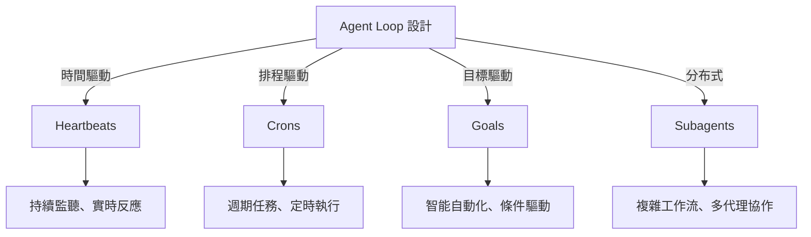

## How to design AI agent loops: schedules, goals, and subagents in Claude Code and Codex

Lenny's Newsletter 發布 AI agent loop 設計完整指南，系統講解多種 loop 型態的應用場景與實現方法。文章涵蓋四大 loop 類型：heartbeats（心跳式觸發）、crons（定時觸發）、goals（目標驅動）、subagents（子代理分工模式）。特色是包含兩個實時演示案例，分別使用 Claude Code 和 Codex 構建完全自主執行的 agent 工作流，具體展示如何自動化 PR 管理等重複工作，使開發者無需手動干預。這篇文章提出 agent loop 設計是現代 AI 驅動開發的核心基礎設施，代表軟體工程實踐的重大轉變。

### 重點
- Agent loop 設計框架明確化：heartbeats、crons、goals、subagents 四大類型各有應用場景
- Claude Code × Codex 實戰案例：展示自主 PR 管理工作流，無需人工干預
- Loop 設計已成為 AI 時代軟體開發的基礎設施，是規模化自動化的關鍵

**原文：** [substack-lennys-newsletter](https://www.lennysnewsletter.com/p/how-to-design-ai-agent-loops-schedules)

---

### 📄 原文內容

點此展開 / 收合

Watch now | &#127897;&#65039;Every loop type explained: heartbeats, crons, goals, and subagents. Plus two live Claude Code and Codex builds that run autonomously so you never manually babysit a PR again

