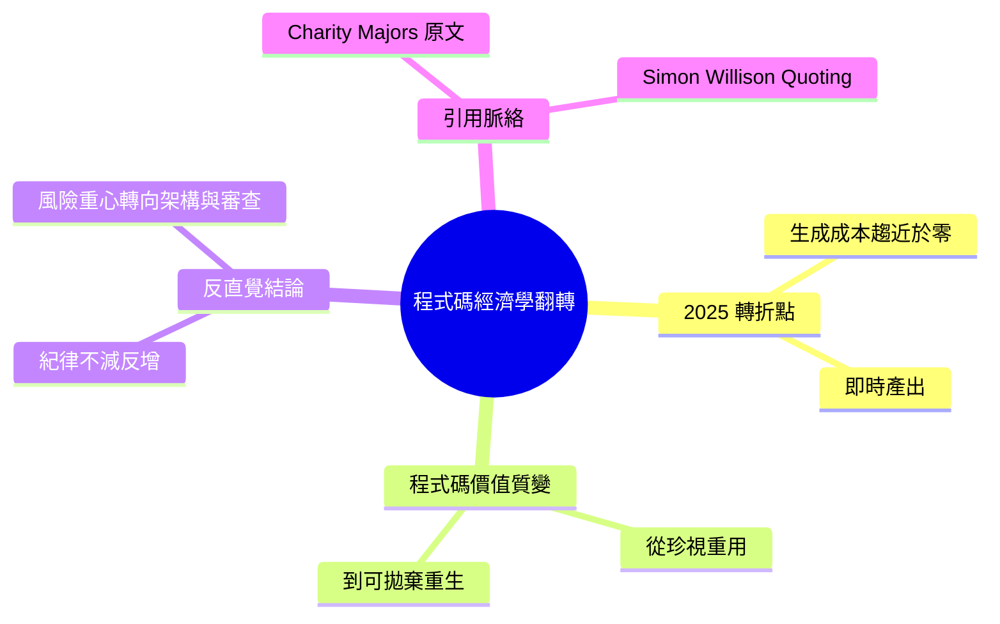

## Quoting Charity Majors

Simon Willison 引用 Charity Majors 的深度觀點：2025 年程式碼生成的經濟學發生根本轉變。從前程式碼編寫困難、耗時、昂貴，現已變成幾乎免費且瞬間完成。程式碼行數因此從被珍視、重用、精心維護的資源，一夜之間轉變為可拋棄式、可隨時重新產生的商品。Majors 主張此典範轉移對工程紀律提出了更高的要求，而非如一般預期的降低要求——組織需要更嚴格的架構規範、測試覆蓋、與代碼質量治理。

### 重點
- 2025 年程式碼生成經濟學翻轉：從昂貴困難 → 免費瞬間
- 程式碼地位轉變：珍視品 → 可拋棄商品
- 工程紀律：需要加強而非削弱（架構、測試、品質治理）

**原文：** [simon-willison](https://simonwillison.net/2026/Jun/17/charity-majors/#atom-everything)

---

<!-- deep-analysis:begin -->
## 📌 摘要 (TL;DR)

- Simon Willison 在其部落格的「Quoting」系列引用工程領袖 Charity Majors（Honeycomb 共同創辦人暨 CTO）的論點，來源文章原標題為〈AI demands more engineering discipline. Not less〉（AI 要求更多工程紀律，而非更少）。
- Majors 的核心主張：2025 年「程式碼生成的經濟學」（economics of code production）被徹底翻轉——過去寫程式碼「困難、耗時、昂貴」，如今變得「近乎免費且即時」（effectively free and instant）。
- 結果是程式碼行數（lines of code）的地位幾乎一夜翻轉：從被「珍視、重用、悉心照料、精心策展」的資產，轉為「可拋棄、可隨時重新生成」（disposable and regenerable）的耗材。
- 反直覺的結論寫在原文標題：當寫程式碼變便宜，組織反而需要「更多」而非更少的工程紀律。
- 對開發者與技術主管而言，這提出一個治理層面的問題：當生成程式碼幾乎零成本，價值與風險的重心便從「寫程式」本身，轉移到架構、審查與維護。

## 🎯 核心概念

- **程式碼生成經濟學**（economics of code production）：產出程式碼所需的難度、時間與成本結構——Majors 認為這正是 2025 年被翻轉的東西。
- **可拋棄式程式碼**（disposable / regenerable code）：不再被長期維護、需要時即可重新生成的程式碼，與傳統「精心維護的資產」相對。
- **工程紀律**（engineering discipline）：架構規範、程式碼審查、測試與維護等確保品質的實踐總稱。

## 📖 整理分析

### 1. 2025 年的經濟學翻轉
Majors 把 2025 年點名為轉折點（What happened in 2025 was this）。她用兩組對立來描述變化：寫程式碼從「very hard, time-consuming, and expensive」變成「effectively free and instant」。換言之，被改變的不是某個工具或語言，而是「產出程式碼」這件事本身的成本曲線——這是她整個論證的前提。

### 2. 程式碼價值的質變
引文以一連串動詞對比呈現程式碼地位的崩塌：過去程式碼是被「treasured, reused, cared for and carefully curated」（珍視、重用、照料、精心策展）的東西；現在則是「disposable and regenerable」（可拋棄、可重新生成）。Majors 特別強調這個轉變「practically overnight」（幾乎一夜之間）發生——重點不只在於便宜，而在於人對程式碼的「態度」隨成本一起改變了。

### 3. 反直覺結論：紀律不減反增
直覺上，程式碼變便宜似乎意味著可以更隨意、更省事；但原文標題給出相反的判斷——AI 要求「更多」工程紀律，而非更少。其推論方向不難理解：若可拋棄、可重生的程式碼缺乏架構規範與審查治理，近乎零成本的產出反而會等比例放大技術債與系統風險。需注意：本則僅收錄了關於「經濟學翻轉」的引文段落，標題所主張「更多紀律」的完整論證與具體做法，仍須回到 Majors 的原文閱讀。

### 4. Simon Willison 的引用脈絡
這是一則典型的 Simon Willison「Quoting」貼文——他擷取一段他認為值得保存的觀點並附上出處，標題即直接命名為「Quoting Charity Majors」。該則的標籤涵蓋 charity-majors、ai-assisted-programming、generative-ai、ai、llms，反映 Willison 將這段話歸類為「AI 輔助編程」（AI-assisted programming）趨勢下的代表性觀點，而非單一產品消息。

## 🧠 Mindmap

<!-- deep-analysis:end -->
### 📄 原文內容

點此展開 / 收合

What happened in 2025 was this: the economics of code production were turned upside down . Instead of being very hard, time-consuming, and expensive to generate code, it became effectively free and instant. Lines of code went from being treasured, reused, cared for and carefully curated, to being disposable and regenerable, practically overnight. 
 &mdash; Charity Majors , AI demands more engineering discipline. Not less 

 Tags: charity-majors , ai-assisted-programming , generative-ai , ai , llms

